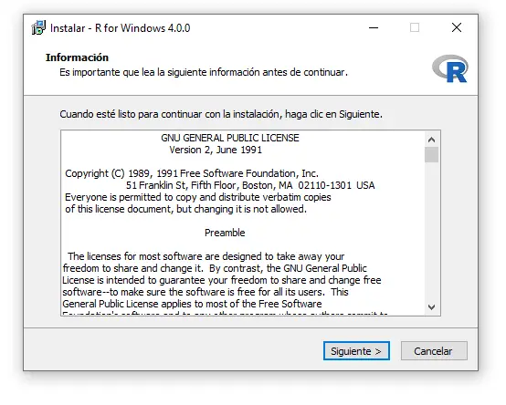
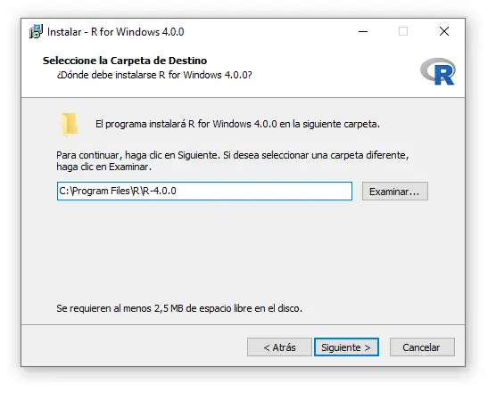

# El concepto detrás de R

R es un lenguaje de programación y entorno computacional de código abierto gratuito dedicado a la estadística. Decimos que es un lenguaje de programación porque nos permite darle instrucciones, mediante código, a nuestro computador para que realice ciertas tareas; para ello es necesario un intérprete para el código y eso es a lo que llamamos entorno computacional. Cuando instalamos R en nuestra computadora en realidad lo que estamos instalando es el entorno computacional, y para que podamos hacer algo en ese entorno necesitamos conocer la manera de escribir instrucciones que el software pueda interpretar y ejecutar. Eso es lo que aprenderemos a hacer en este curso.

R es diferente a otros lenguajes de programación que por lo general están diseñados para realizar muchas tareas diferentes; esto es porque fue creado con el único propósito de hacer estadística. Esta característica es la razón de que R sea un lenguaje de programación peculiar, que puede resultar absurdo en algunos sentidos para personas con experiencia en otros lenguajes, pero también es la razón por la que R es una herramienta muy poderosa para el trabajo en estadística, puesto que funciona de la manera que una persona especializada en esta disciplina desearía que lo hiciera.

## Breve Historia

R tiene sus orígenes en S, un lenguaje de programación creado en los Laboratorios Bell de Estados Unidos. Dado que S y sus estándares son propiedad de los Laboratorios Bell, lo cual restringe su uso, Ross Ihaka y Robert Gentleman, de la Universidad de Auckland en Nueva Zelanda, decidieron crear una implementación abierta y gratuita de S. Este trabajo, que culminaría en la creación de R inició en 1992, teniendo una versión inicial del lenguaje en 1995 y en el 2000 una versión final estable.

En el presente, el mantenimiento y desarrollo de R es realizado por el R Development Core Team, un equipo de especialistas en ciencias computacionales y estadística provenientes de diferentes instituciones y lugares alrededor del mundo. La versión de R mantenida por este equipo es conocida como "base" y como su nombre indica, es sobre aquella que se crean otras implementaciones de R, así como los paquetes que expanden su funcionalidad.

## ¿Quiénes usan R?

R, por citar un ejemplo, es usado por Facebook para analizar la manera en que sus usuarios interactúan con sus muros de publicaciones para así determinar qué contenido mostrarles. Google usa R para analizar la efectividad las campañas de publicidad implementadas en sus servicios. R También es usado para hacer predicciones económicas y otras actividades.

Microsoft adquirió y ahora desarrolla una versión propia de R llamada OpenR, que ha hecho disponible para uso general del público. OpenR es empleada para realizar todo tipo de análisis estadísticos, por ejemplo, para empatar a jugadores en la plataforma de videojuegos XBOX Live (así que puedes culpar a R cuando te tocan partidas contra jugadores mucho más hábiles que tú). Otras compañías que usan R de modo cotidiano son American Express, IBM, Ford, Citibank, HP y Roche, entre muchas más.

# Instrucciones de Instalación

La manera de instalar R cambia dependiendo del sistema operativo utilices pero todas tienen en común el uso de CRAN.

CRAN es el The Comprehensive R Archive Network, una red en la que se archivan todas las versiones de R base, así como todos los paquetes para R que han pasado por un proceso de revisión riguroso, realizado por el CRAN Team, que se encarga de asegurar su correcto funcionamiento.

CRAN es una red porque existen copias de su contenido en diferentes servidores alrededor del mundo, los cuales se actualizan diariamente. De este modo, no importa de qué servidor de CRAN descargues R o algún paquete, lo que vas a obtener será la versión más reciente de ese recurso, que es igual a la disponible en todos los demás servidores.

El sitio oficial de CRAN, en el que encontrarás más información sobre este repositorio es el siguiente: <https://cran.r-project.org/>

## Instalación en Windows

Para instalar R en Windows, puedes acceder al siguiente enlace y hacer clic en "Download R x.x.x for Windows" para comenzar a descargar la última versión de R disponible.

`https://cran.r-project.org/bin/windows/base/`

Una vez descargado, ábrelo, selecciona el idioma preferido y haz clic en "Siguiente" a todos los cuadros de diálogo.

Recuerda seleccionar la ruta donde quieres instalar R:

Ten en cuenta que puedes desmarcar los archivos de bits que no corresponden a tu PC:

También puedes especificar personalizar algunas opciones de inicio, aunque podrás modificarlas una vez instalado R si lo prefieres:

 

Cuando finalice la instalación, podrás comenzar a utilizar R base en Windows.

## Instalar R en mac OS

El proceso de instalación de R en una Mac es análogo a la instalación en Windows. Puedes descargar el paquete binario (para Mac OS X 10.6 y superior) desde la siguiente URL y luego instalarlo.

`https://cran.r-project.org/bin/macosx/`

Si por alguna razón estás utilizando versiones de Mac OS 8.6 a 9.2 (y Mac OS X 10.1) [puedes encontrar aquí los paquetes binarios antiguos](https://cran.r-project.org/bin/macos/). Para sistemas Mac OS X y PowerPC Macs anteriores, debes usar este repositorio para descargar R.

### Instalar R con Homebrew

Una alternativa para instalar R en macOS es usar el administrador de paquetes Homebrew. Para ese propósito solo necesitas escribir lo siguiente en la terminal correspondiente:

``{script}
brew install r
``

## Instalar R en GNU/Linux

En Linux, como suele ser el caso para casi todo, hay una manera fácil y una difícil de instalar R.

La manera fácil depende de la presencia de R en los repositorios de la distribución de Linux que estés usando. Si R se encuentra en los repositorios de tu distribución, sólo es necesario usar el gestor de paquetes de tu preferencia para instalarlo, como cualquier otro software.

Si R no se encuentra en los repositorios, debes agregar una entrada a tu lista de fuentes de software. Esta entrada depende de tu distribución.

También tienes la opción de puedes compilar R directamente desde archivos fuente.

Para todas las opciones anteriores, los detalles de instalación se se encuentran en el siguiente enlace:

`https://cran.r-project.org/bin/linux/`

Si estás usando Linux no te debería ser difícil seguir las instrucciones presentadas.

# RStudio - un IDE para R

Aunque podemos usar R directamente, es recomendable instalar y usar un entorno integrado de desarrollo (IDE, por sus siglas en inglés).

Podemos utilizar R ejecutando nuestro código directamente desde documentos de texto plano, pero esta es una manera poco efectiva de trabajar, especialmente en proyectos complejos.

Un IDE nos proporciona herramientas para escribir y revisar nuestro código, administrar los archivos que estamos usando, gestionar nuestro entorno de trabajo y algunas otras herramientas de productividad. Tareas que serían difíciles o tediosas de realizar de otro modo, son fáciles a través de un IDE.

RStudio es el IDE más popular para R, proporcionando una interfaz gráfica limpia y útil para desarrollar código R. Las principales ventajas de este IDE son el panel para obtener ayuda y mostrar gráficos (incluso interactivos), crear documentos RMarkdown y Sweave, entre otros. Puedes descargar RStudio desde el siguiente enlace, seleccionando el archivo correspondiente a tu sistema operativo:

`https://rstudio.com/products/rstudio/download/#download`

Una vez descargado, abre el asistente de configuración y sige los sencillos pasos de instalación.

# Mi entorno de trabajo

Para trabajar con R es necesario conocer un poco del vocabulario usado en en este lenguaje de programación. Los siguientes son conceptos básicos que usaremos a lo largo de todo el libro.

-   Editor de texto para rutinas de código (Rojo).
-   La consola interactiva de R (Verde).
-   Ambiente/Historial (Azul).
-   Archivos/Gráficos/Paquetes/Ayuda/Visor(Amarillo).

