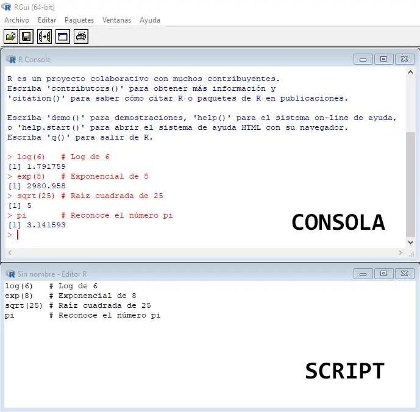

# Conociendo tu entorno de trabajo

Para trabajar con R es necesario conocer un poco del vocabulario usado en en este lenguaje de programación. Los siguientes son conceptos básicos que usaremos a lo largo de todo el libro.

Editor de texto para rutinas de código (Rojo).

La consola interactiva de R (Verde).

Ambiente/Historial (Azul).

Archivos/Gráficos/Paquetes/Ayuda/Visor(Amarillo).


## La consola de R

Lo primero que nos encontramos al ejecutar R es una pantalla que nos muestra la versión de este lenguaje que estamos ejecutando y un prompt:

```         
>_
```

Podemos escribir código directamente en la consola y R nos dará el resultado de lo pidamos allí mismo. Esta es la razón por la que se dice que R permite el uso interactivo, pues no es necesario compilar nuestro código para ver sus resultados.

Para escribir nuestro código disponemos de dos secciones: script y la consola. La diferencia radica en que todo el texto que escribamos en la consola se borrará una vez que se cierre el programa mientras que en los scripts se puede almacenar como un archivo.



# Concepto básicos

## Constantes y Variables

De manera análoga al uso de estos términos en lenguaje matemático, una constante es un objeto cuyo valor no podemos cambiar, en contraste, una variable es un objeto que puede cambiar de valor.

Las constantes ya están establecidas por R, mientras que nosotros podemos crear variables, asignándoles valores a nombres.

En R usamos `<-` para hacer asignaciones. De este modo, podemos asignar el valor 3 a la variable radio.

``` r
radio <- 3
```

Es recomendable que al crear una variable usemos nombres claros, no ambiguos y descriptivos. R es sensible al uso de mayúsculas, así que deben tener cuidado al escribir un nombre.

Los nombres de las variables pueden incluir letras, números, puntos y guiones bajos. Deben empezar siempre con una letra o un punto y si empiezan con un punto, a este no puede seguirle un número.

Finalmente, cuando te encuentres con un renglón de código que inicia con un gato (hashtag), esto representa un comentario, es código que no se ejecutará, sólo se mostrará.

``` r
# Esto es un comentario
```

## Concepto de Funciones

Una función es una serie de operaciones a la que les hemos asignados un nombre. Las funciones aceptan argumentos, es decir, especificaciones sobre cómo deben funcionar.

Cuando llamamos una función, se realizan las operaciones que contiene, usando los argumentos que hemos establecido.

En R reconocemos a una función usando la notación: `nombre_de_la_función()`. Por ejemplo:

-   mean()
-   quantile()
-   summary()
-   density()
-   c()

## Documentación y Ayuda de R

Las funciones de R base y aquellas que forman parte de algún paquete tienen un archivo de documentación.

Este archivo describe qué hace la función, sus argumentos, detalles sobre las operaciones que realiza,los resultados que devuelve y ejemplos de uso.

Para obtener la documentación de una función, escribimos el ? antes de su nombre y lo ejecutamos. También podemos usar la función help(), con el nombre de la función.

Los dos procedimientos siguientes son equivalentes.

``` r
?mean()

help("mean")
```

También podemos obtener la documentación de un paquete, si damos el argumento package a la función help(), con el nombre de un paquete.

Por ejemplo, la documentación del paquete stats, instalado por defecto en R base.

``` r
help(package = "stats")
```

## Directorio de Trabajo

El directorio o carpeta de trabajo es el lugar en nuestra computadora en el que se encuentran los archivos con los que estamos trabajando en R. Este es el lugar donde R buscara archivos para importarlos y al que serán exportados, a menos que indiquemos otra cosa.

Puedes encontrar cuál es tu directorio de trabajo con la función `getwd()`. Sólo tienes que escribir la función en la consola y ejecutarla.

``` r
getwd()
```

``` r
C:/Users/Maedre/Desktop/R/Taller_Uso_R"
```

Puedes cambiar el directorio de trabajo usando la función `setwd()`, dando como argumento la ruta del directorio que quieres usar.

``` r
setwd("C:/Users/Maedre/Desktop/R/Taller_Uso_R2")
```

Por último, si deseas conocer el contenido de tu directorio de trabajo, puedes ejecutar. la función `list.files()`, sin argumentos, que devolverá una lista con el nombre de los archivos de tu directorio de trabajo. La función `list.dirs()`, también sin argumentos\` te dará una lista de los directorios dentro del directorio de trabajo.

``` r
# Ver archivos
list.files()

# Ver directorios
list.dirs()
```

### Concepto de Sesión

Los objetos y funciones de R son almacenados en la memoria RAM de nuestra computadora.

Cuando ejecutamos R, ya sea directamente o a través de RStudio, estamos creando una instancia del entorno del entorno. cada instancia es una sesión.

Todos los objetos y funciones creadas en una sesión, permanecen sólo en ella, no son compartidos entre sesiones, sin embargo una sesión puede tener el mismo directorio de trabajo que otra sesión.

Cuando cerramos R, también cerramos nuestra sesión. Se nos preguntará si deseamos guardar el contenido de nuestra sesión para poder volver a ella después. Esto se guarda en un archivo con extensión `**.Rdata*` en tu directorio de trabajo.

Para conocer los objetos y funciones que contiene nuestra sesión, usamos la función `ls()`, que nos devolverá una lista con los nombres de todo lo guardado en la sesión.

## Creación de Proyectos

Esta sección está basada en el material de [Software Carpentries.](https://github.com/swcarpentry/good-enough-practices-in-scientific-computing/blob/gh-pages/good-enough-practices-for-scientific-computing.pdf)

Cuando estamos trabajando en un proyecto de investigación cualquiera generalmente se generan muchos archivos como notas, datos, datos modificados, imágenes, scripts de código. Incluso, si se usan herramientas distintas se tiende a almacenar todo en una carpeta sin algún orden en particular.

Al hacer esto se vuelve más complicado rastrear las versiones, idenficar la versión original de los archivos, se mezclan archivos con diferentes extensiones, puede ser lento encontrar documentos si los nombres son muy similares.

Mejorar el manejo de estos proyectos no sólo hace más organizado el avance del proyecto, si no que nos ahorra muchos dolores de cabeza para ubicar archivos. También ayuda a garantizar la integridad de los datos, a compartir el proyecto y sus avances con otras personas o con nostros mismos en el futuro.

### RStudio como herramienta de manejo de proyectos.

Si bien hay muchas herramientas con este objetivo, RStudio es una excelente opción.

#### Pasos para crear un proyecto en RStudio:

1.  File \> New Project

2.  New Directory

3.  Empty Project

4.  Creamos un nombre para el proyecto

5.  Seleccionar (si está disponible)

6.  Create Project

Lo que acabamos de hacer es crear un proyecto autocontenido, entonces, cuando abramos RStudio desde este directorio todo el contenido del proyecto estará disponible. También podemos abrir el proyecto desde RStudio.

### Buenas prácticas para organizar proyectos

Les presentamos algunos consejos para facilitar la organización de proyectos.

-   Mantener datos como \"sólo lectura\": Es importante mantener nuestros datos originales y no modificarlos, tener ese respaldo siempre es de utilidad.

-   Limpiar datos: Es muy común que los datos que vayamos a usar requieran algunos cambios o preprocesamiento para tener un formato compatible con R. Cuando se hace esto es bueno crear una carpeta que contenga los scripts que se utilizaron para preparar los datos y otra por aparte que contenga los datos \"limpios\" o ya procesados.

-   Tratar la salida generada como disponible: Los \"outputs\" debería ser descartables ya que se pueden volver a generar corriendo de nuevo los scripts. Es bueno también guardar los scripts en un mismo lugar para poder acceder a ellos rápidamente, en caso de sean necesarios distintos análisis.

-   Mantener organizadas las carpetas: se recomienda separar en carpetas distintas los scripts que son para funciones útiles que se van a reutilizar a lo largo del proyecto y otra para los scripts de análisis, esto para evitar la duplicación.

[Algunos consejos adicionales!](https://github.com/swcarpentry/good-enough-practices-in-scientific-computing/blob/gh-pages/good-enough-practices-for-scientific-computing.pdf)

-   El paquete [ProjectTemplate](http://projecttemplate.net/) ayuda en la automatización de la gestión:

```         
#install.packages("ProjectTemplate") library("ProjectTemplate")
```

```         
## Loading required package: digest
```

```         
## Loading required package: tibble
```

```         
#create.project("../my_project", merge.strategy = "allow.non.conflict")
```
**Carpetas principales:**
* data
* docs
* graphs
* reports
* src
* test
## Paquetes de R

R puede ser expandido con paquetes. Cada paquete es una colección de funciones diseñadas para atender una tarea específica. Por ejemplo, hay paquetes para trabajo visualización geoespacial, análisis psicométricos, mineria de datos, interacción con servicios de internet y muchas otras cosas más.

Estos paquetes se encuentran alojados en **CRAN**, así que pasan por un control riguroso antes de estar disponibles para su uso generalizado.

Podemos instalar paquetes usando la función `install.packages()`, dando como argumento el nombre del paquete que deseamos instalar, entre comillas.

Por ejemplo, para instalar el paquete `readr`, corremos lo siguiente.

``` r
install.packages("readr")
```

Hecho esto, apareceran algunos mensajes en la consola mostrando el avance de la instalación

Una vez concluida la instalación de un paquete, podrás usar sus funciones con la función library(). Sólo tienes que llamar esta función usando como argument oel nombre del paquete que quieres utilizar.

``` r
library(readr)
```

Cuando haces esto, R importa las funciones contenidas en el paquete al entorno de trabajo actual.

Es importante que tengas en mente que debes hacer una llamada a `library()` cada que inicies una sesión en R. Aunque hayas importado las funciones de un paquete con anterioridad, las sesiones de R se inician "limpias", sólo con los objetos y funciones de base.

Los paquetes que hemos importado en nuestra sesión actual aparecen al llamar `sessionInfo()`.

También podemos ver qué paquetes tenemos ya instalados ejecutando la función `installed.packages()` sin ningún argumento.

# Tipos de Datos

En R los datos pueden ser de diferentes tipos. Cada tipo tiene características particulares que lo distinguen de los demás. Entre otras cosas algunas operaciones sólo pueden realizarse con tipos de datos específicos.

## Tipos más Comunes

| **Tipo**        | **Ejemplo** | **Nombre en inglés** |
|-----------------|-------------|----------------------|
| Entero          | 1           | integer              |
| Numérico        | 1.3         | numeric              |
| Cadena de texto | "uno"       | character            |
| Factor          | soltero     | factor               |
| Lógico          | TRUE        | logical              |
| Perdido         | `NA`        | NA                   |
| Vacio           | `NULL`      | null                 |

Además de estos tipos, en R también contamos con datos complejos numéricos complejos (con una parte real y una imaginaria), raw (bytes), fechas y raster, entre otros. Estos tipos tiene aplicaciones muy específicas, por ejemplo, los datos de tipo fecha son ampliamente usados en economía, para análisis de series de tiempo.

### Concepto de Factor

Un factor es un tipo de datos específico a R. Puede ser descrito como un dato numérico representado por una etiqueta.

Supongamos que tenemos un conjunto de datos que representan el sexo de personas encuestadas por teléfono, pero estos se encuentran capturados con los números 1 y 2. El número 1 corresponde a **femenino** y el 2 a **masculino**.

En R, podemos indicar que se nos muestre, en la consola y para otros análisis, los 1 como `femenino` y los 2 como masculino. Aunque para nuestra computadora, femenino tiene un valor de 1, pero a nosotros se nos muestra la palabra `femenino`. De esta manera reducimos el espacio de almacenamiento necesario para nuestros datos.

Por último, cada una de las etiquetas o valores que puedes asumir un factor se conoce como nivel. En nuestro ejemplo con `femenino` y `masculino`, tendríamos dos niveles.

### Concepto de NA y NULL

En R, usamos `NA` para representar datos perdidos, mientras que `NULL` representa la ausencia de datos.

La diferencia entre las dos es que un dato `NULL` aparece sólo cuando R intenta recuperar un dato y no encuentra nada, mientras que `NA` es usado para representar explícitamente datos perdidos, omitidos o que por alguna razón son faltantes.

Por ejemplo, si tratamos de recuperar la edad de una persona encuestada que no existe, obtendríamos un `NULL`, pues no hay ningún dato que corresponda con ello. En cambio, si tratamos de recuperar su estado civil, y la persona encuestada no contestó esta pregunta, obtendríamos un `NA`.

`NA` además puede aparecer como resultado de una operación realizada, pero no tuvo éxito en su ejecución.

## Coerción de Datos

En R, los datos pueden ser coercionados, es decir, forzados, para transformarlos de un tipo a otro.

La coerción es muy importante. Cuando pedimos a R ejecutar una operación, intentará coercionar de manera implícita, sin avisarnos, los datos de su tipo original al tipo correcto que permita realizarla. Habrá ocasiones en las que R tenga éxito y la operación ocurra sin problemas, y otras en las que falle y obtengamos un error.

Lo anterior ocurre porque no todos los tipos de datos pueden ser transformados a los demás, para ello se sigue una regla general.

La coerción de tipos se realiza de los tipos de datos más restrictivos a los más flexibles.

Las coerciones ocurren en el siguiente orden.

lógico -\> entero -\> numérico -\> cadena de texto (logical -\> integer -\> numeric -\> character)

### Coerción explícita con la familia as()

| **Función**      | **Tipo al que hace coerción** |
|------------------|-------------------------------|
| `as.integer()`   | Entero                        |
| `as.numeric()`   | Numerico                      |
| `as.character()` | Cadena de texto               |
| `as.factor()`    | Factor                        |
| `as.logical()`   | Lógico                        |
| `as.null()`      | `NULL`                        |

## Verificar Tipo

En ocasiones, tenemos datos pero no sabemos de simple vistazo de qué tipo son. Para esto casos, podemos usar la función class() para determinar el tipo de un dato. Esto es de utilidad para asegurarnos que las operaciones que deseamos realizar tendrán los datos apropiados para llevarse a cabo con éxito.

class() recibe como argumento un dato o vector y devuelve el nombre del tipo al que pertenece, en inglés.

``` r
class(3)
```

Otra manera de comprobar el tipo de dato es mediante la familia `is()`

| **Función**      | **Tipo que verifican** |
|------------------|------------------------|
| `is.integer()`   | Entero                 |
| `is.numeric()`   | Numerico               |
| `is.character()` | Cadena de texto        |
| `is.factor()`    | Factor                 |
| `is.logical()`   | Lógico                 |
| `is.na()`        | `NA`                   |
| `is.null()`      | `NULL`                 |

# Operadores

Los operadores son los símbolos que le indican a R que debe realizar una tarea. Combinando datos y operadores es que logramos que R haga su trabajo.

Existen operadores específicos para cada tipo de tarea. Los tipos de operadores principales son los siguientes:

-   Aritméticos
-   Relacionales
-   Lógicos
-   De asignación

## Operadores Aritméticos

Como su nombre lo indica, este tipo de operador es usado para operaciones aritméticas.

| **Operador** | **Operación**   | **Ejemplo** | **Resultado** |
|--------------|-----------------|-------------|---------------|
| `+`          | Suma            | `5 + 3`     | 8             |
| `-`          | Resta           | `5 - 3`     | 2             |
| `*`          | Multiplicación  | `5 * 3`     | 18            |
| `/`          | División        | `5 /3`      | 1.666667      |
| `^`          | Potencia        | `5 ^ 3`     | 125           |
| `%%`         | División entera | `5 %% 3`    | 2             |

Es posible realizar operaciones aritméticas con datos de tipo **entero** y **numérico**.

Si escribes una operación aritmética en la consola de R y das Enter, esta se realiza y se devuelve su resultado.

``` R
15 * 3
```

```         
## [1] 45
```

Cuando intentas realizar una operación aritmética con otro tipo de dato, R primero intentará coercionar ese dato a uno numérico. Si la coerción tiene éxito se realizará la operación normalmente, si falla, el resultado será un error.

``` R
4 + "tres"
```

```         
## Error in 4 + "tres": argumento no-numérico para operador binario
```

El mensaje *\"non-numeric argument for binary operator\"* aparece siempre que intentas realizar una operación aritmética con un argumento no numérico. Si te encuentras un un error que contiene este mensaje, es la primera pista para que identifiques donde ha ocurrido un problema.

``` R
NA - 66
```

```         
## [1] NA
```

``` R
21 * NA
```

```         
## [1] NA
```

``` R
NA ^ 13
```

```         
## [1] NA
```

### Concepto de División Entera

Entre los operadores aritméticos, el de división entera o **módulo** requiere una explicación adicional sobre su uso. La operación que realiza es una división de un número entre otro, pero en lugar de devolver el cociente, nos devuelve el residuo.

Por ejemplo, si hacemos una división entera de 4 entre 2, el resultado será 0. Esta es una división exacta y no tiene residuo.

``` R
4 %% 2
```

```         
## [1] 0
```

En cambio, si hacemos una división entera de 5 entre 2, el resultado será 1, pues este es el residuo de la operación.

``` R
5 %% 2
```

```         
## [1] 1
```

## Operadores relacionales

Los operadores lógicos son usados para hacer comparaciones y siempre devuelven como resultado `TRUE` o `FALSE` (verdadero o falso, respectivamente).

| **Operador** | **Comparación**       | **Ejemplo** | **Resultado** |
|--------------|-----------------------|-------------|---------------|
| `<`          | Menor que             | `5 < 3`     | `FALSE`       |
| `<=`         | Menor o igual que     | `5 <= 3`    | `FALSE`       |
| `>`          | Mayor que             | `5 > 3`     | `TRUE`        |
| `>=`         | Mayor o igual que     | `5 >= 3`    | `TRUE`        |
| `==`         | Exactamente igual que | `5 == 3`    | `FALSE`       |
| `!=`         | No es igual que       | `5 != 3`    | `TRUE`        |

Es posible comparar cualquier tipo de dato sin que resulte en un error.

Sin embargo, al usar los operadores `>`, `>=`, `<` y `<=` con cadenas de texto, estos tienen un comportamiento especial.

Por ejemplo, `"casa" > "barco"` nos devuelve `TRUE`.

``` R
"casa" > "barco"
```

```         
## [1] TRUE
```

Este resultado se debe a que se ha hecho una comparación por orden alfabético. En este caso, la palabra \"casa\" tendría una posición posterior a \"barco\", pues empieza con \"c\" y esta letra tiene una posición posterior a la \"b\" en el alfabeto. Por lo tanto, es verdadero que sea \"mayor\".

## Operadores lógicos

Los operadores lógicos son usados para operaciones de **álgebra Booleana**, es decir, para describir relaciones lógicas, expresadas como verdadero (`TRUE`) o falso (`FALSO`).

| **Operador** | **Comparación**              | **Ejemplo**    | **Resultado** |
|--------------|------------------------------|----------------|---------------|
| `x | y`      | x Ó y es verdadero           | `TRUE | FALSE` | `TRUE`        |
| `x & y`      | x Y y son verdaderos         | `TRUE & FALSE` | `FALSE`       |
| `!x`         | x no es verdadero (negación) | `!TRUE`        | `FALSE`       |
| `isTRUE(x)`  | x es verdadero (afirmación)  | `isTRUE(TRUE)` | `TRUE`        |

Los operadores `|` y `&` siguen estas reglas:

-   `|` devuelve `TRUE` si alguno de los datos es `TRUE`

-   `&` solo devuelve `TRUE` si ambos datos es `TRUE`

-   `|` solo devuelve `FALSE` si ambos datos son `FALSE`

-   `&` devuelve `FALSE` si alguno de los datos es `FALSE`

Estos operadores pueden ser usados con estos con datos de tipo **numérico**, **lógico** y **complejo**. Al igual que con los operadores relacionales, los operadores lógicos siempre devuelven `TRUE` o `FALSE`.

Para realizar operaciones lógicas, todos los valores numéricos y complejos distintos a `0` son coercionados a `TRUE`, mientras que `0` siempre es coercionado a `FALSE`.

Por ejemplo, `5 | 0` resulta en `TRUE` y `5 & FALSE` resulta en `FALSE`. Podemos comprobar lo anterior con la función `isTRUE()`.

``` R
5 | 0
```

```         
## [1] TRUE
```

Estos operadores se pueden combinar para expresar relaciones complejas.

Por ejemplo, la negación `FALSE` Y `FALSE` dará como resultado `TRUE`.

``` R
!(FALSE | FALSE)
```

```         
## [1] TRUE
```

## Operadores de asignación

Este es probablemente el operador más importante de todos, pues nos permite asignar datos a variables.

| **Operador** | **Operación**                  |
|--------------|--------------------------------|
| `<-`         | Asigna un valor a una variable |
| `=`          | Asigna un valor a una variable |

En este ejemplo, asignamos valores a las variables `estatura` y `peso`.

``` R
estatura <- 1.73
peso = 83
```

## Orden de operaciones

En R, al igual que en matemáticas, las operaciones tienen un orden de evaluación definido.

Cuanto tenemos varias operaciones ocurriendo al mismo tiempo, en realidad, algunas de ellas son realizadas antes que otras y el resultado de ellas dependerá de este orden.

El orden de operaciones incluye a las aritméticas, relacionales, lógicas y de asignación.

En la tabla siguiente se presenta el orden en que ocurren las operaciones que hemos revisado en este capítulo.

| **Orden** | **Operadores**              |
|-----------|-----------------------------|
| 1         | `^`                         |
| 2         | `*` `/`                     |
| 3         | `+` `-`                     |
| 4         | `<` `>` `<=` `>=` `==` `!=` |
| 5         | `!`                         |
| 6         | `&`                         |
| 7         | `|`                         |
| 8         | `<-`                        |

## 
