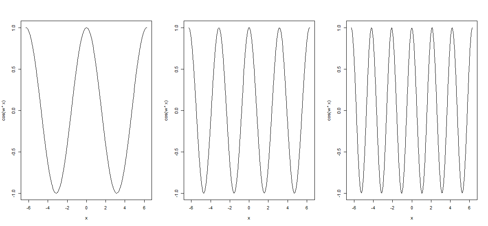
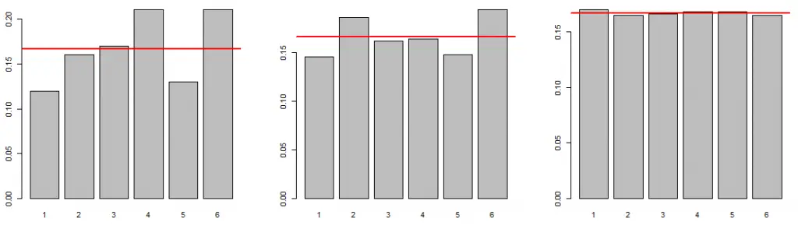
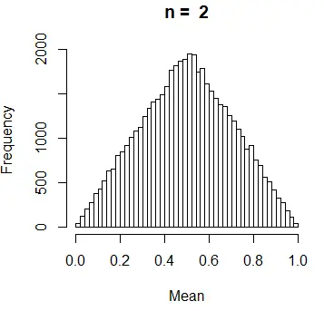
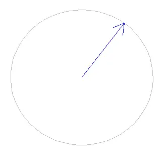
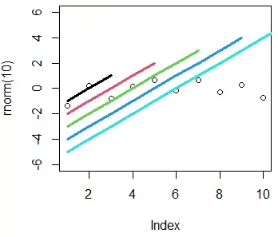

# Funciones

La instalación base de R tiene suficientes funciones para que realicemos todas las tareas básicas de análisis de datos, desde importar información hasta crear documentos para comunicarla. Ese material ha sido creado usando R.

Sin embargo, hay ocasiones en las que necesitaremos realizar algún proceso en específico para el cual no haya una función o debamos usar más de una función en cadena. Es por ello que vamos a ver como crear nuestras propias funciones.

## **¿Cómo crear funciones en R?**

Las funciones base de R no siempre cubren todas nuestras necesidades. Para escribir una función en R, primero necesitamos saber cómo es la sintaxis del comando `function`. La sintaxis básica de una función de R es la siguiente.

``` r
nombre_funcion <- function(arg1, arg2, ... ) {
        # Código
}
```

En el bloque de código anterior tenemos las siguientes partes:

-   `arg1, arg2, ...` son los **argumentos de entrada**.

-   `# Código` representa el **código a ser ejecutado** dentro de la función para obtener la salida desada.

**La salida de la función puede ser** un número, una lista, un data.frame, un gráfico, un mensaje o **cualquier objeto** que queramos.

### **Creando una función en R**

Para introducirnos en la creación de funciones de R, crearemos una función para trabajar con progresiones geométricas. Una progresión geométrica es una sucesión de números $a_{1},a_{2},a_{3}$de modo que cada uno de ellos (excepto el primero) es igual al último multiplicado por una constante *r* llamada ratio. Se puede verificar que,

$$
a_2 = a_1 \cdot r; \;\;\;\ a_3 = a_2 \cdot r = a_1 \cdot r^2;...
$$

Por lo tanto, generalizando este proceso, puede obtenerse el término general

$$
a_n = a_1 \cdot r^{n-1}
$$

También se puede verificar que la suma de los *n* términos de la progresión es

$$
S_n = a_1 + ... + a_n = \frac{a_1(r^n -1)}{r -1}
$$

Con esto en mente, puedes crear la siguiente función,

``` r
an <- function(a1, r, n){
    a1 * r ** (n - 1)
}
```

que calcula el término general $a_n$ de una progresión geométrica pasando los parámetros $a_1$​, el ratio *r* y el valor *n*. En el siguiente bloque podemos ver algunos ejemplos, mostrando su salida como comentarios.

``` r
an(a1 = 1, r = 2, n = 5)  # 16 
an(a1 = 4, r = -2, n = 6) # -128
```

Con la función anterior puedes obtener varios valores de la progresión pasando un vector al argumento *n*.

``` r
an(a1 = 1, r = 2, n = 1:5)   # a_1, ..., a_5
an(a1 = 1, r = 2, n = 10:15) # a_10,..., a_15
```

También puedes calcular los primeros *n* elementos de la progresión con la función `sn`, definida a continuación.

``` r
sn <- function(a1, r, n){
    a1 * (r ** n-1)/(r - 1)
}
```

``` r
sn(a1 = 1, r = 2, n = 5) # 31

# Equivalente
values <- an(a1 = 1, r = 2, n = 1:5)
values

sum(values) # 31
```

## **Argumentos de entrada**

**Los argumentos son valores de entrada de las funciones**. Como ejemplo, en la función que creamos antes tenemos tres argumentos de entrada llamados `a1`, `r` y `n`. Hay varias consideraciones cuando se trata con este tipo de argumentos.

-   **Si mantenemos el orden de entrada, no necesitamos llamar a los nombres de los argumentos**. Como ejemplo, las siguientes llamadas a la función son equivalentes.

``` r
an(1, 2, 5) # Devuelve 16
an(a1 = 1, r = 2, n = 5) # Devuelve 16
```

-   Si ponemos el **nombre de los argumentos**, podemos usar **cualquier oden**.

``` r
an(r = 2, n = 5, a1 = 1) # Devuelve 16
an(n = 5, r = 2, a1 = 1) # Devuelve 16
```

-   Podemos usar la función `args` para **conocer los argumentos de entrada** de cualquier función que queramos usar.

``` r
args(an)
```

-   Si **escribimos el nombre de la función**, la consola devolverá el **código de la función**.

**Ten en cuenta que** a veces no podrás ver el código fuente de una función si ésta no está escrita en R.

## **Argumentos adicionales en las funciones de R**

En ocasiones resulta muy interesante tener argumentos predeterminados en la función. En tal caso **se utilizarán los valores predeterminados a menos que se incluyan otros** al ejecutar la función. Al escribir una función, como la de nuestro ejemplo,

``` r
nombre_función <- function(arg1, arg2, arg3 ) {
        # Código
}
```

si queremos que `arg2` y `arg3` sean los valores `a` y `b` por defecto, podemos asignarlos en los argumentos de nuestra función.

``` r
nombre_función <- function(arg1, arg2 = a, arg3 = b) {
        # Código
}
```

Ilustraremos esto con un ejemplo muy simple. Considera una función que dibuja la función coseno.

``` r
coseno <- function(w = 1, min = -2 * pi, max = 2 * pi) {
    x <- seq(-2 * pi, 2 * pi, length = 200)
    plot(x, cos(w * x), type = "l")
}
```

Nótese que esta no es la mejor manera de usar una función para dibujar un gráfico.

Si ejecutamos `coseno()`, la gráfica de `cos(x)` se trazará por defecto en el intervalo [-2 π , 2 π ]. Sin embargo, si queremos graficar la función `cos(2x)` en el mismo intervalo, necesitamos ejecutar `coseno(w = 2)`. Veamos algunos ejemplos:

``` r
# Una fila, tres columnas
par(mfcol = c(1, 3))

coseno()
coseno(w = 2)
coseno(w = 3, min = -3 * pi)
```



## **La función return**

Por defecto, las funciones de R devolverán el último objeto evaluado dentro de ella. También podemos hacer uso de la función `return`, que es especialmente importante cuando se quiere devolver un objeto u otro dependiendo de ciertas condiciones o cuando se quiere ejecutar algún código después del objeto que queremos devolver.

Además, ten en cuenta que podemos devolver todos los tipos de objetos de R, pero solo uno de ellos. Por esa razón, es muy habitual devolver una lista de objetos. Veamos un ejemplo:

``` r
asn <- function(a1 = 1, r = 2, n = 5) {
    A  <- an(a1, r, n)
    S  <- sn(a1, r, n)
    ii <- 1:n
    AA <- an(a1, r, ii)
    SS <- sn(a1, r, ii)
    return(list(an = A, sn = S,
                salida = data.frame(valores = AA,
                                    sum = SS)))
}
```

Cuando ejecutes la función, obtendrás el siguiente resultado. Recuerda tener las funciones `sn` y `an` en el espacio de trabajo.

``` r
asn()
```

``` r
Output
$`an`
[1] 16

$sn
[1] 31

$salida
  valores sum
1      1   1
2      2   3
3      4   7
4      8  15
5     16  31
```

Puede que te hayas dado cuenta de que en el caso anterior es equivalente usar la función `return` o no usarla. Sin embargo, considera el siguiente ejemplo, donde queremos comprobar si los parámetros que se pasan a los argumentos son números o no. Para ello, si alguno de los parámetros no es qun número devolveremos un string, pero si son números seguiremos ejecutando el código.

``` r
asn <- function(a1 = 1, r = 2, n = 5) {
    if(!is.numeric(c(a1, r, n))) return("Todos los parámetros deben ser números")
    A  <- an(a1, r, n)
    S  <- sn(a1, r, n)
    ii <- 1:n
    AA <- an(a1, r, ii)
    SS <- sn(a1, r, ii)
    return(list(an = A, sn = S,
                salida = data.frame(valores = AA,
                                    sum = SS)))
}
```

``` r
asn("3")
```

```         
Output
"Todos los parámetros deben ser números"
```

Ahora bien, si en lugar de usar la función `return` hubiésemos usado la función `print`, si se pasa algún dato que no sea numérico se devolverá el texto pero también un error, ya que se ejecutará todo el código.hora bien, si en lugar de usar la función `return` hubiésemos usado la función `print`, si se pasa algún dato que no sea numérico se devolverá el texto pero también un error, ya que se ejecutará todo el código.

``` r
asn <- function(a1 = 1, r = 2, n = 5) {
    if(!is.numeric(c(a1, r, n))) print("Todos los parámetros deben ser números")
    A  <- an(a1, r, n)
    S  <- sn(a1, r, n)
    ii <- 1:n
    AA <- an(a1, r, ii)
    SS <- sn(a1, r, ii)
    return(list(an = A, sn = S,
                salida = data.frame(valores = AA,
                                    sum = SS)))
}
```

``` r
asn("3")
```

```         
Output
Todos los parámetros deben ser números
Error in a1 * r^(n - 1) : argumento no-numérico para operador binario
```

## **Variables locales y globales en R**

En R no es necesario declarar las variables utilizadas dentro de una función. La regla llamada "ámbito lexicográfico" se usa para decidir si un objeto es local a una función o global. Considera el siguiente ejemplo:

``` r
fun <- function() {
    print(x)
}

x <- 1

fun() # 1
```

La variable `x` no se define dentro de `fun`, por lo que R buscará `x` dentro del ámbito "circundante" e imprimirá su valor. Si `x` se usa como el nombre de un objeto dentro de la función, el valor de `x` en el entorno global (fuera de la función) no cambia.

``` r
x <- 1
fun2 <- function() {
    x <- 2
    print(x)
}

fun2() # 2
x #1
```

Para cambiar el valor global de una variable dentro de una función, puedes usar el operador de doble asignación (`<<-`).

``` r
x <- 1
y <- 3
fun3 <- function() {
    x <- 2
    y <<- 5
    print(paste(x, y))
}

fun3() # 2 5
x # 1 (el valor no cambió)
y # 5 (el valor cambió)
```

## **Escribiendo funciones en R. Ejemplos**

En esta sección se muestran diferentes ejemplos de funciones R para mejorar la comprensión de su creación y uso para el lector.

### **Función de ejemplo 1: Letra del DNI español**

Vamos a calcular la letra del DNI a partir de su correspondiente número. El método utilizado para obtener la letra (L) del DNI consiste en dividir el número entre 23 y de acuerdo con el resto (R) obtenido otorgar la letra correspondiente de la siguiente tabla.

| **R** | **L** |     | **R** | **L** |     | **R** | **L** |     | **R** | **L** |
|:-----:|:-----:|:---:|:-----:|:-----:|:----|:-----:|:-----:|:---:|:-----:|:-----:|
|   0   |   T   |     |   7   |   F   |     |  14   |   Z   |     |  21   |   K   |
|   1   |   R   |     |   8   |   P   |     |  15   |   S   |     |  22   |   E   |
|   2   |   W   |     |   9   |   D   |     |  16   |   Q   |     |       |       |
|   3   |   A   |     |  10   |   X   |     |  17   |   V   |     |       |       |
|   4   |   G   |     |  11   |   B   |     |  18   |   H   |     |       |       |
|   5   |   M   |     |  12   |   N   |     |  19   |   L   |     |       |       |
|   6   |   Y   |     |  13   |   J   |     |  20   |   C   |     |       |       |

Nuestra función será como sigue:

``` r
DNI <- function(numero) {
    letras <- c("T", "R", "W", "A", "G", "M", "Y", "F", "P", "D", "X", "B",
                "N", "J", "Z", "S", "Q", "V", "H", "L", "C", "K", "E")
    letras <- letras[numero %% 23 + 1]
    return(letras)
}
```

```         
DNI(50247828) # G
```

### **Función de ejemplo 2: Lanzando un dado**

La siguiente función simula *n* (por defecto *n* = 100) lanzamientos de un dado. La función devuelve la tabla de frecuencias y el gráfico correspondiente.

``` r
dado <- function(n = 100){
    lanzamientos <- sample(1:6, n, rep = T)
    frecuencias <- table(lanzamientos)/n
    barplot(frecuencias, main = "")
    abline(h = 1/6, col = "red", lwd = 2)
    return(frecuencias)
}
```

Puedes ver los resultados de simulación ejecutando la función.

``` r
par(mfcol = c(1, 3))

dado(100)
dado(500)
dado(100000)
```

``` r
Output
# 100
 1     2    3   4    5    6
0.17 0.11 0.20 0.16 0.25 0.11

# 500
  1     2     3    4      5     6
0.144 0.158 0.148 0.178 0.164 0.208

# 100000
    1      2       3       4       5      6
0.16612 0.16630 0.16569 0.16791 0.16697 0.16701
```



Como puedes ver, a medida que aumentamos *n* estamos más cerca del valor teórico 1/6 = 0.1667.

# **Sentencia if en R**

El if en R, al igual que en otros lenguajes de programación, es una sentencia condicional. Vamos a estudiar la sintaxis y algunos ejemplos de **cómo usar if y else en R, con condiciones simples y anidadas**. También mostraremos cómo usar la función `ifelse`, que es la versión vectorizada de la condición if y else en R.

## **Sintaxis de la sentencia if else en R**

Las condiciones if else son muy intuitivas. Debes definir una o más condiciones que quieres que se cumplan para ejecutar algún código y, si no, ejecutar otro código. Por lo tanto, la condición debe devolver `TRUE` si la condición se cumple o `FALSE` si no.

**SI** la condición se cumple, **ENTONCES** se ejecuta un código, **EN OTRO CASO**, se ejecuta otro código.

La sintaxis del if else en R es como sigue:

``` r
Syntax
if (Condición) { # La condición debe devolver TRUE o FALSE
    # Ejecuta un código
} else {
    # Ejecuta otro código
}
```

También puedes **escribir sentencias if en una sola línea sin llaves**, pero generalmente no se recomienda, ya que podrías cometer errores de sintaxis en el código.

``` r
if (Condición) print("Código") else print("Más código")
```

Recuerda que también puedes usar esta sentencia condicional**SIN el else**.

Si necesitas que se cumplan varias condiciones puedes **crear if anidados** (if else if). Esto significa que puedes llamar más condiciones if else dentro de tus condiciones previas. En el siguiente bloque de código mostramos un ejemplo de un if anidado dentro del primer `else`. Puedes anidar tantos ifs como quieras.

``` r
if (Condición) { # La condición debe devolver TRUE o FALSE
    # Código
} else {
    # Código
    if(Condición 2) { # La condición debe devolver TRUE o FALSE
        # Código
    } else {
        # Más código
    }
} 
```

Ten en cuenta que dentro de 'Condición' tienes que usar **operadores condicionales**, como AND (&), OR (\|), o IGUAL A (==).

### **Ejemplos de uso de if en R**

Ahora vamos a mostrar algunos casos elaborados de uso de las sentencias if else en R. Primero, vamos a evaluar la siguiente función que depende de `x`:


Para ese propósito, creamos una función llamada `f` y dentro de la función creamos una condición if anidada para trabajar con todos los casos posibles.

``` r
f <- function(x) {
    if (x < 0) {
        0
    } else {
        if (x <= 10) {
            x / 10
        } else {
            1
        }
     }
  }

# Llamamos a la función
f(-1)  # 0
f(5)   # 0.5
f(100) # 1
```

En segundo lugar, vamos a definir una función para verificar **si algún número es par o impar**. Para verificarlo, comprobaremos si el módulo del número es igual a 0 o no e imprimiremos el resultado correspondiente.

``` r
is_even <- function(x) {
    if (x %% 2 == 0 ) {
        print("x es par")
    } else {
        print("x es impar")
    } 
}

# Llamamos a la función
is_even(5)  # x es impar
is_even(10) # x is par
```

## **La sentencia ifelse en R**

En R, hay muchas funciones vectorizadas. La función `ifelse` es la versión vectorizada del condicional if else. Supongamos que quieres ejecutas un if en R con la siguiente estructura:

``` r
if (seq(1, 5) < 5) {
  print(TRUE)
} else {
 print(FALSE)
}
```

Nótese que estás tratando de comparar un vector numérico con un número entero. En consecuencia obtendrás el siguiente error:

**Warning message:** In if (seq(1, 5) \< 5) { : la condicion tiene longitud \> 1 y solo el primer elemento será usado.

Esto significa que l**a condición solo compara el primer elemento del vector**, ya que la condición if solo devuelve `TRUE` o `FALSE`, y no un vector lógico. Para ello, debes utilizar la función `ifelse`, que tiene la siguiente sintaxis.

``` r
ifelse(vector_condicional, valor_si_TRUE, vvalor_si_FALSE)
```

Ahora, con esta función, se evaluarán todos los elementos del vector y la función devolverá un vector lógico.

``` r
ifelse(seq(1, 5) < 5, TRUE, FALSE)
```

``` r
Output 

TRUE  TRUE  TRUE  TRUE FALSE
```

También puedes **evaluar varias condiciones** utilizando anidaciones con la función `ifelse`. Ten en cuenta que puedes anidar hasta 50 condiciones de esta forma.

``` r
ifelse(vector_condicional,
       ifelse(vector_condicional_si_TRUE, value_if_TRUE, valor_si_FALSE),
       ifelse(vector_condicional_si_FALSE, value_if_TRUE, valor_si_FALSE))
```

R limita el número de ifelse a 50 líneas de **`ifelse`** anidados.

### **Ejemplos con la función ifelse**

Supón que deseas clasificar los siguientes datos:

``` r
x <- c("hombre", "hombre", "mujer", "hombre", "mujer")
y <- c(10, 14, 80, 56, 27)
```

El vector de caracteres `x` representa si el individuo es un hombre o una mujer y el vector numérico `y` representa la edad del individuo correspondiente. En este ejemplo, clasificaremos a todos los individuos como hombres / mujeres adultos o menores de edad .

``` r
ifelse (x == "hombre", ifelse(y > 18, "Hombre adulto", "Hombre menor de edad"),
        ifelse(y > 18, "Mujer adulta", "Mujer menor de edad"))
```

```         
Output

"Hombre menor de edad" "Hombre menor de edad" "Mujer adulta" "Hombre adulto" "Mujer adulta"
```

Ahora, supongamos que queremos establecer como 1 las personas con más de 30 años o menos de 10 y 0 en el otro caso. Para ello podemos utilizar el operador `|`.

``` r
ifelse (y > 30 | y <= 10, 1, 0) 
```

```         
Output

1 0 1 1 0
```

# **Bucles for en R**

El bucle for en R, también conocido como ciclo for, **es una iteración repetitiva** (en bucle) de cualquier código, donde en cada iteración se evalúa un mismo código a través de los elementos de un vector o lista.

## **Sintaxis del bucle for en R**

La **sintaxis del bucle for en R** es muy simple:

``` r
Sintaxis
for (i in lista) {
  # Código
}
```

También puedes escribir un bucle for en una sola línea de código sin corchetes. Sin embargo, no es recomendable escribir así los bucles for.

``` r
for (i in lista) # Código
```

Como primer ejemplo, podrías pensar en imprimir `i + 1`, siendo `i = 1, ..., 5` en cada iteración del bucle. En este caso, el bucle `for` comenzará con `i = 1` y finalizará con `i = 5,` por lo tanto la salida será la que se muestra a continuación:

``` r
for (i in 1:5) {
  print(i + 1)
}

# Equivalente a :
# for (i in 1:5) print (i + 1) 
```

```         
Output
2
3
4
5
6
```

Ten en cuenta que 'i' toma su **valor correspondiente en cada iteración** . Cabe destacar también que puedes **usar cualquier letra o cadena de caracteres en lugar de 'i'**. Sin embargo, usar 'i' es la forma más común de representar la iteración actual en un único bucle.

## **Bucles for anidados en R**

También puedes escribir **sentencias for dentro de otras**. A esto se le llama **bucles anidados**. La sintaxis se representa en el siguiente bloque de código:

``` r
Sintaxis
for (i in lista) {
        # Código
    for(j in lista) {
        # Código
    }
}
```

Asegúrate de cambiar el nombre que le das a los índices cuando trabajes con bucles anidados. Nunca uses el mismo nombre para los índices dos veces.

## **Ejemplos del ciclo for en R**

### **Bootstrap con el bucle for**

Supón que quieres conocer la media muestral de `n` observaciones obtenidas independientemente de una distribución uniforme a lo largo del intervalo (0, 1). El problema mencionado se puede resolver teóricamente, pero vamos a realizar una simulación. Para ese propósito, debemos seguir estos simples pasos:

1.  Generar *n* observaciones con distribución uniforme en (0, 1).

2.  Calcular la media muestral de los datos.

3.  Repetir los pasos anteriores un elevado número de repeticiones.

4.  Aproximar la distribución de la media muestral con el histograma obtenido con las medias muestrales obtenidas en las repeticiones.

Si estás familiarizado con los métodos estadísticos, puede que te hayas dado cuenta de que estamos ejecutando un bootstrap uniforme.

``` r
set.seed(1)  # Fijamos semilla para reproductibilidad
rep <- 50000 # Número de repeticiones
n <- 2       # Número de puntos

Mean <- numeric(rep)

for (irep in 1:rep) {
    x <- runif(n)
    Mean[irep] <- mean(x)
}


hist(Mean, breaks = 40, main = paste("n = ", n))
```



### **Creando un reloj con el bucle for**

Ahora vamos a representar un minuto en segundos de reloj. Esta animación es recomendable que la hagas en R base en lugar de en RStudio, ya que la tasa de refresco de los gráficos en R GUI es menor.

``` r
angulo <- seq(0, 360, length = 60)
radianes <- angulo * pi / 180

x <- cos(radianes)
y <- sin(radianes)

for (i in 1:60) {
    plot(y, x, axes = F, xlab = "", ylab = "", type = "l", col = "grey")
    arrows(0, 0, y[i], x[i], col = "blue")
    Sys.sleep(1) # Espera un segundo
}
```

En cada iteración, el bucle anterior dibuja un reloj y después de un segundo dibuja el segundo siguiente y así sucesivamente. La representación de una iteración se muestra en la siguiente imagen:



## **Las funciones break y next**

A veces es necesario **detener el ciclo** en algún índice si se cumple alguna condición o **evitar evaluar algún código** para algún índice o condición. Para ese propósito puedes usar las funciones `break` y `next`.

En el siguiente ejemplo, el bucle se interrumpirá en la sexta iteración (que ya no será evaluada) a pesar de que el ciclo completo tiene 15 iteraciones, y además se saltará la tercera iteración.

``` r
for (iter in 1:15) {

  if (iter == 3) {
        next  
    }

    if (iter == 6) {
        break   
    }

  print(iter)
}
```

```         
Output
1
2
4
5
```

## **Preasignar espacio para ejecutar bucles**

Los bucles son especialmente lentos en R. **Si ejecutas o planeas ejecutar tareas computacionalmente costosas, debes preasignar memoria**. Esta técnica consiste en reservar espacio para los objetos que estás creando o rellenando dentro de un bucle. Veamos un ejemplo.

Primero, puedes crear una variable llamada `almacenar` sin indicar el tamaño de la variable final una vez que se haya llenado dentro del bucle. La función `Sys.time` almacenará la hora exacta en el que se ejecuta la función en sí, así que asegúrate de llamar al siguiente código de una vez, no línea por línea.

``` r
inicio <- Sys.time()

almacenar <- numeric() # Sin preasignación

for (i in 1:1000000){
 almacenar[i] <- i ** 2
}

fin <- Sys.time()
fin - inicio  # El código tardó en ejecutarse 0.4400518 segundos en mi ordenador
```

Segundo, copia el código anterior y preasigna la variable `almacenar` con la longitud final que tendrá el vector.

``` r
inicio <- Sys.time()

almacenar <- numeric(1000000) # Con preasignación

for (i in 1:1000000){
 almacenar[i] <- i ** 2
}

fin <- Sys.time()
fin - inicio   # El código tardó en ejecutarse 0.126972 segundos
```

¡Casi **3.5 veces más rapido**!

Ten en cuenta que **los resultados pueden depender de la velocidad de tu ordenador** y variarán si ejecutas el código varias veces. Sin embargo, cuantos más recursos consuman la tarea, **mayor será la reducción de tiempo de ejecución** si preasignas espacio para los objectos en la memoria. Si intentas ejecutar los códigos anteriores para solo 1000 o 10000 iteraciones, no verás prácticamente ninguna diferencia.

## **Bucle for vectorizado**

La función `foreach` es una alternativa del bucle `for` del paquete `foreach`. Sin embargo, esta función es similar a la función `apply`. Ten en cuenta que también necesitarás usar el operador `%do%`. Esta función puede hacer que tus bucles sean más rápidos, pero la velocidad final podría depender del bucle que realices.

En el siguiente ejemplo creamos una función llamada `for_each` donde ejecutamos la raíz cuadrada del valor correspondiente de cada iteración. Como `foreach` devuelve una lista de forma predeterminada, puedes usar el argumento `.combine` y establecerlo como `'c'` para que la salida se concatene. Otra opción es devolver el resultado envuelto por la función `unlist`.

``` r
# install.packages("foreach")
library(foreach)

for_each <- function(x) {

    res <- foreach(i = 1:x, .combine = 'c') %do% {
        sqrt(i)
    }

    return(res)
}

for_each(10)
```

```         
Output
1.000000 1.414214 1.732051 2.000000 2.236068 2.449490 2.645751 2.828427 3.000000 3.162278
```

## **Bucle for con proceso en paralelo**

Cuando se trata de **tareas computacionalmente muy intensivas**, como estudios de simulación, **puede que necesites hacer que tus bucles sean paralelos**. Para eso necesitarás hacer uso de los paquetes `parallel` y `doParallel`. Sin embargo, el segundo paquete se carga cuando carga el primero, por lo que no necesitas cargar ambos.

En el siguiente ejemplo, configuramos nuestra ejecución paralela **con todos los núcleos disponibles,** pero puedes usar tantos como quieras. Luego registramos la paralelización y al acabar, debes recordar detener el clúster.

Nótese que necesitas usar **`%dopar%`** en lugar de **`%do%`**.

``` r
library(parallel)

par_for_each <- function(x) {

    cl <- parallel::makeCluster(detectCores())
    doParallel::registerDoParallel(cl) 

    res <- foreach(i = 1:x, .combine = 'c') %dopar% {
        sqrt(i)
    }

  parallel::stopCluster(cl)
  return(res)
}

par_for_each(10)
```

```         
Output
1.000000 1.414214 1.732051 2.000000 2.236068 2.449490 2.645751 2.828427 3.000000 3.162278
```

Los bucles en paralelo necesitan cierto tiempo para registrar el entorno en paralelo. Por tanto, solo son **más eficientes con ciclos for muy intensivos desde el punto de vista computacional**.

# **Bucle while en R**

Un bucle while en R es una función diseñada para **ejecutar algún código hasta que se cumpla una condición**. Mientras la condición lógica sea TRUE, el código no dejará de ejecutarse. Este tipo de bucle es muy útil para estudios de simulación. El bucle while es muy similar al bucle for, salvo que en éste no definirás el número total de iteraciones a ejecutar.

## **Sintaxis del bucle while**

El bucle while ejecutará algún código mientras se cumpla una condición lógica. Por lo tanto, mientras la condición sea `TRUE`, R seguirá ejecutando el código en ciclo. Para realizar un bucle while necesitas usar la función `while`, que tiene la siguiente sintaxis:

``` r
Sintaxis
while (condición_lógica) {
    # Código
}
```

**¡Ten cuidado!** Los bucles while **pueden no parar nunca** si la **condición lógica no deja de cumplirse**.

## **Ejemplos de uso de los bucles while en R**

En esta sección, mostraremos algunos casos de uso para comprender mejor los bucles while.

### **Factorial en R usando los bucles while**

El factorial de un entero no negativo es la multiplicación de los enteros desde ese número hasta 1. En matemáticas se denota por `!`. Como ejemplo, el factorial de 3 es 3! = 3 ⋅⋅ 2 ⋅⋅ 1 = 6. Recuerda que el factorial de 0 es 1.

``` r
factorialR <- function(x) {
  
  if (x == 0) {
    res <- 1
  } else {
  
  res <- x
  
    while(x > 1){
      res <- (x - 1) * res
      x <- x - 1
    }
  }
  return(res)
}

factorialR(8)
factorialR(0)
```

```         
Output
40320
1
```

Sin embargo, debe mencionarse que **estos resultados podrían lograrse de diferentes maneras**. De hecho, en R ya existe una función base denominada `factorial`, que es más eficiente que la de nuestro ejemplo, ya que está escrita en C.

### **Primer cuadrado que excede un número con el bucle while**

Supongamos que queremos saber el primer número entero positivo cuyo cuadrado excede 4000. Para ello podriamos escribir:

``` r
# Inicializamos las variables
n <- 0
cuadrado <- 0

# Bucle while
while(cuadrado <= 4000) {
    n <- n + 1
    cuadrado <- n ^ 2
}

# Resultados
n          # 64
cuadrado   # 4096
```

### **Suma de dos vectores**

Como último ejemplo, podemos crear un bucle while en R que sume dos vectores. En este caso, vamos a sumar los vectores llamados `x` e `y`.

``` r
x <- c(1, 2, 3, 4)
y <- c(0, 0, 5, 1)
n <- length(x)
i <- 0
z <- numeric(n)

while (i <= n) {
    z[i] <- x[i] + y[i]
    i <- i + 1
}

z
```

```         
Output
1  2  8  5
```

Obviamente, esto podría lograrse solo con el operador `+`.

### **Simulación de n lanzamientos aleatorios dentro de un círculo**

Supón que quieres simular *n* lanzamientos aleatorios dentro de un círculo de radio r. Para ello puedes hacer lo siguiente:

``` r
n <- 5     # Número de lanzamientos
radio <- 1 # Radio del círculo
contador <- 0
datos <- matrix(nrow = n, ncol = 2)

while (contador < n) {
    xaux <- runif(2, min = -radio, max = radio)
    if (sqrt(xaux[1] ** 2 + xaux[2] ** 2) < radio) {
        contador<- contador + 1
        datos[contador, ] <- xaux
    }
}

datos
```

```         
Output
        [, 1]      [, 2]
[1,]  0.7228765  -0.3418237
[2,] -0.1762560  -0.9262462
[3,]  0.7169295   0.2026573
[4,] -0.3739910   0.2346970
[5,]  0.4458186  -0.6395707
```

# **apply en R**

Las funciones de la familia apply en R son un conjunto bien conocido de funciones vectorizadas de R que permiten realizar tareas complejas sobre arrays evitando el uso de bucles for.

## **La función apply en R**

El **comando apply en R** permite aplicar una función a través de una matriz, array o data frame. Puedes hacer esto de varias maneras, dependiendo de cómo configures el argumento `MARGIN`, que habitualmente puede tomar los valores `1`, `2` o `c(1, 2)`.

``` r
Sintaxis
apply(X,       # Array, matriz o data frame
      MARGIN,  # 1: filas, 2: columnas, c(1, 2): filas y columnas
      FUN,     # Función a ser aplicada
      ...)     # Argumentos adicionales para ser pasados a FUN
```

A través de este tutorial **usaremos los siguientes datos de ejemplo**, así que asegúrate de tenerlos cargados en tu espacio de trabajo. Ten en cuenta que vamos a utilizar un data frame, pero también podríamos haber elegido una matriz o un array en su lugar.

``` r
# Data frame
df <- data.frame(x = 1:4, y = 5:8, z = 10:13)
df
```

```         
Datos de muestra
  x  y   z
  1  5  10
  2  6  11
  3  7  12
  4  8  13
```

### **Aplicar función a cada fila**

Puedes aplicar una función a cada fila de un array pasando un 1 como parámetro al argumento `MARGIN`. Para este primer ejemplo, vamos a aplicar la función `sum` a las filas del data frame de ejemplo.

``` r
apply(X = df, MARGIN = 1, FUN = sum)
```

Nótese que al usar esta función **es habitual no especificar los nombres de los argumentos** debido a la simplicidad de la función, pero recuerda el orden de los argumentos.

``` r
apply(df, 1, sum)
```

```         
Output
16 19 22 25
```

También puedes aplicar la función a índices o datos específicos, creando un subconjunto de los datos que quieras de tu data frame.

``` r
apply(df[c(1, 2), ], 1, sum)
```

```         
Output
16 19
```

Ten en cuenta que **la salida es un vector** que contiene la suma correspondiente de cada fila.

### **Aplicar función a cada columna**

Estableciendo `MARGIN = 2`, **la función se aplicará a cada columna** del array con el que estés trabajando.

``` {.r .t}
apply(df, 2, sum)
```

```         
x  y  z
10 26 46
```

En este caso, la salida es un vector que contiene la suma de cada columna del data frame de muestra. También puedes **aplicar la función a columnas específicas** si las indicas.

``` r
apply(df[, c(1, 3)], 2, sum)
```

```         
Output
 x  z
10 46
```

Cabe destacar que esto es más eficiente que aplicar la función a todo el data frame si luego quieres quedarte con un subconjunto de los datos originales.

Los ejemplos anteriores son para fines educativos. Es más eficiente usar las funciones **`colSums`** y **`rowSums`** para calcular la suma de columnas y filas, respectivamente.

## **Aplicar función a todo el data frame**

Puedes establecer el argumento `MARGIN` como `c(1, 2)` o equivalentemente como `1:2` para aplicar la función a cada valor del data frame.

``` r
apply(df, c(1, 2), sum)
```

```         
 x  y   z
[1, ] 1  5  10
[2, ] 2  6  11
[3, ] 3  7  12
[4, ] 4  8  13
```

Si pones `MARGIN = c(2, 1)` en lugar de `c(1, 2)` la salida será la misma matriz, pero traspuesta.

``` r
apply(df, c(2, 1), sum)
```

```         
 [, 1] [, 2] [, 3] [, 4]
x    1     2     3     4
y    5     6     7     8
z   10    11    12    13
```

El output es de clase "matrix" en lugar de "data.frame".

Nótese que en este caso **los elementos de la salida son los elementos del data frame en sí**, ya que se está calculando la suma de cada celda individual.

En la sección donde explicamos cómo usar funciones propias con la función `apply` mostraremos un ejemplo donde aplicar por filas y columnas es lo mismo que aplicar la función por columnas y otro donde **las salidas son diferentes en todos los casos**, con el objetivo de comprender mejor el propósito de aplicar una función sobre filas y columnas al mismo tiempo.

## **Argumentos adicionales de la función apply**

La función `mean` tiene un argumento adicional (`na.rm`) para especificar si se eliminan los valores de tipo `NA` o no. Si necesitas especificar argumentos de la función que estás aplicando, puedes pasarlos separados por comas de la siguiente manera:

``` r
apply(df, 1, mean, na.rm = TRUE)
```

## **Apply en R con una función propia**

La función que pases al argumento `FUN` no necesita ser una función de R base. **Puedes aplicar** una función de R incluso si es una **función propia**. En este ejemplo, crearemos una función llamada `fun` que calcula el cuadrado de un número y convertiremos la salida a carater si el argumento `character` se establece como `TRUE`.

``` r
# Función de ejemplo
fun <- function(x, character = FALSE) {
  if (character == FALSE) {
    x ^ 2
  } else {
    as.character(x ^2)
  }
}
```

Primero, si **aplicas la función por filas**, la salida será una matriz que contiene el cuadrado de los elementos por fila.

``` r
apply(df, 1, fun)
```

```         
Output
  [, 1] [, 2] [, 3] [, 4]
x    1     4     9    16
y   25    36    49    64
z  100   121   144   169
```

Si especificas `character = TRUE`, cada elemento de la matriz se convertirá a tipo caracter.

``` {.r .R}
apply(df, 1, fun, character = TRUE)
```

```         
Output
      [, 1]  [, 2]  [, 3]  [, 4]
[1, ]   "1"    "4"    "9"   "16"
[2, ]  "25"   "36"   "49"   "64"
[3, ] "100"  "121"  "144"  "169"
```

En segundo lugar, si **aplicas la función por columnas**, obtendrás el siguiente resultado, que corresponde a la matriz traspuesta de la que obtuviste al aplicar la función por filas.

``` r
apply(df, 2, fun)
```

```         
   x   y   z
[1, ]  1  25  100
[2, ]  4  36  121
[3, ]  9  49  144
[4, ] 16  64  169
```

Por último, si aplicas la función a cada celda, obtendrás el siguiente resultado:

``` r
apply(df, c(1, 2), fun)
```

```         
Output
       x   y   z
[1, ]  1  25  100
[2, ]  4  36  121
[3, ]  9  49  144
[4, ] 16  64  169
```

Nótese que, en este caso, aplicar la función por filas y columnas es lo mismo que aplicar la función por columnas, porque la función está calculando la suma de cada elemento individual, es decir, el elemento en sí. A continuación mostraremos **un ejemplo donde las tres salidas son diferentes**. Considera, como ejemplo, la siguiente función:

``` r
# Función de ejemplo
f <- function(x) sum(exp(x))
```

Esta función **calcula la suma de la exponencial de un número o vector**. Entonces, si aplicas la función por filas, obtendrás lo siguiente:

``` r
apply(df, 1, f) 
```

```         
Output
22177.60  60284.96  163871.51  445448.95
```

Por ejemplo, el primer elemento de la salida (22177.60) se puede obtener con: `sum(exp(1) + exp(5) + exp(10))`. Ahora, **si aplicas la función por columnas**, la salida será completamente diferente.

``` r
apply(df, 2, f) 
```

```         
Output
   x           y            z
84.79102  4629.43310  687068.79094 
```

Finalmente, **si aplicas la función por filas y columnas**, la salida será una matriz que contiene el exponencial de cada elemento.

``` r
apply(df, 1:2, f)
```

```         
Output
            x         y         z
[1, ]  2.718282   148.4132   22026.47
[2, ]  7.389056   403.4288   59874.14
[3, ] 20.085537  1096.6332  162754.79
[4, ] 54.598150  2980.9580  442413.39
```

## **Ejemplos adicionales de la función apply en R**

A continuación se muestran más ejemplos de uso de la función `apply` en R, incluído uno en el que se aplica una función a un array multidimensional.

``` r
apply(df, 2, min)     # Valores mínimos por columna

apply(df, 2, range)   # Rango (valores mínimos y máximos) por columna

apply(df, 1, summary) # Resumen por fila

apply(df, 2, summary) # Resumen por columna

# Aplicando la función sum a un array multidimensional
ar <- array(data = 1:18, dim = c(3, 2, 3))
apply(ar, 3, sum) # <- El argumento MARGIN = 3
```

La última línea devuelve la suma de todas las componentes de cada elemento del array.

# **tapply en R**

Qué significa tapply en R? tapply es una función de R que permite crear resúmenes de grupos basados ​​en niveles de los factores.

## **La función tapply en R**

La función `tapply` es muy similar a la función `apply`. En el siguiente bloque de código mostramos **la sintaxis de la función y la descripción simplificada de cada argumento**.

``` r
Sintaxis
tapply(X,                # Objeto divisible (matriz, data frame, ...)
       INDEX,            # Lista(s) de factores de la misma longitud que X
       FUN,              # Función que se aplicará a los factores (o NULL)
       ...,              # Argumentos adicionales para pasar a FUN
       default = NA,     # Si simplify = TRUE, es el valor de inicialización del array
       simplify = TRUE)  # Si FALSE devuelve una lista
```

Ten en cuenta que **los tres primeros argumentos son los más habituales** y que **es común no especificar el nombre de los argumentos** en las funciones de la familia apply debido a su simple sintaxis.

## **¿Cómo usar la función tapply en R?**

La función `tapply` es muy fácil de usar en R. Primero, considera el siguiente conjunto de datos de ejemplo, que representa el precio de algunos objetos, su tipo y la tienda donde se vendió.

``` r
Generación de datos de ejemplo
set.seed(2)

data_set <- data.frame(precio = round(rnorm(25, sd = 10, mean = 30)),
                       tipo = sample(1:4, size = 25, replace = TRUE),
                       tienda = sample(paste("Tienda", 1:4),
                                      size = 25, replace = TRUE))

head(data_set)
```

```         
Output
 precio  tipo   tienda
   21     2    Tienda 2
   32     3    Tienda 3
   46     4    Tienda 4
   19     3    Tienda 4
   29     1    Tienda 4
   31     3    Tienda 4
```

Segundo, **almacena los valores como variables** y convierte la columna `tipo` a factor, para que los nombres de los niveles se muestren en la salida de la función cuando se ejecute.

``` r
precio <- data_set$precio
tienda<- data_set$tienda
tipo <- factor(data_set$tipo,
               labels = c("juguetes", "comida", "electrónica", "bebidas"))
```

Por último, puedes usar la función `tapply` para calcular la media por tipo de objeto de las tiendas de la siguiente manera:

``` r
# Precio medio por tipo de producto
precios_medios <- tapply(precio, tipo, mean)
precios_medios
```

```         
Output
juguetes    comida    electrónica   bebidas 
39.50000    30.33333    32.20000    29.33333
```

Nótese que los argumentos de la función `tapply` deben tener la misma longitud. Puedes verificarlo con la función `length`. También debe tenerse en cuenta que la salida predeterminada es de clase "array".

``` r
class(precios_medios) # "array"
```

Por lo tanto, si es necesario, puedes acceder a cada elemento de la salida especificando el índice deseado entre corchetes.

``` r
precios_medios[2] # 30.33333
```

Sin embargo, la clase de salida puede ser de clase `list` (una lista) si estableces el argumento `simplify` como `FALSE`.

``` r
# Precio medio por tipo de producto
lista_precios_medios <- tapply(precio, tipo, mean, simplify = FALSE)
lista_precios_medios
```

``` r
Output
$juguetes
[1] 39.5

$comida
[1] 30.33333

$electrónica
[1] 32.2

$bebidas
[1] 29.33333
```

En este caso, puedes acceder a los elementos de salida con el signo `$` y el nombre del elemento.

``` r
lista_precios_medios$juguetes # 39.5
```

### **Argumentos adicionales: Ignorar valores NA**

Supón que tienes un data frame que contiene algunos valores `NA` en sus columnas.

``` r
# Añadiendo valores NA al conjunto de datos
data_set[1, 1] <- NA
data_set[2, 3] <- NA

# Precio medio por tienda
tapply(data_set$precio, data_set$tienda, mean)
```

```         
Output
Tienda 1  Tienda 2  Tienda 3  Tienda 4 
32.00000     NA     39.25000  33.14286 
```

Dentro de la función `tapply` puedes especificar argumentos adicionales de la función que estás aplicando después del argumento `FUN`. En este caso, la función `mean` permite especificar el argumento `na.rm` para eliminar los valores `NA`. Nótese que este argumento por defecto es `FALSE`.

``` r
tapply(data_set$precio, data_set$tienda, mean, na.rm = TRUE)
```

```         
Output
Tienda 1  Tienda 2  Tienda 3  Tienda 4 
32.00000  33.50000  39.25000  33.14286
```

Lo anterior es equivalente a lo siguiente:

``` r
f <- function(x) mean(x, na.rm = TRUE)
tapply(data_set$precio, data_set$tienda, f)
```

## **Tapply en R con múltiples factores**

Puedes aplicar la función `tapply` a varias columnas (o variables de factor) pasándolas a través de una lista. En este ejemplo, vamos a aplicar la función `tapply` a los factores `tipo` y `tienda` para calcular el precio medio de los objetos por tipo y tienda.

``` r
# Precio medio por tipo de producto y tienda
tapply(precio, list(tipo, tienda), mean)
```

```         
Output
            Tienda 1  Tienda 2   Tienda 3   Tienda 4
juguetes      46      31.00000      49       36.66667
comida        26      30.33333      39             NA
electrónica   50      29.00000      32       25.00000
bebidas       22      40.00000      20       36.00000
```

Nótese que no se vendió comida en la Tienda 4, por lo que se devuelve un `NA`. Para sobrescribir este comportamiento, puedes establecer en el argumento `default` un valor para que aparezca en lugar de un `NA`. En este ejemplo, decidimos establecerlo en 0.

``` r
# Precio medio por tipo de producto y tienda, cambiando el argumento default
tapply(precio, list(tipo, tienda), mean, default = 0)
```

```         
Output
            Tienda 1  Tienda 2   Tienda 3   Tienda 4
juguetes      46      31.00000      49       36.66667
comida        26      30.33333      39             NA
electrónica   50      29.00000      32       25.00000
bebidas       22      40.00000      20       36.00000
```

# **Función sapply en R**

La función sapply en R es una función vectorizada de la familia de aplicaciones que **permite iterar sobre una lista o vector sin la necesidad de usar el bucle for**, que es conocido por ser lento en R.

## **La función sapply()**

La función `sapply` en R aplica una función a un vector o lista y devuelve un vector, una matriz o un array. La función tiene la siguiente sintaxis:

``` r
Sintaxis de la función sapply
sapply(X,   # Vector o lista
       FUN, # Función a ser aplicada
       ..., # Argumentos adicionales para ser pasados a FUN
       simplify = TRUE,  # Si FALSE devuelve una lista. Si "array" devuelve un array si es posible
       USE.NAMES = TRUE) # Si TRUE y si X es un vector de caracteres, usa los nombres de X
```

En las siguientes secciones revisaremos cómo trabajar con la función `sapply` con varios ejemplos.

## **¿Cómo usar la función sapply en R?**

Para usar la función sapply en R, deberás especificar la lista o el vector que deseas iterar en el primer argumento y la función que quieres aplicar a cada elemento del vector en el segundo. Ten en cuenta que **puedes usar una función de cualquier paquete o una función personalizada**:

``` r
sapply(1:4, sqrt)
# 1.000000 1.414214 1.732051 2.000000

# Equivalente a:
sapply(1:4, function(i) sqrt(i)) 

# También equivalente a:
mi_fun <- function(i) {
    sqrt(i)
}

sapply(1:4, mi_fun) 
```

### **Iterar sobre un vector**

Considera, por ejemplo, que deseas calcular el cuadrado de los elementos de un vector. Usando el bucle for necesitarás escribir el siguiente código:

``` r
out <- numeric(10)

for (i in 1:10) {
    out[i] <- i ^ 2
}
out
```

```         
Output
1  4  9 16  25  36  49  64  81 100
```

Sin embargo, con la función `sapply` puedes obtener el mismo resultado escribiendo una sola línea de código:

``` r
sapply(1:10, function(i) i ^ 2)
```

```         
Output
1  4  9 16  25  36  49  64  81 100
```

### **Iterar sobre una lista**

Si tienes una lista en lugar de un vector, los pasos son análogos, pero ten en cuenta que la función se aplicará a los elementos de la lista. En el siguiente ejemplo calcularemos el número de componentes de cada elemento de la lista con la función `length`.

``` r
Lista <- list(A = 1:5, B = 6:20, C = 1)

sapply(Lista, length)
```

```         
Output
A  B  C 
5 15  1
```

## **sapply vs lapply**

La diferencia entre las funciones `lapply` y `sapply` es que la función `sapply` es un *wrapper* de la función `lapply` y devuelve un vector, una matriz o un array en lugar de una lista.

Considera que quieres calcular la exponencial de tres números. En este caso, si usas la función `sapply` obtendrás un vector como salida:

``` r
sapply(c(3, 5, 7), exp)
```

```         
Output de la función sapply
20.08554 148.41316 1096.63316
```

Pero si usas la función `lapply`, obtendrás una lista cuyos elementos corresponden a los componentes del vector anterior.

``` r
lapply(c(3, 5, 7), exp)
```

```         
Output de la función lapply
[[1]]
[1] 20.08554

[[2]]
[1] 148.4132

[[3]]
[1] 1096.633
```

Sin embargo, por un lado, si estableces el argumento `simplify` de la función `sapply` como `FALSE` obtendrás la misma salida que si usases la función `lapply`. Nótese que esto es lo mismo que usar la función `as.list`:

``` r
sapply(c(3, 5, 7), exp, simplify = FALSE)
as.list(sapply(c(3, 5, 7), exp)) # Equivalente
```

```         
Output de la función sapply con simplify = FALSE
[[1]]
[1] 20.08554

[[2]]
[1] 148.4132

[[3]]
[1] 1096.633
```

Por otro lado, puedes convertir la salida de la función `lapply` al mismo tipo de salida de la función `sapply` usando las funciones `simplify2array` o `unlist`:

``` r
simplify2array(lapply(c(3, 5, 7), exp))
unlist(lapply(c(3, 5, 7), exp)) # Equivalente
```

Resumiendo, las funciones `sapply` y `lapply` son casi lo mismo, pero se diferencian en la clase de la salida.

Es más eficiente usar la función correspondiente que transformar la clase de la salida.

## **Función sapply con argumentos adicionales**

La función `sapply` en R permite pasar argumentos adicionales a la función que estás aplicando después de la función. Considera a modo ilustrativo la siguiente lista con un valor `NA`:

``` r
Lista de ejemplomi_lista <- list(A = c(1, 4, 6), B = c(8, NA, 9 , 5))
```

Si aplicas la función `sum` a cada elemento de la lista calculará la suma de los componentes de cada uno de sus elementos. En este caso, como el segundo elemento contiene un valor `NA`, su suma devuelve un `NA`.

``` r
sapply(mi_lista, sum)
```

```         
Output
 A  B 
11 NA
```

Ahora bien, dado que la función `sum` tiene un argumento adicional llamado `na.rm`, puedes establecerlo en `TRUE` como sigue para eliminar los valores `NA`:

``` r
sapply(mi_lista, sum, na.rm = TRUE)
```

En consecuencia, el valor `NA` no se tiene en cuenta y la función devuelve la suma de los valores finitos.

```         
Output
 A  B 
11 22
```

Cabe señalar que si la función que estás aplicando tiene más argumentos adicionales, puedes especificarlos de la misma manera, uno tras otro.

## **Devolviendo una matriz o un array**

La salida de la función `sapply` en R también puede ser una matriz o un array. Por un lado, si la función que estás aplicando **devuelve vectores de la misma longitud**, la función `sapply` devolverá una matriz, donde las columnas son cada uno de los vectores. Por otro lado, si la función devuelve una matriz, la función `sapply` **tratará, por defecto, las matrices como vectores, creando una nueva matriz**, donde cada columna corresponde a los elementos de cada matriz.

Considera, como ejemplo, que quieres crear matrices de tres filas y tres columnas, donde todas las celdas contienen el mismo número. Para crear una, puedes escribir lo siguiente:

``` r
matrix(1, ncol = 3, nrow = 3)
```

```         
Output
     [,1] [,2] [,3]
[1,]    1    1    1
[2,]    1    1    1
[3,]    1    1    1
```

Sin embargo, si intentas usar la función `sapply` para iterar sobre una lista y crear más matrices, el resultado no será el esperado, debido a que, como señalamos, la función trata a cada matriz por defecto como vectores.

``` r
sapply(1:3, function(i) matrix(i, ncol = 3, nrow = 3))
```

```         
Output
     [,1] [,2] [,3]
 [1,]    1    2    3
 [2,]    1    2    3
 [3,]    1    2    3
 [4,]    1    2    3
 [5,]    1    2    3
 [6,]    1    2    3
 [7,]    1    2    3
 [8,]    1    2    3
 [9,]    1    2    3
```

Para resolver este problema, puedes establecer el argumento `simplify` como `TRUE` y en consecuencia cada elemento de la matriz contendrá la matriz deseada:

``` r
sapply(1:3, function(i) matrix(i, ncol = 3, nrow = 3), simplify = "array")
```

```         
Output
, , 1

     [,1] [,2] [,3]
[1,]    1    1    1
[2,]    1    1    1
[3,]    1    1    1

, , 2

     [,1] [,2] [,3]
[1,]    2    2    2
[2,]    2    2    2
[3,]    2    2    2

, , 3

     [,1] [,2] [,3]
[1,]    3    3    3
[2,]    3    3    3
[3,]    3    3    3
```

Cabe mencionar que si estableces `simplify` como `FALSE`, puedes generar una lista, donde cada elemento contendrá la matriz correspondiente. Ten en cuenta que este es el comportamiento predeterminado de la función `lapply`.

``` r
sapply(1:3, function(i) matrix(i, ncol = 3, nrow = 3), simplify = FALSE)
```

```         
Output
[[1]]
     [,1] [,2] [,3]
[1,]    1    1    1
[2,]    1    1    1
[3,]    1    1    1

[[2]]
     [,1] [,2] [,3]
[1,]    2    2    2
[2,]    2    2    2
[3,]    2    2    2

[[3]]
     [,1] [,2] [,3]
[1,]    3    3    3
[2,]    3    3    3
[3,]    3    3    3
```

## **Funciones sapply anidadas**

Puedes anidar múltiples funciones `sapply` en R. Supón que quieres iterar sobre las columnas y filas de un data frame y multiplicar cada elemento por dos. Para ese propósito, usando un bucle for podrías escribir:

``` r
df <- trees

res <- data.frame()

for(i in 1:ncol(df)) {
    for (j in 1:nrow(df)) {
        res[j, i] <- df[j, i] * 2
    }
}
```

No obstante, utilizando la función `sapply` puedes evitar bucles. Escribe lo siguiente para lograr el mismo resultado:

``` r
sapply(1:ncol(df), function(i) {
       sapply(1:nrow(df), function(j) {
              df[j, i] * 2
        })
})
```

Este ejemplo es solo para fines educativos, ya que podrías lograr el mismo resultado con **`df * 2`**.

## **Ejemplo de la función sapply en R: creando gráficos**

A veces, el número de líneas o gráficos que quieres dibujar depende de algo (como el número de variables de un data frame, por ejemplo). En este caso, debes iterar sobre alguna lista para mostrar el resultado final. Para este propósito, puedes usar un bucle for:

``` r
plot(rnorm(10), ylim = c(-6, 6))

nlines <- 5

for (i in 1:nlines) {
    lines(-i:i, col = i, lwd = 3)
}
```

Sin embargo, si quieres evitar el uso de bucles, puede usar la función `sapply`. Ten en cuenta que ya que estamos aplicando una función de gráficos, la función `sapply` devuelve `NULL` pero la función `invisible` evita mostrar el texto de salida.

``` r
plot(rnorm(10), ylim = c(-6, 6))

nlines <- 5

invisible(sapply(1:nlines, function(i) lines(-i:i, col = i, lwd = 3)))
```


