# **Leer TXT en R**

El lenguaje de programación R permite **cargar archivos TXT**. Si te estás preguntando **cómo leer archivos TXT en R**, la función más básica para ello es la función `read.table`.

## **¿Cómo leer archivos TXT en R?**

Puedes leer un archivo TXT en R con la función `read.table`. Importar archivos TXT en R rara vez necesita más argumentos de los especificados a continuación. Aun así, en las siguientes subsecciones explicaremos dos más (`skip` y `skipNul`) por si resultan de interés, pero en caso de que quieras conocer todos los argumentos, puedes encontrarlos en la [documentación de la función read.table](https://www.rdocumentation.org/packages/utils/versions/3.6.2/topics/read.table) o llamando a la ayuda de la función con `?read.table`. Esta sintaxis básica afecta a casi todos los archivos de datos TXT.

``` r
Sintaxis básica
read.table(file,                 # Archivo de datos TXT indicado como string o ruta completa al archivo
           header = FALSE,       # Si se muestra el encabezado (TRUE) o no (FALSE)
           sep = "",             # Separador de las columnas del archivo
           dec = ".")            # Caracter utilizado para separar decimales de los números en el archivo
```

Considera, como ejemplo, que tienes un archivo llamado `mi_archivo.txt` y que lo has **guardado en tu directorio de trabajo**. Puedes leerlo con el siguiente código, si quieres mostrar también el encabezado (nombres de las columnas).

``` r
data <- read.table(file = "mi_archivo.txt", header = TRUE)
head(data)
```

La salida de un archivo TXT leído con la función **`read.table`** será de la clase \"data.frame\".

En caso de que tengas el archivo en otro directorio que no sea su directorio de trabajo, **deberás especificar la ruta completa** donde se encuentra el archivo de datos.

``` r
data <- read.table(file = "C:\\Mi_ruta\\mi_archivo.txt", header = TRUE)
data <- read.table(file = "C:/Mi_ruta/mi_archivo.txt", header = TRUE) # Equivalente
```

También hay dos funciones (`read.delim` y `read.delim2`) para tratar con archivos delimitados de forma predeterminada. Estas funciones tienen los argumentos predeterminados siguientes:

``` r
read.delim(file = "mi_archivo.txt" header = TRUE, sep = "\t", dec = ".")
read.delim2(file = "mi_archivo.txt", header = TRUE, sep = "\t", dec = ",")
```

| **Función** | **header** | **sep** | **dec** |
|:-----------:|:----------:|:-------:|:-------:|
| read.table  |   FALSE    |  \"\"   |  \".\"  |
| read.delim  |    TRUE    | \"\\t\" |  \".\"  |
| read.delim2 |    TRUE    | \"\\t\" |  \",\"  |

### **Saltar filas con el argumento skip**

A veces, los archivos TXT que estás leyendo **contienen algunas líneas de texto antes del conjunto de datos**. Para ese propósito, puedes usar el argumento `skip`, que por defecto está establecido en 0. Como ejemplo, en caso de que haya 5 líneas de texto antes de tus datos, puedes leer el archivo de la siguiente manera:

``` r
read.table(file = "mi_archivo.txt", skip = 5)
```

### **¿Cómo identificar valores NULL en un TXT?**

Si tu archivo de datos TXT contiene valores `NULL`, puedes establecer el argumento `skipnul` como `TRUE` para obviarlos.

``` r
read.table(file = "C:\\My_path\\mi_archivo.txt", skipnul = TRUE)
```

### **Importar TXT desde una URL en R**

En caso de que tengas un archivo TXT alojado en algún sitio web, puedes abrirlo sin descargarlo. Solo necesita pasar la URL como cadena al primer argumento de la función.

``` r
url <- "https://github.com/jdamador/jdamador.github.io/blob/master/Taller_Uso_R/mi_archivo.txt"
datos <- read.table(url, header = TRUE)
```

## **Descargar TXT en R**

Ahora que ya sabes cómo leer un TXT en R, debes tener en cuenta que puedes **descargar directamente un archivo TXT** a tu directorio de trabajo con la función `download.file`, pasando como primer argumento el enlace y como segundo el nombre que le quieras poner a los datos de tipo .txt.

``` r
getwd() # Directorio donde se guardará el archivo
url <- "https://github.com/jdamador/jdamador.github.io/blob/master/Taller_Uso_R/mi_archivo.txt"
download.file(url, "mi_archivo.txt")
```

Si no quieres que el archivo se guarde en el directorio de trabajo actual, puedes especificar la ruta donde quieras que se descargue el archivo.

```         
download.file(url, "C:\\carpeta\\mi_archivo.txt")
```

# **Leer CSV en R**

Es habitual encontrar conjuntos de datos en formato CSV (valores separados por comas). Este tipo de almacenamiento de datos es una solución ligera para la mayoría de los casos.

## **¿Cómo leer un CSV en R?**

En esta sección aprenderás a **importar datos CSV en R o RStudio** con las funciones `read.csv` y `read.csv2`. Puedes ver la sintaxis básica de las funciones con los argumentos más comunes en el siguiente bloque de código. Para obtener detalles adicionales, recuerda escribir `?read.csv` o `?read.csv2`.

``` r
Sintaxis básica
# Por defecto coma (,) como separador y punto (.) como separador decimal
read.csv(file,                 # Nombre del archivo o ruta completa del archivo
         header = TRUE,        # Leer el encabezado (TRUE) o no (FALSE)
         sep = ",",            # Separador de los valores
         quote = "\"",         # Caracter de citaciones
         dec = ".",            # Punto decimal
         fill = TRUE,          # Rellenar celdas vacías (TRUE) o no (FALSE)
         comment.char = "",    # Carácter de los comentarios o cadenas vacías
         encoding = "unknown", # Codificación del archivo
         ...)                  # Argumentos adicionales

# Por defecto punto y coma (;) como separador y coma (,) como separador decimal
read.csv2(file, header = TRUE, sep = ";", quote = "\"", dec = ",",
          fill = TRUE, comment.char = "", encoding = "unknown", ...)
```

Es posible que hayas notado que la única diferencia entre las funciones es el separador de valores y el separador decimal, debido a que **en algunos países usan comas como separador decimal**.

**En este segundo caso**, para crear archivos CSV **se necesita el punto y coma** y por tanto, para **importar archivos con decimales**, es necesario cambiar los argumentos por defecto de la función `read.csv`, o usar directamente la función `read.csv2`.

La siguiente tabla resume los tres argumentos predeterminados principales:

| **Función** | **Header** | **Sep** | **Dec** |
|:-----------:|:----------:|:-------:|:-------:|
|  read.csv   |    TRUE    |  \",\"  |  \".\"  |
|  read.csv2  |    TRUE    |  \";\"  |  \",\"  |

Para cargar un archivo CSV en R con los argumentos predeterminados puedes pasar el archivo como cadena de caracteres a la función correspondiente. La salida será de clase `data.frame`.

``` r
read.csv("mi_archivo.csv")
```

Si tan solo ejecutas el código anterior imprimirás el data frame, pero no se almacenará en memoria, ya que no lo estás asignado a ninguna variable. Si lo guardas, por ejemplo, en un variable llamada `mi_archivo`, podrás acceder a las variables o a los datos que quieras.

``` r
mi_archivo <- read.csv("mi_archivo.csv")
```

El archivo debe estar en tu directorio de trabajo. Si no lo está necesitarás especificar la ruta completa del archivo en el argumento **`file`**.

### **Encabezado del archivo CSV**

**Por defecto**, las funciones **leen el encabezado** de los archivos. En caso de que quieras **leer el CSV sin encabezado**, deberás configurar como `FALSE` el argumento `header`.

``` r
read.csv("mi_archivo.csv", header = FALSE)
```

### **Codificación del CSV**

Un problema común surge con la mala codificación de los archivos. En caso de que estés leyendo un archivo con caracteres raros, tal vez necesites especificar el argumento `encoding`. Establecer la codificación en `UTF-8` tiende a resolver la mayoría de estos problemas.

``` r
read.csv("mi_archivo.csv", encoding = "UTF-8")
```

Ten en cuenta que este argumento y los siguientes se heredan de la función **`read.table`**.

### **El argumento na.strings**

Algunas veces los archivos contienen alguna **cadena de caracteres que representan los valores faltantes u omitidos**. Encontrarás más información sobre cómo se manejan los valores faltantes en la fuente de donde hayas obtenido el conjunto de datos. Para resolver este problema, puedes convertirlos a valores `NA` con el argumento `na.strings`, especificando la cadena de caracteres que representa el valor faltante.

Si, por ejemplo, en nuestro archivo los valores `-9999` representan valor omitidos o faltantes podemos escribir:

``` r
read.csv("mi_archivo.csv", na.strings = "-9999") 
```

Además, en caso de que el archivo contenga múltiples `na.strings`, puedes especificar todo dentro de un vector.

``` r
read.csv("mi_archivo.csv", na.strings = c("-9999" , "Na" )) 
```

Sin embargo, si necesitas eliminar los valores `NA` después de abrir el CSV, deberás usar la función que corresponda según tus datos. La función más habitual es `na.omit`.

### **El argumento stringsAsFactors**

El argumento `stringsAsFactors` transformará las columnas de tipo caracter del conjunto de datos en factores.

``` r
read.csv("mi_archivo.csv", stringsAsFactos = TRUE) 
```

## **Leer múltiples CSV en R**

Para finalizar, cabe destacar que es posible importar múltiples archivos CSV al mismo tiempo en lugar de cargarlos en R uno por uno. Para ese propósito, puedes usar la función `list.files` para buscar todos los archivos CSV y luego leerlos aplicando la función `read.csv` (o `read.csv2`) con la función `sapply`.

``` r
archivos <-  list.files(pattern = "*.csv")

multiples_csv <- sapply(archivos, read.csv)
```

# **Leer Excel en R**

Excel es una hoja de cálculo desarrollada por Microsoft, que permite administrar los datos de una manera muy simple. Hasta 2007, XLS era la extensión de archivo principal. Sin embargo, en la versión de 2007 se introdujo la extensión XLSX (basada en XML), para convertirse en el formato de libro de Excel predeterminado.

## **Cómo importar archivos Excel en R?**

Para trabajar con datos de Excel en R deberás usar un paquete desarrollado para tal fin. Hay varias opciones, pero los mejores paquetes para leer archivos de Excel podrían ser `openxlsx` y `readxl`, ya que no dependen de JAVA (a diferencia de los paquetes `xlsx` y `XLConnect`) ni de Perl (como el paquete `gdata`).

Ten en cuenta que las **dependencias externas pueden causar errores** al cargar los paquetes, **pero para grandes conjuntos de datos deberían ser más rápidos** que las otras alternativas.

### **Importar datos de Excel en RStudio desde el menú**

Si estás usando RStudio puedes ir a File → Import Dataset → From Excel\.... Luego, selecciona tu archivo de Excel dándole a Browse\... y personaliza la salida (el nombre de la variable, la hoja, el rango de celdas, ...). También puedes ver una vista previa del código que se ejecutará de fondo y de los datos que se cargarán:

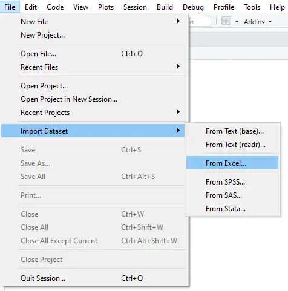

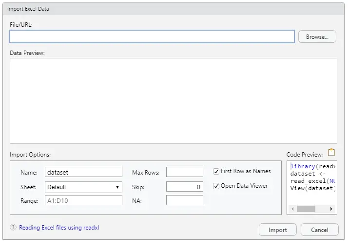

Ten en cuenta que para utilizar este procedimiento necesitas tener instalado el paquete **`readxl`**.en en cuenta que para utilizar este procedimiento necesitas tener instalado el paquete **`readxl`**.

### **Leer XLSX sin JAVA en R: readxl y openxlsx**

#### **El paquete readxl**

El paquete `readxl` forma parte del paquete `tidyverse`, creado por Hadley Wickham (científico jefe en RStudio) y su equipo. Este paquete soporta XLS via la librería de C `libxls` y archivos XLSX via el paquete `RapidXML` de C++, sin la necesidad de utilizar dependencias externas.

El paquete proporciona algunos archivos Excel (XLS y XLSX) de muestra almacenados en la carpeta de instalación del paquete, por lo que con el objetivo de ofrecer un ejemplo reproducible, en los siguientes ejemplos vamos a utilizar el archivo `clippy.xlsx`, cuya primera hoja es la siguiente:

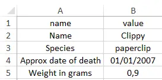

Para cargar la ruta del archivo Excel de muestra, puedes utilizar la función `readxl_example`. Una vez cargado, o una vez que tengas la ruta de tu propio archivo Excel, puedes usar la función `excel_sheets` para obtener los nombres de las hojas del archivo Excel, en caso de que lo necesites.

``` r
# install.packages("readxl")
library(readxl)

# Obtener la ruta de un archivo XLSX de ejemplo del paquete
ruta_archivo <- readxl_example("clippy.xlsx")

# Comprobar los nombres de las hojas del archivo
excel_sheets(ruta_archivo) # "list-column" "two-row-header"
```

La función genérica del paquete para **leer archivos de Excel en R** es la función `read_excel`, que \'adivina\' el tipo de archivo (XLS o XLSX) según la extensión del archivo y el archivo en sí, en ese orden.

``` r
read_excel(ruta_archivo)
```

``` r
Output
# A tibble: 4 x 2
  name                 value    
  <chr>                <chr>    
1 Name                 Clippy   
2 Species              paperclip
3 Approx date of death 39083    
4 Weight in grams      0.9 
```

El argumento `sheet` permite **especificar la hoja que quieres cargar**, pasando su nombre o el número correspondiente de la pestaña. Ten en cuenta que, por defecto, la función carga la primera hoja de Excel.

``` r
# Seleccionamos la otra hoja del Excel
read_excel(ruta_archivo, sheet = "two-row-header")
read_excel(ruta_archivo, sheet = 2) # Equivalente
```

```         
Output
# A tibble: 2 x 4
  name       species              death                 weight    
  <chr>      <chr>                <chr>                 <chr>     
1 (at birth) (office supply type) (date is approximate) (in grams)
2 Clippy     paperclip            39083                 0.9 
```

También puedes **saltar filas** con el argumento `skip` de la función:

``` r
# Saltar la primera fila
read_excel(ruta_archivo, skip = 1)
```

```         
Output
# A tibble: 3 x 2
  Name                 Clippy   
  <chr>                <chr>    
1 Species              paperclip
2 Approx date of death 39083    
3 Weight in grams      0.9  
```

Ten en cuenta que también puedes **especificar un rango de celdas** con el argumento `range`. En este caso, el argumento `skip` no se tendrá en cuenta si lo especificas.

``` r
read_excel(ruta_archivo, range = "B1:B5")
```

```         
# A tibble: 4 x 1
  value    
  <chr>    
1 Clippy   
2 paperclip
3 39083    
4 0.9 
```

Además, si quieres **evitar leer los nombres de las columnas**, puedes establecer el argumento `col_names` como `FALSE`:

``` r
read_excel(ruta_archivo, col_names = FALSE)
```

```         
Output
New names:
* `` -> ...1
* `` -> ...2
                  ...1      ...2
1                 name     value
2                 Name    Clippy
3              Species paperclip
4 Approx date of death     39083
5      Weight in grams       0.9
```

Sin embargo, es posible que hayas notado que **la salida es de clase** `tibble` (un tipo moderno de data frame). Si quieres que la salida sea de clase `data.frame`, deberás usar la función `as.data.frame` de la siguiente manera:

``` r
data <- read_excel(ruta_archivo, skip = 1) as.data.frame(data)
```

```         
Output
                  Name    Clippy
1              Species paperclip
2 Approx date of death     39083
3      Weight in grams       0.9
```

Recuerda que la función `read_excel` \'adivina\' la extensión de archivo. No obstante, si conoces la extensión del archivo que vas a leer, puedes usar la función correspondiente de las siguientes para evitar ese proceso de \'adivinación\':

``` r
# Si conoces la extensión del archivo
# usa una de estas dos funciones

# Para archivos XLS
read_xls()

# Para archivos XLSX
read_xlsx()
```

#### **El paquete openxlsx**

El paquete `openxlsx` usa `Rcpp` y, como no depende de JAVA, es una alternativa interesante al paquete `readxl` para leer un archivos Excel en R. Las diferencias respecto al paquete anterior son que la **salida es de clase** `data.frame` por defecto en lugar de `tibble` y que su uso principal no es solo la importación de archivos de Excel, ya que **también proporciona una amplia variedad de funciones para escribir, diseñar y editar archivos de Excel**.

La función para leer archivos XLSX se llama `read.xlsx`:

``` r
# install.packages("openxlsx")
library(openxlsx)

read.xlsx(ruta_archivo)
```

```         
Output
                  name     value
1                 Name    Clippy
2              Species paperclip
3 Approx date of death     39083
4      Weight in grams       0.9
```

Como en la función del paquete anterior, existen varios argumentos que puedes personalizar, como `sheet`, `skip` o `colNames`. Si quieres seleccionar celdas específicas puedes usar los argumentos `rows` y `cols`. Recuerda escribir `?read.xlsx` o `help(read.xlsx)` para obtener información adicional.

``` r
read.xlsx(ruta_archivo, cols = 1:2, rows = 2:3)
```

```         
Output
     Name    Clippy
1 Species paperclip
```

### **El paquete xlsx**

Aunque este paquete requiere que JAVA esté instalado en tu ordenador, es muy popular. Las funciones principales para importar archivos de Excel son `read.xlsx` y `read.xlsx2`. El segundo tiene ligeras diferencias en los argumentos predeterminados y hace más trabajo en JAVA, logrando un mejor rendimiento.

``` r
# install.packages("xlsx")
library(xlsx)

read.xlsx(ruta_archivo)
read.xlsx2(ruta_archivo)
```

Puedes personalizar diversos argumentos, como `sheetIndex`, `sheetName`, `header`, `rowIndex`, `colIndex`, entre otros. Ejecuta `?read.xlsx` o `help(read.xlsx)` para obtener detalles adicionales.

### **El paquete XLConnect**

Una alternativa al paquete `xlsx` es `XLConnect`, que permite escribir, leer y dar formato a archivos de Excel. Para leer un Excel en R puedes usar la función `readWorksheetFromFile` como sigue. Recomendamos ejecutar `??XLConnect` para buscar información adicional de los argumentos de cada función del paquete.

``` r
Importar una hoja una sola vez
# install.packages("XLConnect")
library(XLConnect)

data <- readWorksheetFromFile(ruta_archivo, sheet = "list-column",
                              startRow = 1, endRow = 5,
                              startCol = 1, endCol = 2)
```

En caso de que quieras cargar varias hojas, se recomienda utilizar la función `loadWorkbook` y luego cargar cada hoja con la función `readWorksheet`:

``` r
Leer varias hojas de Excel
load <- loadWorkbook(ruta_archivo)

data <- readWorksheet(load, sheet = "list-column",
                      startRow = 1, endRow = 5,
                      startCol = 1, endCol = 2)

data2 <- readWorksheet(load, sheet = "two-row-header",
                       startRow = 1, endRow = 3,
                       startCol = 1, endCol = 4)
```

Además, este paquete proporciona una función para cargar regiones con nombre de Excel. Análogo al ejemplo anterior, puedes importar solo una región con `readNamedRegionFromFile`, especificando el nombre del archivo (si el archivo está en tu directorio de trabajo) o la ruta del archivo y el nombre de la región en otro caso.

``` r
Importar una región con nombre una vez
data <- readNamedRegionFromFile(file, # Ruta del archivo
                                name, # Nombre de la región
                                ...)  # Argumentos de readNamedRegion()                                ...)  # Argumentos de readNamedRegion()
```

Si quieres cargar varias regiones con nombre, puedes cargar el libro de Excel con la función `loadWorkbook` y luego importar cada región con la función `readNamedRegion`.

``` r
Leer múltiples regiones con nombres
cargar <- loadWorkbook(ruta_archivo)

data <- readNamedRegion(cargar, name_Region_1, ...)
data2 <- readNamedRegion(cargar, name_Region_2, ...)
```

Cabe mencionar que si tienes problemas con los paquetes que requieren JAVA, puedes obtener y establecer la ruta de JAVA en R con los siguientes códigos:

``` r
# Imprime la ruta de JAVA en R
Sys.getenv("JAVA_HOME")

# Establece la ruta de JAVA
Sys.setenv(JAVA_HOME = "path_to_jre_java_folder")
```

Ten en cuenta que deberás especificar la ruta a la carpeta `jre` dentro de la carpeta `Java` de tu ordenador, que por lo general se encontrará en `Archivos de Programa`.

## **Convertir archivos XLSX a CSV en R**

Por último, también podrías convertir tus archivos de Excel a formato CSV y [leer el archivo CSV](https://r-coder.com/leer-csv-en-r/) en R. Para este propósito, puedes usar la función `convert` del paquete `rio`. Una alternativa sería guardar directamente el archivo de Excel como CSV con el menú de Microsoft Excel.

``` r
# install.packages("rio")
library(rio)

convert(ruta_archivo, "file.csv")
```

# **Exportar datos en R**

R permite trabajar con datos y almacenarlos en variables en el espacio de trabajo. Sin embargo, a veces se necesita **exportar o guardar para compartir o trabajar con los resultados en otro software**. En esta sección aprenderás **cómo exportar datos en R o RStudio**. Ten en cuenta que puedes exportar datos de R a varios formatos, como CSV, SAV, XLS, XLSX, TXT o incluso XML.

## **Guardar objetos de R**

Al trabajar con R, puedes guardar los objetos almacenados en tu espacio de trabajo. Hay tres opciones principales, dependiendo de si quieres guardar el espacio de trabajo completo, algunos objetos o solo uno.

Exportar objetos de R desde tu espacio de trabajo es muy útil cuando tu código tarda mucho tiempo en ejecutarse, como en los estudios de simulación. En consecuencia, si necesitas los resultados después de la primera ejecución, no necesitarás volver a ejecutar el código.

Primero, puedes **exportar todo el espacio de trabajo** desde R con la función `save.image` como se muestra en el siguiente bloque de código. Ten en cuenta que el archivo resultante será de tipo `RData`.

``` r
# Exportar todos los objetos (la imagen del entorno de trabajo)
save.image(file = "Objetos_R.RData")
```

En segundo lugar, si solo necesitas **exportar algunos objetos**, puedes especificarlos separados por comas con la función `save`.

``` r
# Exportar algunos objetos de R
save(x, y, file = "Dos_objetos.RData")
```

Finalmente, para **guardar solo un objeto**, se recomienda guardarlo como `RDS` con la función `saveRDS`:

``` r
# Exportar solo un objeto de R
saveRDS(x, file = "Un_objeto.rds")
```

Si especificas **`compress = TRUE`** como argumento de las funciones anteriores, el archivo se comprimirá de forma predeterminada como gzip.

## **Guardar data frame como CSV en R**

En caso de que quieras exportar un data frame como CSV en R, puedes utilizar las funciones `write.csv` o `write.csv2`.

El uso de una u otra dependerá del formato de tus datos. En algunos países usan una coma como separador decimal, por lo que no se puede guardar un CSV separado por comas en este escenario. En este caso, el CSV se crea utilizando un **punto y coma como separador** de los datos. Lo último es lo que hace la función `write.csv2`, mientras que `write.csv` usa una coma para separar los datos. En consecuencia, puedes exportar a CSV escribiendo:

``` r
df <- data.frame(x = rnorm(10), y = rnorm(10))

# Coma como separador y punto como separador decimal
write.csv(df, "mi_df.csv")

# Punto y coma como separador y coma como separador decimal
write.csv2(df, "mi_df.csv")
```

Nótese que también puedes **escribir una tabla en CSV** en R con las mismas funciones:

``` r
tb <- table(chickwts$feed)

write.csv(tb, "mi_tb.csv")

write.csv2(tb, "mi_tb.csv")
```

Recuerda escribir `?write.csv` o `help(write.csv)` para obtener más información.

En esta y las otras funciones de este tutorial, si especificas solo el nombre del archivo resultante, el archivo se guardará en el directorio de trabajo. Si prefieres otra ubicación, cambia el directorio de trabajo o especifica la ruta completa, en lugar de solo el nombre del archivo.

## **Exportar datos desde R a un archivo TXT**

Para exportar un TXT en R puedes usar la función `write.table`. Considera, por ejemplo, que quieres **exportar un data frame de R a un archivo TXT**. En este caso podrías escribir:

``` r
df <- trees[1:5, ]

write.table(df, "archivo.txt")
```

Sin embargo, si quieres imprimir en la consola lo que vas a guardar, antes de guardarlo, puedes escribir:

``` r
write.table(df)
```

```         
Output
   "Girth"  "Height"  "Volume"
"1"   8.3      70       10.3
"2"   8.6      65       10.3
"3"   8.8      63       10.2
"4"   10.5     72       16.4
"5"   10.7     81       18.8
```

Ten en cuenta que también puedes exportar un objeto, como un vector, a TXT con esta función:

``` r
x <- runif(5)
write.table(x, "vector.txt")
```

Si guardas como TXT un objeto diferente a un data frame o una matriz, se intentará convertir a data frame por defecto.

Además, hay varios argumentos que puedes personalizar. Como ejemplo, si quieres especificar la codificación y escribir la tabla sin comillas, puedes ejecutar lo que sigue:

``` r
write.table(x, "vector.txt", fileEncoding = "UTF-8", quote = FALSE)
```

## **Exportar datos de R a Excel (XLS y XLSX)**

La exportación de datos de R a Excel se puede lograr con varios paquetes. El paquete más conocido para convertir data frames o tablas en Excel es `xlsx`, que proporciona las funciones `write.xlsx` y `write.xlsx2`.

``` r
# Requiere JAVA
# install.packages("xlsx")
library(xlsx)

# Coma como separador y punto como separador decimal
write.xlsx(x,                    # Data frame a ser exportado
           file,                 # Ruta completa
           sheetName = "Sheet1", # Nombre de la hoja de Excel
           col.names = TRUE,     # Incluir los nombres de las columnas (TRUE) o no (FALSE)
           row.names = TRUE,     # Incluir los nombres de las filas (TRUE) o no (FALSE)
           append = FALSE,       # Agregar a un archivo existente (TRUE) o no (FALSE)
           showNA = TRUE,        # Si TRUE, los NA serán celdas vacías
           password = NULL)      # Contraseña como cadena de caracteres

# Punto y coma como separador y coma como separador decimal
write.xlsx2(x, file, sheetName = "Sheet1", col.names = TRUE,
            row.names = TRUE, append = FALSE, showNA = TRUE, password = NULL)
```

Como ejemplo, si quieres guardar el conjunto de datos de `cars`, puedes escribir:

``` r
write.xlsx(cars, "cars.xlsx")
```

Sin embargo, la principal desventaja del **paquete anterior es que requiere JAVA** instalado en tu ordenador, por lo que si `JAVA_HOME` no se especifica o si R no encuentra el archivo `rJava.dll`, el paquete no funcionará.

Las alternativas para exportar la salida de R a XLSX que no requieren JAVA son los paquetes `openxlsx` y `writexl`:

Por un lado, la función `write.xlsx` de `openxlsx` permite escribir un data frame o una lista de data frames en un archivo XLSX:

``` r
# install.packages("openxlsx")
library(openxlsx)

write.xlsx(data_frame, "nombre.xlsx")
```

Por otro lado, la biblioteca `writexl` proporciona la función `write_xlsx`, para exportar data frames de R a Excel:

``` r
# install.packages("writexl")
library("writexl")

write_xlsx(data_frame, "nombre.xlsx")
```

## **Exportar a SPSS desde R**

En caso de que quieras exportar a SPSS desde R, necesitarás instalar el paquete llamado `haven`, que contiene la función `write_sav`. El proceso para guardar los datos es análogo a los demás:

``` r
# install.packages("haven")
library(haven)

write_sav(mtcars, "mtcars.sav")
```

## **Guardar como STATA desde R**

En caso de que desees exportar datos de R a STATA, deberás usar la función `write.dta` del paquete `foreign` de la siguiente manera:

``` r
# install.packages("foreign")
library(foreign)

write.dta(data_frame, "mis_datos.dta")
```

## **Exportar datos de R a XML**

Para **exportar fácilmente un data frame a formato XML**, puedes usar la función `write.xml` del paquete `kulife`, indicando como primer argumento el conjunto de datos y el nombre del archivo exportado en el segundo. En este ejemplo vamos a guardar el conjunto de datos `mtcars`.

``` r
# install.packages("kulife")
library(kulife)

write.xml(mtcars, "mtcars.xml")
```

```         
Primeras filas del XML generado
<?xml version="1.0"?>
<document>
  <row>
    <mpg>21</mpg>
    <cyl>6</cyl>
    <disp>160</disp>
    <hp>110</hp>
    <drat>3.9</drat>
    <wt>2.62</wt>
    <qsec>16.46</qsec>
    <vs>0</vs>
    <am>1</am>
    <gear>4</gear>
    <carb>4</carb>
  </row>
```

No obstante, es posible que hayas notado que el archivo XML de salida no contiene los nombres de las filas del data frame, ya que el lenguaje de marcado no admite nombrarlas. Para resolver este problema, en este ejemplo puedes vincular los nombres de fila al conjunto de datos y nombrar la nueva columna como \"car\".

``` r
data <- cbind(rownames(mtcars), mtcars)
colnames(data)[1] <- "car"

write.xml(data, "mtcars.xml")
```

```         
Primeras filas del XML generado
<?xml version="1.0"?>
<document>
  <row>
    <car>Mazda RX4</car>
    <mpg>21</mpg>
    <cyl>6</cyl>
    <disp>160</disp>
    <hp>110</hp>
    <drat>3.9</drat>
    <wt>2.62</wt>
    <qsec>16.46</qsec>
    <vs>0</vs>
    <am>1</am>
    <gear>4</gear>
    <carb>4</carb>
  </row>
```

Ahora, cada fila del documento XML contendrá el nombre del coche y sus características.

# **Plot en R**

La función gráfica más básica en R es la función `plot`. Esta función tiene múltiples argumentos para configurar el gráfico final, que permiten agregar un título, cambiar las etiquetas de los ejes, personalizar colores, cambiar tipos de línea, etc.

## **Función plot en R**

La función `plot` en R permite **crear un gráfico** pasando dos vectores (de la misma longitud), un data frame, una matriz o incluso otros objetos, dependiendo de su clase o tipo de los datos de entrada. A continuación simulamos dos variables normales aleatorias llamadas `x` e `y` , que usaremos en gran parte de los ejemplos.

``` r
Datos de ejemplo
set.seed(1)

# Generamos datos de ejemplo
x <- rnorm(500)
y <- x + rnorm(500)
```

Puedes dibujar los datos creados escribiendo:

``` r
# Dibujamos los datos
plot(x, y)

# Equivalente
M <- cbind(x, y)
plot(M)
```

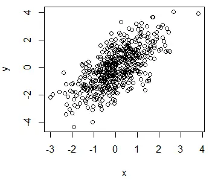

Con la función `plot` se puede crear una **amplia gama de gráficos, dependiendo de los argumentos de entrada**. En la siguiente tabla resumimos todas las posibilidades disponibles para la función `plot` de R base.

+-----------------------------------+--------------------------------------+
| **Función y argumentos**          | **Gráfico de salida**                |
+:=================================:+:====================================:+
| plot(x, y)                        | Diagrama de dispersión de\           |
|                                   | los vectores numéricos x e y         |
+-----------------------------------+--------------------------------------+
| plot(factor)                      | Gráfico de barras del factor         |
+-----------------------------------+--------------------------------------+
| plot(factor, y)                   | Diagrama de caja del vector\         |
|                                   | numérico y los niveles del factor    |
+-----------------------------------+--------------------------------------+
| plot(serie_temporal)              | Gráfico de una serie de tiempo\      |
|                                   | (clase ts)                           |
+-----------------------------------+--------------------------------------+
| plot(data_frame)                  | Gráfico de correlación\              |
|                                   | de todas las columnas\               |
|                                   | del data frame (más de dos columnas) |
+-----------------------------------+--------------------------------------+
| plot(fecha, y)                    | Traza un vector basado en fechas     |
+-----------------------------------+--------------------------------------+
| plot(función, inferior, superior) | Traza la función entre el valor\     |
|                                   | inferior y máximo especificado       |
+-----------------------------------+--------------------------------------+

Si ejecutas el siguiente código, obtendrás ejemplos de los diferentes tipos de gráfico.

``` r
# Ejemplos

par(mfrow = c(2, 3))

# Datos
mi_ts <- ts(matrix(rnorm(500), nrow = 500, ncol = 1),
              start = c(1950, 1), frequency = 12)

mis_fechas <- seq(as.Date("2005/1/1"), by = "month", length = 50)

mi_factor <- factor(mtcars$cyl)

fun <- function(x) x^2

# Diagrama de dispersión
plot(x, y, main = "Gráfico de dispersión")

# Gráfico de barras
plot(mi_factor, main = "Diagrama de barras")

# Diagrama de cajas
plot(mi_factor, rnorm(32), main = "Diagrama de cajas y bigotes")

# Gráfico de una serie temporal
plot(mi_ts, main = "Serie temporal")

# Time-based plot
plot(mis_fechas, rnorm(50), main = "Gráfico basado en fechas")

# Dibujar una función
plot(fun, 0, 10, main = "Trazar una función")

# Gráfico de correlación
plot(trees[, 1:3], main = "Matriz de correlación")

par(mfrow = c(1, 1))
```

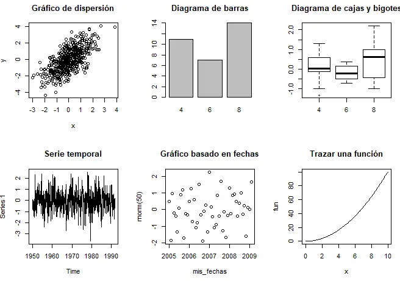

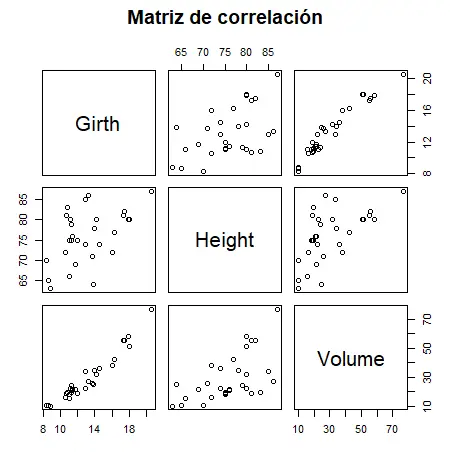

**Cuando creas varios gráficos en R base (no en RStudio), el siguiente gráfico borrará el anterior** . Sin embargo, puedes crear nuevas ventanas gráficas con las funciones **`windows`**, **`X11`** y **`quartz`** según tu sistema operativo, para resolver este problema.

## **Ventanas gráficas**

Al crear gráficos en R base, se abrirán en una nueva ventana. Sin embargo, es posible que necesites personalizar la altura y el ancho de la ventana, que por defecto es de 7 pulgadas. Para ese propósito, puedes utilizar los argumentos `height` y `width` de las siguientes funciones, dependiendo de tu sistema operativo.

Cabe destacar que en RStudio el gráfico se mostrará en el panel de gráficos, pero si utilizas la función correspondiente, el gráfico se abrirá en una nueva ventana, al igual que en R base.

``` r
windows() # Windows
X11()     # Unix
quartz()  # Mac
```

Además de poder abrir y establecer el tamaño de la ventana, estas funciones se usan para evitar sobrescribir gráficos, ya que al crear uno nuevo perderás el anterior. Ten en cuenta que en RStudio puedes navegar por todas los gráficos que hayas creado en tu sesión en el panel de gráficos

``` r
# Este gráfico se 
# abrirá en una ventana nueva
plot(x, y)

# Nueva ventana
windows()

# Otro gráfico en la nueva ventana
plot(x, x)
```

También puedes **limpiar la ventana gráfica** en R con la función `dev.off`, para borrar la ventana actual y `graphics.off` para borrar todas las gráficas y restablecer la configuración gráfica predeterminada.

``` r
# Borrar el plot actual
dev.off()

# Borrar todos los gráficos
graphics.off()
while (dev.cur() > 1) dev.off() # Equivalente
```

Nótese que la función `dev.cur` cuenta el número de dispositivos gráficos disponibles actualmente.

## **Tipos de plot en R**

Puedes **personalizar el tipo de gráfico** con el argumento `type`. **La selección del tipo dependerá de los datos que estés representando**. En el siguiente bloque de código mostramos los tipos de gráficos más comunes que se pueden crear con la función `plot` en R.

``` r
j <- 1:20
k <- j

par(mfrow = c(1, 3))

plot(j, k, type = "l", main = "type = 'l'")
plot(j, k, type = "s", main = "type = 's'")
plot(j, k, type = "p", main = "type = 'p'")

par(mfrow = c(1, 1))

par(mfrow = c(1, 3))

plot(j, k, type = "l", main = "type = 'l'")
plot(j, k, type = "s", main = "type = 's'")
plot(j, k, type = "p", main = "type = 'p'")

par(mfrow = c(1, 1))
```

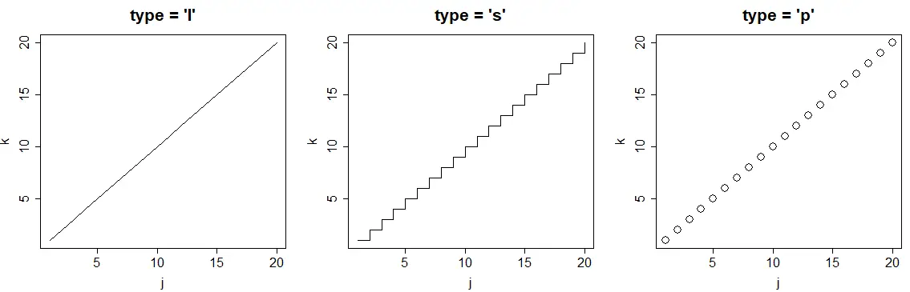

+------------------+------------------------------+
| **Tipo de plot** | **Descripción**              |
+:================:+:============================:+
| p                | Gráfico de puntos\           |
|                  | (por defecto)                |
+------------------+------------------------------+
| l                | Gráfico de líneas            |
+------------------+------------------------------+
| b                | Ambos\                       |
|                  | (puntos y líneas, separados) |
+------------------+------------------------------+
| o                | Ambos\                       |
|                  | (líneas y por encima puntos) |
+------------------+------------------------------+
| s                | Gráfico de escaleras         |
+------------------+------------------------------+
| h                | Gráfico estilo histograma    |
+------------------+------------------------------+
| n                | Gráfico vacío                |
+------------------+------------------------------+

## **El argumento pch**

El argumento `pch` permite **modificar el símbolo de los puntos en el gráfico**. Los símbolos principales se pueden seleccionar pasando los **números 1 a 25** como parámetros. También **puedes cambiar el tamaño de los símbolos** con el argumento `cex` y el **ancho de los bordes de los símbolos** (excepto los símbolos 15 a 18) con el argumento `lwd`.

``` r
r <- c(sapply(seq(5, 25, 5), function(i) rep(i, 5)))
t <- rep(seq(25, 5, -5), 5)

plot(r, t, pch = 1:25, cex = 3, yaxt = "n", xaxt = "n",
     ann = FALSE, xlim = c(3, 27), lwd = 1:3)
text(r - 1.5, t, 1:25)
```

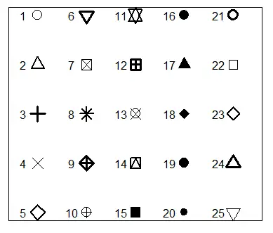

Además, **los símbolos 21 a 25 permiten establecer el ancho del borde y también el color de fondo**, con los argumentos `lwd` y `bg`, respectivamente.

``` r
plot(r, t, pch = 21:25, cex = 3, yaxt = "n", xaxt = "n", lwd = 3,
     ann = FALSE, xlim = c(3, 27), bg = 1:25, col = rainbow(25))
```


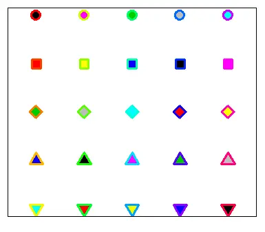

En el siguiente bloque de código mostramos un ejemplo simple de cómo personalizar uno de estos símbolos.

``` r
# Ejemplo

plot(x, y, pch = 21,
     bg = "red",   # Color de fondo
     col = "blue", # Color del borde
     cex = 3,      # Tamaño del símbolo
     lwd = 3)      # Ancho del borde
```

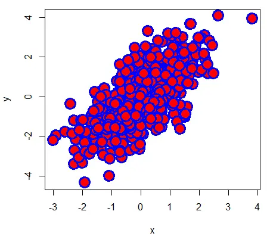

Cabe mencionar que **puedes usar cualquier caracter como símbolo**. De hecho, algunos símbolos de caracteres pueden seleccionarse usando los números 33 a 240 como valores del argumento `pch`.

``` r
# Símbolos personalizados
plot(1:5, 1:5, pch = c("☺", "❤", "✌", "❄", "✈"),
     col = c("orange", 2:5), cex = 3,
     xlim = c(0, 6), ylim = c(0, 6))
```

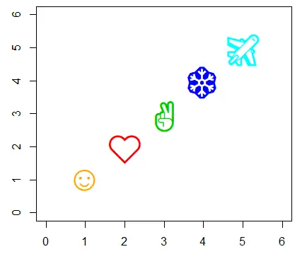

## **Título del plot en R**

Se puede agregar un título a un plot en R con el argumento `main` o con la función `title`.

``` {.r .R}
plot(x, y, main = "Mi título")

# Equivalente
plot(x, y)
title("Mi título")
```

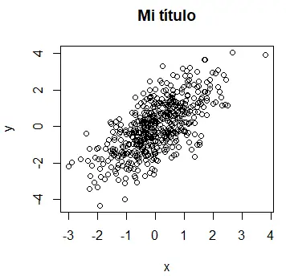

La principal diferencia entre usar la función `title` o el argumento es que **los argumentos que se pasan a la función solo afectan al título**.

Para cambiar la posición del título del gráfico puedes establecer el argumento `adj` como un valor entre 0 (izquierda) y 1 (derecha) y el argumento `line` como un valor por encima de 1.7 (valor predeterminado) para mover el título hacia arriba o un valor por debajo de 1.7 para moverlo hacia abajo. Valores negativos de `line` hacen que el título se desplace hacia abajo, entrando dentro del gráfico. Nótese que si estableces estos argumentos en la función `plot`, los cambios se aplicarán a todos los textos.

``` r
plot(x, y)
title("Mi título",
      adj = 0.75,  # Título a la derecha
      line = 0.25)
```

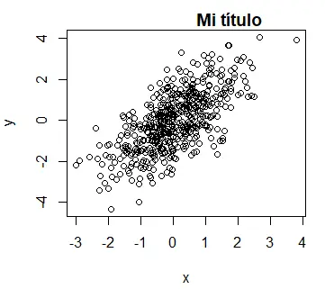

### **Título en LaTeX**

Es muy común para los científicos de datos la necesidad de **mostrar expresiones matemáticas en el título de los gráficos**. Para ese propósito puedes usar la función `expression`. Puedes buscar todas las opciones disponibles para utilizar la notación matemática similar a LaTeX con el siguiente comando de ayuda: `?plotmath`.

``` r
plot(x, y, main = expression(alpha[1] ^ 2 + frac(beta, 3)))
```

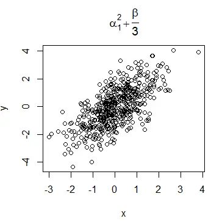

Sin embargo, verás que la sintaxis de la función es bastante diferente de la sintaxis de LaTeX. Si lo prefieres, puedes usar la función `TeX` del paquete `latex2exp`, pero ten en cuenta que esta función traduce la notación TeX a la notación de función `expression`, por lo que **los símbolos y la notación disponibles son los mismos en ambas funciones**.

``` r
# install.packages("latex2exp")
library(latex2exp)

plot(x, y, main = TeX('$\\beta^3, \\beta \\in 1 \\ldots 10$'))
```


Las expresiones de **LaTeX se pueden usar también en** los subtítulos, las etiquetas de eje o **cualquier otro texto**, como textos agregados a la gráfica.

## **Subtítulo del gráfico**

Además, puedes **agregar un subtítulo** a un plot en R con el argumento `sub` que se mostrará debajo del gráfico. También se puede agregar un subtítulo aunque no haya título principal.

``` r
plot(x, y, main = "Mi título", sub = "Mi subtítulo")

# Equivalente
plot(x, y)
title(main = "Mi título", sub = "Mi subtítulo")
```

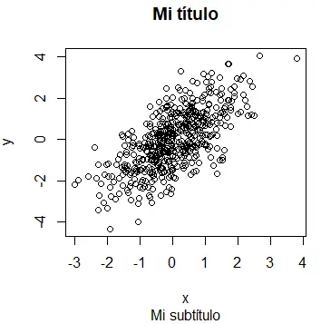

## **Ejes de los plots en R**

En los gráficos de R puedes modificar las etiquetas de los ejes X e Y, agregar y cambiar las etiquetas de los ticks (marcas) de los ejes, la escala e incluso los límites de los ejes.

### **Etiquetas de los ejes X e Y**

Por defecto, R usará los nombres de los vectores que pases a la función `plot` como etiquetas de los ejes X e Y. Sin embargo, puedes cambiarlos con los argumentos `xlab` e `ylab`.

``` r
plot(x, y, xlab = "Etiqueta del eje X", ylab = "Etiqueta del eje Y")
```

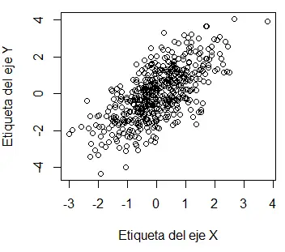

Si quieres **borrar las etiquetas de los ejes**, puedes establecerlas como una cadena de caracteres vacía o establecer el argumento `ann` como `FALSE`.

``` r
# Eliminar las etiquetas de los ejes
plot(x, y, xlab = "", ylab = "")

# Equivalente
plot(x, y, xlab = "Etiqueta del eje X", ylab = "Etiqueta del eje Y", ann = FALSE)
```

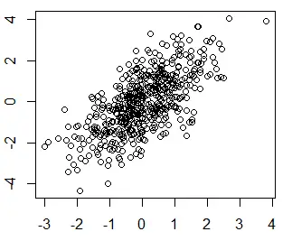

### **La función axis**

El argumento `axes` de la función `plot` puede establecerse en `FALSE` para **evitar dibujar los ejes**, por lo que, en caso de que quieras, puedas agregar solo uno de ellos con la función `axis` y personalizarlo. Pasar un `1` como argumento dibujará el eje X, pasar un `2` dibujará el eje Y, pasar un `3` agregará el eje superior y un `4` el derecho.

``` r
plot(x, y, axes = FALSE)

# Añadir el eje X
axis(1)

# Añadir el eje Y
axis(2)
```

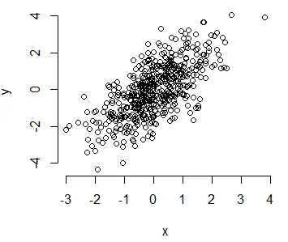

### **Cambiar los ticks**

También es posible cambiar los ticks de los ejes. Por una parte, el argumento `at` de la función axis permite indicar los puntos en los que se van a dibujar las etiquetas.

``` r
plot(x, y, axes = FALSE)
axis(1, at = -2:2)
```

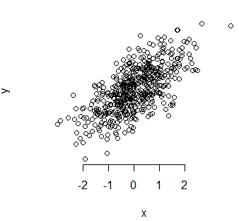

Por otra parte, la función `minor.tick` del paquete `Hmisc` permite crear ticks más pequeños entre los ticks principales:

``` r
# install.packages("Hmisc")
library(Hmisc)

plot(x, y)
minor.tick(nx = 3, ny = 3, tick.ratio = 0.5)
```

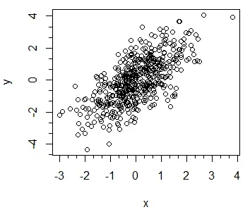

Por último, pasar un número positivo al argumento `tck` de la función `plot` permite añadir ticks interiores.

``` r
# Ticks interiores
plot(x, y, tck = 0.02)
```

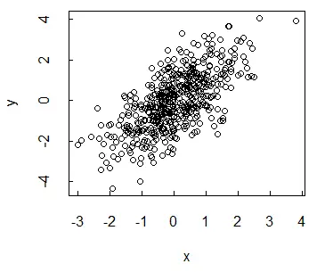

### **Eliminar etiquetas de las marcas de los ejes**

Estableciendo los argumentos `xaxt` o `yaxt` como `"n"` en la función `plot` evitará trazar las etiquetas de los ejes X e Y, respectivamente.

``` r
par(mfrow = c(1, 3))

# Eliminar las etiquetas de los ticks del eje X
plot(x, y, xaxt = "n", main = "xaxt = 'n'")

# Eliminar las etiquetas de los ticks del eje Y
plot(x, y, yaxt = "n", main = "yaxt = 'n'")

# Eliminar las etiquetas de los ticks de ambos ejes
plot(x, y, yaxt = "n", xaxt = "n", main = "xaxt = 'n', yaxt = 'n'")

par(mfrow = c(1, 1))
```

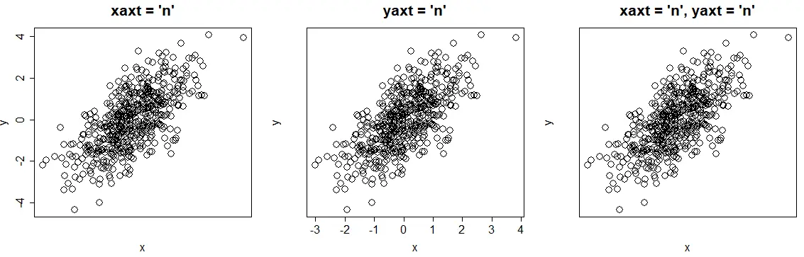

### **Cambiar las etiquetas de los ticks**

Las etiquetas de los ticks de los ejes se numerarán para seguir la numeración de tus datos. Sin embargo, **puedes modificar estas etiquetas** si es necesario con el argumento `labels` de la función `axis`. También deberás especificar dónde se mostrarán las etiquetas de los ticks con el argumento `at`.

``` r
par(mfrow = c(1, 2))

# Cambiar las etiquetas de los ticks del eje X
plot(x, y, xaxt = "n")
axis(1, at = seq(round(min(x)), round(max(x)), by = 1), labels = 1:8)

# Cambiar las etiquetas de los ticks del eje Y
plot(x, y, yaxt = "n")
axis(2, at = seq(round(min(y)), round(max(y)), by = 1), labels = 1:9)
```

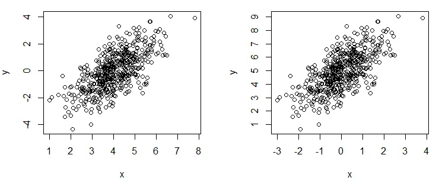

### **Rotar las etiquetas de los ejes**

El argumento `las` de la función `plot` en R te permite **rotar las etiquetas de los ejes de tus gráficos.** En el siguiente bloque de código encontrarás ejemplos y la explicación de las diferentes alternativas.

``` r
par(mfrow = c(2, 2))

plot(x, y, las = 0, main = "Paralelo")      # Paralelo a los ejes (por defecto)
plot(x, y, las = 1, main = "Horizontal")    # Horizontal
plot(x, y, las = 2, main = "Perpendicular") # Perpendicular a los ejes
plot(x, y, las = 3, main = "Vertical")      # Vertical

par(mfrow = c(1, 1))
```

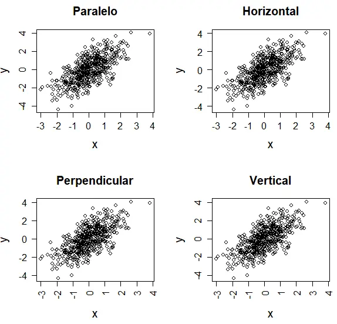

### **Límites de los ejes**

Puedes acercar o alejar el gráfico cambiando los límites de los ejes. Estos argumentos son muy útiles cuando agregas curvas a tu gráfico.

``` r
plot(x, y,
     ylim = c(-8, 8), # Eje Y desde -8 hasta 8
     xlim = c(-5, 5)) # Eje X desde -5 hasta 5
```

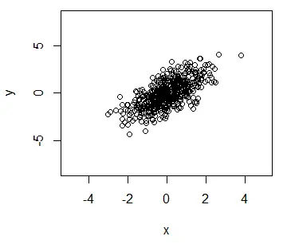

### **Cambiar la escala de los ejes**

El argumento `log` permite cambiar la escala de los ejes de un gráfico. Puedes transformar el eje X, el eje Y o ambos, de la siguiente manera:

```         
# Nuevos datos para evitar números negativos
s <- 1:25
u <- 1:25

par(mfrow = c(2, 2))

# Por defecto
plot(s, u, pch = 19,
     main = "Sin transformar")

# Log x
plot(s, u, pch = 19, log = "x", 
     cex = 2, main = "Eje X transformado")

# Log y
plot(s, u, pch = 19, log = "y",
     cex = 2, main = "Eje Y transformado")

# Log xy
plot(s, u, pch = 19, log = "xy",
     cex = 2, main = "Ambos ejes transformados")
```

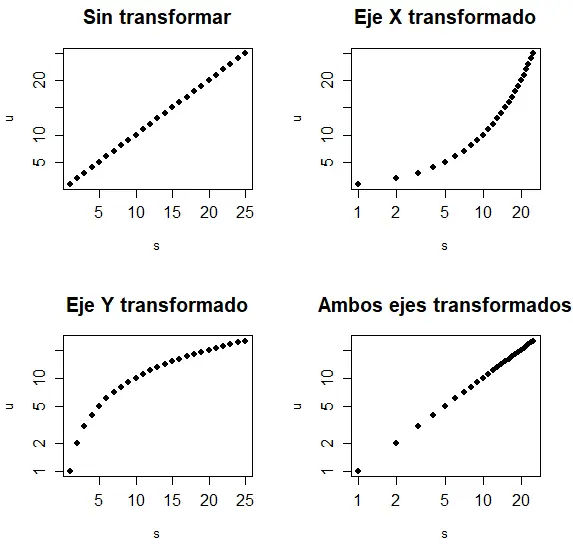

Sin embargo, puedes estar pensando que usar la función `log` es equivalente a usar el argumento, pero no lo es. Como puedes ver en el gráfico anterior, al usar el argumento `log` solo se modifica la escala, no lo datos, pero la función `log` sí los transforamará. Fíjate en la diferencia entre los ejes del siguiente gráfico y los del anterior.

``` r
par(mfrow = c(1, 3))

# Log-log
plot(log(s), log(u), pch = 19,      
     main = "log-log")
# log(x)
plot(log(s), u, pch = 19,
     main = "log(x)")
# log(y)
plot(s, log(u), pch = 19,
     main = "log(y)")

par(mfrow = c(1, 1))
```

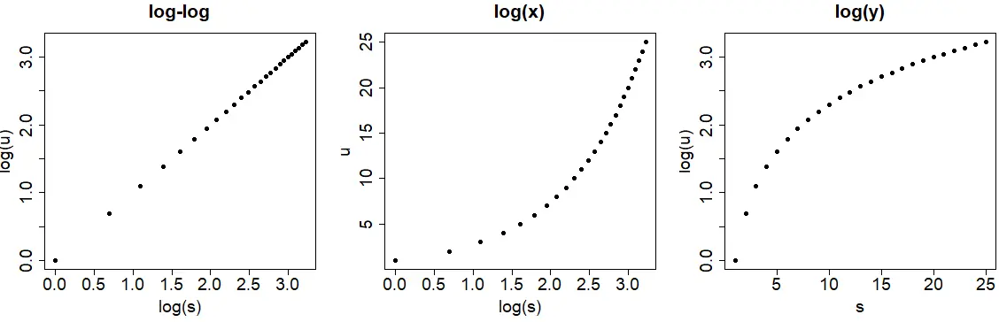

## **Fuente de texto de un plot en R**

### **Tamaño de la fuente**

Puedes cambiar el tamaño de fuente de un gráfico de R con los argumentos `cex.main`, `cex.sub`, `cex.lab` y `cex.axis` para cambiar el título, los subtítulos, las etiquetas de los ejes X e Y y los ticks de los ejes, respectivamente. Valores mayores mostrarán textos más grandes.

``` r
plot(x, y, main = "Mi título", sub = "Mi subtítulo",
     cex.main = 2,   # Tamaño del título
     cex.sub = 1.5,  # Tamaño del subtítulo
     cex.lab = 3,    # Tamaño de las etiquetas de los ejes X e Y
     cex.axis = 0.5) # Tamaño de las etiquetas de los ticks de los ejes
```

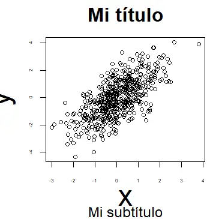

+---------------+---------------------------------------+
| **Argumento** | **Descripción**                       |
+:=============:+:=====================================:+
| cex.main      | Establece el tamaño del título        |
+---------------+---------------------------------------+
| cex.sub       | Establece el tamaño del subtítulo     |
+---------------+---------------------------------------+
| cex.lab       | Establece el tamaño de las\           |
|               | etiquetas de los ejes                 |
+---------------+---------------------------------------+
| cex.axis      | Establece el tamaño de las etiquetas\ |
|               | de los ticks de los ejes              |
+---------------+---------------------------------------+

### **Estilo de las fuentes**

Además, puedes cambiar el estilo de fuente de los gráficos de R con el argumento `font`. Puedes establecer este argumento en 1 para texto sin formato, 2 en negrita (predeterminado), 3 en cursiva y 4 en negrita y cursiva. Este argumento no aplica al título.

``` r
par(mfrow = c(1, 3))

plot(x, y, font = 2, main = "Negrita") # Negrita
plot(x, y, font = 3, main = "Cursiva") # Cursiva
plot(x, y, font = 4, main = "Negrita y cursiva") # Negrita y cursiva

par(mfrow = c(1, 1))
```

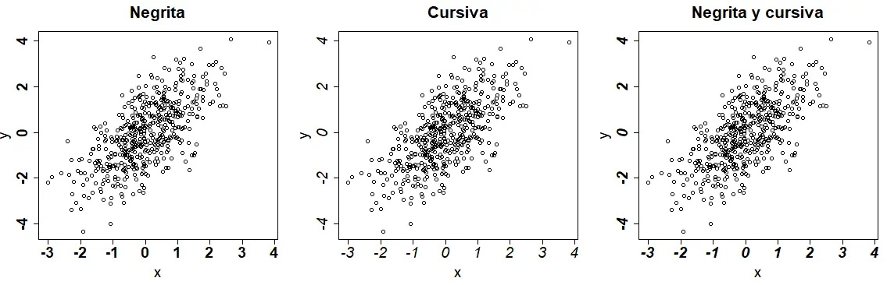

También puedes especificar el estilo de cada uno de los textos del gráfico con los argumentos `font.main`, `font.sub`, `font.axis` y `font.lab`.

``` r
plot(x, y,
     main = "Mi título",
     sub = "Subtítulo",
     font.main = 1, # Estilo de fuente del título
     font.sub  = 2, # Estilo de fuente del subtítulo
     font.axis = 3, # Estilo de fuente de los ejes X e Y
     font.lab  = 4) # Estilo de fuente de los ticks de los ejes
```

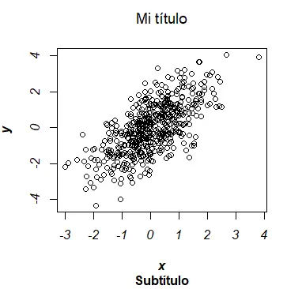

Ten en cuenta que, de forma predeterminada, el título de los gráficos está en negrita.

| **Estilo de fuente** |  **Descripción**  |
|:--------------------:|:-----------------:|
|          1           |    Texto plano    |
|          2           |      Negrita      |
|          3           |      Cursiva      |
|          4           | Negrita y cursiva |

### **Familia de las fuentes**

El argumento `family` permite cambiar la familia de las fuentes de los textos de los plots en R. Incluso puedes agregar más texto con otras familias de fuentes. Ten en cuenta que puedes ver la lista completa de fuentes disponibles en R con el comando `names(pdfFonts())`, pero algunas de ellas pueden no estar instaladas en tu ordenador.

``` r
# Fuentes
names(pdfFonts())

plot(x, y, family = "mono")
text(-2, 3, "Un texto", family = "sans")
text(-2, 2, "Más texto", family = "serif")
text(1, -4, "Otro texto", family = "HersheySymbol")
```

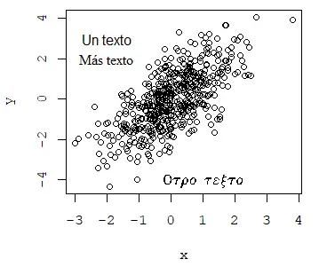

Una alternativa es usar el paquete `extrafont`:

``` r
# install.packages("extrafont")
library(extrafont)

# Autodetecta las fuentes disponibles en el ordenador
# Esto puede tardar varios minutos en ejecutarse
font_import()

# Nombres de las fuentes
fonts()

# Data frame con los nombres de las fuentes
fonttable()
```

## **Colorear plots en R**

En la sección sobre símbolos `pch` explicamos cómo configurar el argumento `col`, que permite **modificar el color de los símbolos de los gráficos**. En R, hay una amplia variedad de [paletas de colores](https://r-charts.com/es/paletas-colores/). Con la función `colors` puedes devolver [todos los colores](https://r-charts.com/es/colores/) base de R disponibles. Además, se puede usar la función `grep` (una función para expresiones regulares) para devolver un vector de colores que contenga algún texto concreto.

``` r
# Devolver todos los colores
colors()

# Devolver todos los colores que contengan 'green'
cl <- colors()
cl[grep("green", cl)]

# Gráfico con puntos azules
plot(x, y, col = "blue")
plot(x, y, col = 4) # Equivalente
plot(x, y, col = "#0000FF") # Equivalente
```

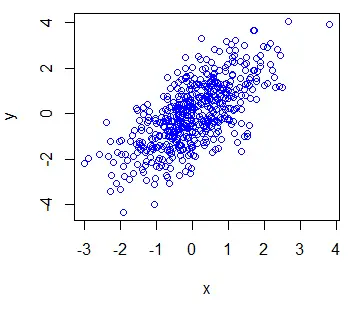

Puedes especificar colores con su nombre en inglés (**`"red"`**, **`"green"`**, ...), con números (1 a 8) o incluso con su referencia HEX (**`"#FF0000"`**, **`"#0000FF"`**, ...).

También puedes modificar los colores de los textos con las funciones `col.main`, `col.sub`, `col.lab` y `col.axis` e incluso cambiar el color de la caja del gráfico con el argumento `fg`.

``` r
plot(x, y, main = "Título", sub = "Subtítulo",
    pch  = 16,
    col = "red",            # Color del símbolo
    col.main = "green",     # Color del título
    col.sub = "blue",       # Color del subtítulo
    col.lab = "sienna2",    # Color de las etiqetas de los ejes
    col.axis = "maroon4",   # Color de las etiquetas de los ticks
    fg = "orange")          # Color de la caja
```

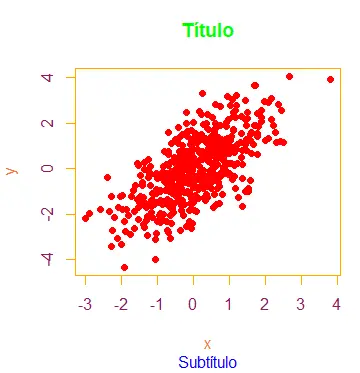

### **Colorear según grupo**

Si tienes variables numéricas etiquetadas por grupo, puedes **dibujar las observaciones separadas por color**, pasando al argumento `col` la variable categórica (como factor). Los colores dependerán de los factores.

``` r
# Creamos un data frame con grupos
grupo <- ifelse(x < 0 , "coche", ifelse(x > 1, "avión", "barco"))
df <- data.frame(x = x, y = y, grupo = factor(grupo))

# Color por grupo
plot(df$x, df$y, col = df$grupo, pch = 16)

# Cambiar los colores de los grupos
colores <- c("red", "green", "blue")
plot(df$x, df$y, col = colores[df$grupo], pch = 16)

# Cambiar el orden del color, cambiando el orden de los niveles
plot(df$x, df$y, pch = 16,
     col = colores[factor(grupo, levels = c("coche", "barco", "avión"))])
```

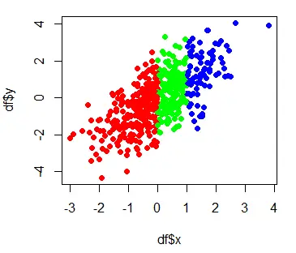

Nótese que, por defecto, los niveles de los factores **están ordenados alfabéticamente**, por lo que en este caso el orden del vector de colores no es el orden de los colores en el gráfico, ya que la primera fila del data frame corresponde a \"coche\", que es el tercer nivel. Por lo tanto, **si cambias el orden de los niveles, puedes modificar el orden de los colores**.

Desde R 4.0.0 el argumento **`stringAsFactors`** de la función **`data.frame`** es **`FALSE`** por defecto, por lo que deberás convertir la variable categórica a factor si quieres colorear las observaciones por grupo como en el ejemplo anterior.

### **Cambiar el color de fondo**

Hay dos formas de cambiar el color de fondo de los gráficos en R: cambiando todo el color o cambiando el color de fondo de la caja. Para cambiar todo el color puedes usar el siguiente comando:

``` r
# Color de fondo gris claro
par(bg = "#f7f7f7")

# Añadimos nuestro gráfico
plot(x, y, col = "blue", pch = 16)

# Volvemos al color original
par(bg = "white")
```

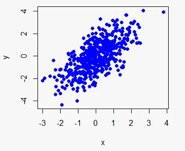

Sin embargo, el resultado quedará más bonito si solo se colorea la caja de un determinado color, aunque esto requiere más codigo. Nótese que la función `plot.new` permite crear un gráfico vacío en R y que `par(new = TRUE)` permite añadir un gráfico sobre otro.

``` r
# Creamos un plot vacío
plot.new()

# Coloreamos la caja
rect(par("usr")[1], par("usr")[3],
     par("usr")[2], par("usr")[4],
     col = "#f7f7f7") # Color

par(new = TRUE)

# Añadimos nuestro gráfico
plot(x, y, col = "blue", pch = 16)
```

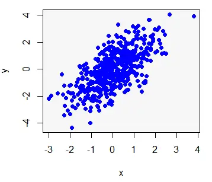

## **Añadir líneas o curvas a un gráfico en R**

Puedes agregar una línea a un diagrama en R con la función `lines`. Supón que quieres agregar una línea roja a una gráfica, desde (-4, -4) a (4, 4), para ello podrías escribir:

``` r
plot(x, y)
lines(-4:4, -4:4, lwd = 3, col = "red")
```

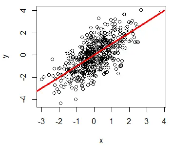

### **Grosor de línea**

El ancho o grosor de línea en R se puede cambiar con el argumento `lwd`. Valores más grandes trazarán una línea más ancha.

``` r
M <- matrix(1:36, ncol = 6)

matplot(M, type = c("l"), lty = 1, col = "black", lwd = 1:6)

# Solo para indicar los anchos de línea en el gráfico
j <- 0
invisible(sapply(seq(4, 40, by = 6),
                 function(i) {
                   j <<- j + 1
                   text(2, i, paste("lwd =", j))}))
```

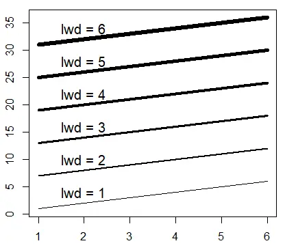

### **Tipo de línea**

Al trazar un gráfico de tipo \"l\", \"o\", \"b\", \"s\", o al agregar una nueva línea sobre un gráfico ya creado, puedes elegir entre diferentes **tipos de línea en R**, estableciendo el argumento `lty` de 0 a 6.

``` r
matplot(M, type = c("l"), lty = 1:6, col = "black", lwd = 3)

# Solo para indicar los tipos de líneas en el gráfico
j <- 0
invisible(sapply(seq(4, 40, by = 6),
                 function(i) {
                   j <<- j + 1
                   text(2, i, paste("lty =", x))}))
```

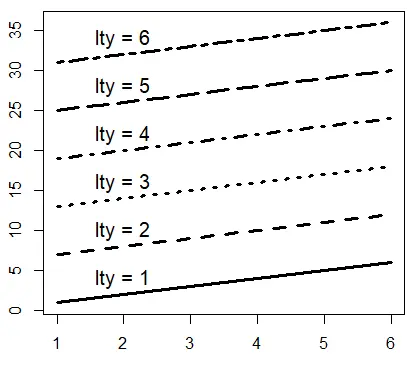

| **Tipo** |         **Descripción**          |
|:--------:|:--------------------------------:|
|    0     |            Sin línea             |
|    1     |    Línea sólida (por defecto)    |
|    2     |        Línea discontinua         |
|    3     |          Línea punteada          |
|    4     |   Línea discontinua con puntos   |
|    5     |    Líneas largas discontinuas    |
|    6     | Línea discontinua con dos trazos |

## **Añadir texto a un plot en R**

Por un lado, la función `mtext` permite agregar texto a todos los lados del gráfico. Hay 12 combinaciones (3 en cada lado de la caja: alineadas a la izquierda, al centro y a la derecha). Solo necesitas cambiar los argumentos `adj` y `side` para obtener la combinación que necesites.

Por otro lado, la función `text` permite agregar texto o fórmulas dentro del gráfico en alguna posición configurando las coordenadas. En el siguiente bloque de código se muestran algunos ejemplos de ambas funciones.

``` r
plot(x, y, main = "Título principal", cex = 2, col = "blue")

#---------------
# Función mtext
#---------------

# Abajo centro
mtext("Texto abajo", side = 1)

# Izquierda centro
mtext("Texto izquierda", side = 2)

# Arriba centro
mtext("Texto arriba", side = 3)

# Derecha centro
mtext("Texto derecha", side = 4)


# Abajo izquierda
mtext("Texto abajo izquierda", side = 1, adj = 0)

# Arriba derecha
mtext("Texto arriba derecha", side = 3, adj = 1)


# Arriba, con separación
mtext("Texto arriba", side = 3, line = 2.5)

#--------------
# Función text
#--------------

# Texto en las coordenadas (-2, 2)
text(-2, 2, "Más texto")

# Fórmula en las coordenadas (3, -3)
text(3, -3, expression(frac(alpha[1], 4)))
```

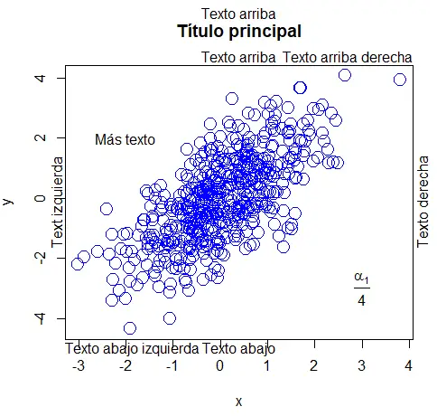

### **Etiquetar puntos en R**

En esta sección, aprenderás a **etiquetar observaciones en R**. Para ello, puedes usar la función `text`, **indicar las coordenadas y la etiqueta de los puntos de datos** en el argumento `labels`. Con el argumento `pos` puedes establecer la posición de la etiqueta con respecto al punto, siendo 1 debajo, 2 a la izquierda, 3 arriba y 4 a la derecha.

``` r
attach(USJudgeRatings)

# Creamos el plot
plot(FAMI, INTG,
     main = "Familiaridad con la ley vs Integridad judicial",
     xlab = "Familiaridad", ylab = "Integridad",
     pch = 18, col = "blue")

# Asignamos las etiquetas
text(FAMI, INTG,
     labels = row.names(USJudgeRatings),
     cex = 0.6, pos = 4, col = "red")

detach(USJudgeRatings)
```

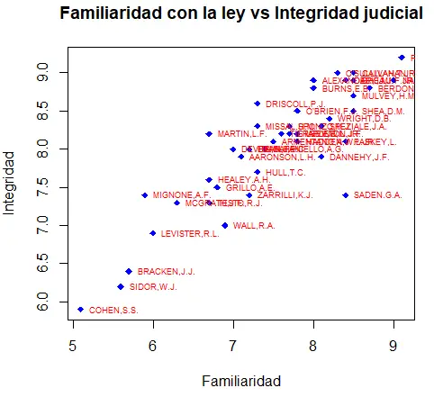

También puedes **etiquetar puntos de datos individuales** si indexas los elementos de la función `text` de la siguiente manera:

``` r
attach(USJudgeRatings)

plot(FAMI, INTG,
     main = "Familiaridad con la ley vs Integridad judicial",
     xlab = "Familiaridad", ylab = "Integridad",
     pch = 18, col = "blue")

# Seleccionamos los índices de los elementos que queremos etiquetar
seleccionados <- c(10, 15, 20)

# Indexamos los elementos con el vector
text(FAMI[seleccionados], INTG[seleccionados],
     labels = row.names(USJudgeRatings)[seleccionados],
     cex = 0.6, pos = 4, col = "red")

detach(USJudgeRatings)
```

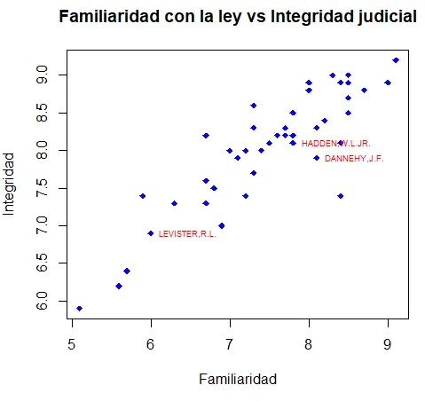

## **Cambiar el tipo de caja con el argumento bty**

El argumento `bty` permite cambiar el tipo de caja de los gráficos de R. Hay diversas opciones, resumidas en la siguiente tabla:

| **Tipo de caja** |      **Descripción**       |
|:----------------:|:--------------------------:|
|      \"o\"       | Caja entera (por defecto)  |
|      \"7\"       |      Arriba y derecha      |
|      \"L\"       |     Izquierda y abajo      |
|      \"U\"       | Izquierda, abajo y derecha |
|      \"C\"       | Arriba, izquierda y abajo  |
|      \"n\"       |          Sin caja          |

La forma de los caracteres \"7\", \"L\" y \"U\" representan la forma de los bordes que dibujan.

``` r
par(mfrow = c(2, 3))

plot(x, y, bty = "o", main = "Por defecto")
plot(x, y, bty = "7", main = "bty = '7'")
plot(x, y, bty = "L", main = "bty = 'L'")
plot(x, y, bty = "U", main = "bty = 'U'")
plot(x, y, bty = "C", main = "bty = 'C'")
plot(x, y, bty = "n", main = "bty = 'n'")

par(mfrow = c(1, 1))
```

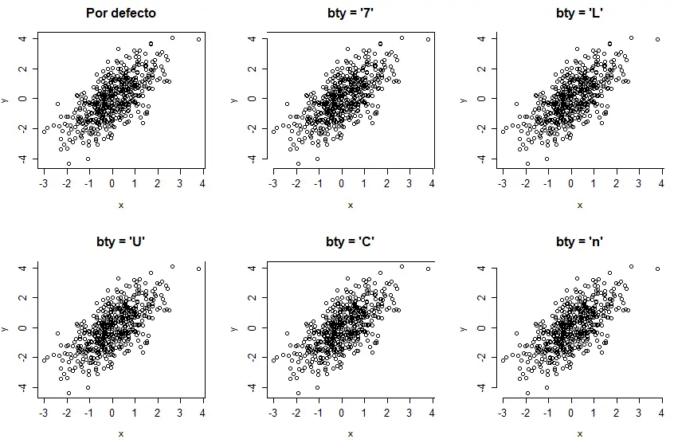

Ten en cuenta que en otros gráficos, como en el caso de los boxplots, deberás especificar el argumento `bty` dentro de la función `par`.

## **Añadir una leyenda a un plot en R**

Por último, revisaremos cómo añadir una leyenda a un plot de R con la función `legend`. Puedes establecer las coordenadas en las que quieres agregar la leyenda o especificar `"top"`, `"bottom"`, `"topleft"`, `"topright"`, `"bottomleft"` o `"bottomright"` . También puedes especificar muchos argumentos como en la función `plot`. Como ejemplo, puedes cambiar el argumento `bty` en la leyenda, o el color de fondo con el argumento `bg`, entre otros.

``` r
plot(x, y, pch = 19)
lines(-4:4, -4:4, lwd = 3, col = "red")
lines(-4:1, 0:5, lwd = 3, col = "green")

# Añadimos la leyenda
legend("bottomright", legend = c("rojo", "verde"),
       lwd = 3, col = c("red", "green"))
```

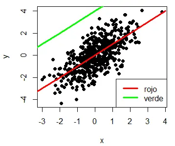

# **Añadir leyenda en R**

La leyenda de un gráfico ayuda a comprender qué series o grupos corresponden a cada barra, línea, cuadro u observaciones, según su tipo, color o ambos. 

## **La función legend() en R**

La función `legend` permite agregar una leyenda a un gráfico en R base. La sintaxis resumida de la función con los argumentos más comunes se describe en el siguiente bloque:

``` r
legend(x, y,   # Coordenadas (x también acepta palabras clave)
       legend, # Vector con el nombre de cada grupo
       fill,   # Crea rectángulos en la leyenda con los colores especificados
       col = par("col"), # Color de las líneas o símbolos
       border = "black", # Color del borde de los rectángulos
       lty, lwd,         # Tipo y ancho de línea
       pch,              # Añade símbolos pch a las líneas o rectángulos
       bty = "o",        # Tipo de caja de la leyenda (bty = "n" elimina el borde)
       bg = par("bg")    # Color de fondo de la leyenda
       box.lwd = par("lwd"), # Ancho de línea de la leyenda
       box.lty = par("lty"), # Tipo de línea de la leyenda
       box.col = par("fg"),  # Color de línea de la leyenda
       cex = 1,          # Tamaño de la leyenda
       horiz = FALSE     # Leyenda horizontal (TRUE) o vertical (FALSE)
       title = NULL      # Título de la leyenda
)
```

Ten en cuenta que hay más argumentos que puedes utilizar, pero hemos listado los más comunes, así que escribe `args(legend)`, `?legend` o `help(legend)` para obtener información adicional.

En las siguientes secciones explicaremos cómo personalizar los argumentos más habituales de la función. Para evitar repetir el código, utilizaremos la siguiente función para dibujar dos funciones de Bessel en R $(J_0(x)$ y $J_2(x))$:

``` r
Función de ejemplo para crear un gráfico
plotl <- function(...) {
    x <- seq(0, 30, 0.01)
    plot(besselJ(x, 0), col = 2, type = "l",
         lwd = 2, ylab = "Jn(x)", xlab = "", ...)
    lines(besselJ(x, 2), col = 3, type = "l", lwd = 2, lty = 2)
}
 
plotl()
```

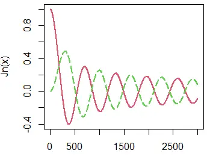

Los gráficos de este artículo se han creado con ventanas de ancho y alto de 4 pulgadas (10.16 cm): **`windows(4, 4)`**, a menos que se indique lo contrario. En caso de utilizar otros tamaños, es posible que necesites ajustar algunos argumentos para obtener los mismos resultados.

## **Posición, líneas y relleno**

Al agregar una leyenda a un diagrama, hay dos formas principales de modificar la posición de la leyenda con la función `legend`.

Por una parte, puedes establecer el argumento `x` como `"top"`, `"topleft"`, `"topright"`, `"bottom"`, `"bottomleft"`, `"bottomright"`, `"left"`, `"right"` o `"center"`. En este escenario no necesitas establecer el argumento `y`.

``` r
plotl()
legend(x = "topright",         # Posición
       legend = c("J0", "J2"), # Textos de la leyenda
       lty = c(1, 2),          # Tipo de líneas
       col = c(2, 3),          # Colores de las líneas
       lwd = 2)                # Ancho de las líneas
```

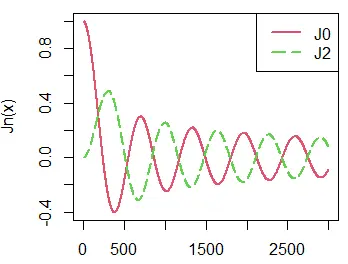

Por otra parte, puedes usar los argumentos `x` e `y` como coordenadas para indicar donde se debe dibujar la leyenda.

``` r
Posición con coordenadas
plotl()
legend(x = 1900, y = 0.8, # Coordenadas
       legend = c("J0", "J2"),
       lty = c(1, 2),
       col = c(2, 3),
       lwd = 2)
```

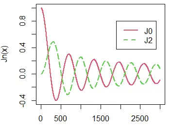

Sin embargo, también puedes modificar la distancia al margen, en caso de que no quieras que la leyenda esté pegada al margen, con el argumento `inset`:

``` r
Modificar margen
plotl()
legend("topright",   # Posición
       inset = 0.05, # Distancia desde el margen como fracción de la región del gráfico
       legend = c("J0", "J2"),
       lty = c(1, 2),
       col = c(2, 3),
       lwd = 2)
```

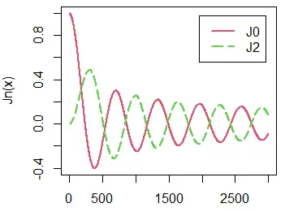

Si las líneas del gráfico contienen algún símbolo puedes agregarlos a la leyenda con el argumento **`pch`**.

Ten en cuenta que si necesitas **agregar una leyenda a un diagrama de barras, gráfico de sectores o diagrama de caja**, puedes usar el argumento `fill` en lugar de establecer líneas.

``` r
barplot(table(mtcars$gear), col = 2:4)

legend("topright",
       legend = c(3, 4, 5),
       fill = 2:4,       # Color de los rectángulos
       border = "black") # Color del borde de los rectángulos
```

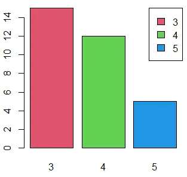

Si tu gráfico tiene líneas de sombreado, también puede agregarlas a la leyenda con el argumentos `density` y modificar el ángulo con el argumento `angle` de la función.

``` r
barplot(table(mtcars$gear), col = 2:4, density = 30, angle = 90)

legend("topright",
       legend = c(3, 4, 5),
       fill = 2:4,
       density = 30, # Líneas de sombreado
       angle = 90)   # Ángulo de las líneas de sombreado
```

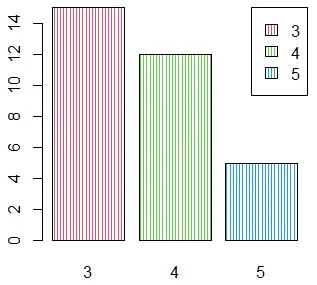

## **Título de la leyenda en R**

En caso de que necesites añadir un título a la leyenda, para agregar alguna descripción de los elementos de la leyenda, puedes usar el argumento `title`. Ten en cuenta que puedes personalizar el color del texto con el argumento `title.col` y que puedes hacer un ajuste horizontal del título con el argumento `title.adj`.

``` r
plotl()
legend("topright", legend = c("J0", "J2"),
       title = "TÍTULO LEYENDA", # Título
       title.adj = 0.5,          # Ajuste horizontal del título
       title.col = "blue",       # Color del título
       lty = c(1, 2), col = c(2, 3), lwd = 2)
```


Nótese que el argumento `text.font` permite modificar la fuente del texto de la leyenda.

## **Bordes y colores de la leyenda**

Por defecto, la leyenda se dibuja dentro de un rectángulo negro. No obstante, puedes cambiar el tipo, el ancho y el color de la línea del rectángulo con los argumentos `box.lty`, `box.lwd` y `box.col`, respectivamente.

``` r
plotl()
legend(1500, 0.9,
       legend = c("J0", "J2"),
       box.lty = 2, # Tipo de línea de la caja
       box.lwd = 2, # Ancho de línea de la caja
       box.col = 4, # Color de línea de la caja
       lty = c(1, 2),
       col = c(2, 3),
       lwd = 2)
```


También puedes deshabilitar el borde del recuadro configurando el argumento `bty` como `"n"`. Ten en cuenta que una alternativa es establecer `box.lty = 0`.

``` r
Eliminar borde de la leyenda
plotl()
legend(1500, 0.9,
       legend = c("J0", "J2"),
       bty = "n", # Elimina la línea de la caja
       lty = c(1, 2),
       col = c(2, 3),
       lwd = 2)
```


Además, si `byt` es diferente de `"n"`, puedes establecer el color de fondo del cuadro de la leyenda. Ten en cuenta que si no quieres mostrar el borde, puedes configurarlo con el color de fondo del gráfico o el color de fondo del cuadro o, en otro caso, establecer `box.lty = 0`.

``` r
Color de fondo de la leyenda
plotl()
legend("topright", inset = 0.05,
       legend = c("J0", "J2"),
       bg = rgb(1, 0, 0, alpha = 0.15), # Color de fondo
       box.col = "white",               # Color del borde
       lty = c(1, 2),
       col = c(2, 3),
       lwd = 2)
```


## **Cambiar el tamaño de la leyenda**

Para cambiar el tamaño de la leyenda en R, puedes utilizar el argumento `cex`. Los valores mayores que 1 crearán a una leyenda más grande y menores, leyendas más pequeñas que las predeterminadas.

``` r
Tamaño de la leyenda

plotl()
legend("topright",
       legend = c("J0", "J2"),
       lty = c(1, 2),
       col = c(2, 3),
       cex = 1.5, # Cambiar el tamaño
       lwd = 2)
```


## **Añadir leyenda fuera del gráfico en R**

A veces, la representación cubre todo el área del gráfico. En ese caso, es una buena idea **mover la leyenda fuera del gráfico**. Para ello, deberás utilizar la función `par`, modificar los márgenes de la gráfica y los argumentos `inset` y `xpd` de la siguiente manera:

``` r
# Ventana gráfica más ancha que alta
windows(width = 4.5, height = 4)

# Guardamos los parámetros gráficos actuales
opar <- par(no.readonly = TRUE)

# Cambiar los márgenes del gráfico (el cuarto es el margen derecho)
par(mar = c(5, 5, 4, 6))

plotl()
legend(x = "topright",
       inset = c(-0.45, 0), # Tendrás que ajustar el primer valor
                            # dependiendo del tamaño de tu gráfico
       legend = c("J0", "J2"), 
       lty = c(1, 2),
       col = c(2, 3),
       lwd = 2,
       xpd = TRUE) # Tienes que especificar este parámetro gráfico
                   # para poner la leyenda fuera del gráfico

# Volvemos a los parámetros gráficos por defecto
on.exit(par(opar))
```


Recuerda que para gráficos de otros tamaños necesitarás ajustar los márgenes y el el argumento **`inset`** para obtener la gráfica correcta.

Una alternativa es **poner la leyenda debajo del gráfico**. Para ello, puedes establecer los márgenes, el argumento `inset` y la posición como sigue:

``` r
windows(width = 4, height = 4)

# Guardamos los parámetros gráficos actuales
opar <- par(no.readonly = TRUE)

# Cambiamos los márgenes del gráfico (el primero es el margen inferior)
par(mar = c(6, 4.1, 4.1, 2.1))

plotl()
legend(x = "bottom",
       inset = c(0, -0.5), # Tendrás que ajustar el segundo valor
                           # dependiendo del tamaño de tu gráfico
       legend = c("J0", "J2"), 
       lty = c(1, 2),
       col = c(2, 3),
       lwd = 2,
       xpd = TRUE, # Tienes que especificar este parámetro gráfico
                   # para poner la leyenda fuera del gráfico
       horiz = TRUE) # Leyenda horizontal. También puedes establecer
                     # el número de columnas con el argumento ncol
                     # si horiz = FALSE
# Volvemos a los parámetros gráficos por defecto
on.exit(par(opar))
```


## **Añadir dos leyendas en R**

Puedes agregar dos o más leyendas a un gráfico, simplemente ejecutando la función `legend` varias veces con diferentes argumentos. En el siguiente ejemplo, agregaremos dos funciones de Bessel más y añadiremos una nueva leyenda para ellas.

``` r
plotl()
lines(besselJ(seq(0, 30, 0.01), 3), col = 4, type = "l", lwd = 2, lty = 2)
lines(besselJ(seq(0, 30, 0.01), 4), col = 5, type = "l", lwd = 2, lty = 2)

legend("topright",
       legend = c("J0", "J2"),
       lty = c(1, 2), col = c(2, 3), lwd = 2)

legend("top",
       legend = c("J3", "J4"),
       lty = 2, col = c(4, 5), lwd = 2)
```


Ten en cuenta que también puedes agregar más leyendas fuera del gráfico, en caso de que las leyendas no quepan dentro:

``` r
# Hacemos la ventana gráfica mas ancha que alta
windows(width = 4.5, height = 4)

# Guardamos los parámetros gráficos actuales
opar <- par(no.readonly = TRUE)
par(mar = c(5, 5, 4, 6))

# Creamos el gráfico
plotl()
lines(besselJ(seq(0, 30, 0.01), 3), col = 4, type = "l", lwd = 2, lty = 2)
lines(besselJ(seq(0, 30, 0.01), 4), col = 5, type = "l", lwd = 2, lty = 2)

# Agregamos la primera leyenda
legend(x = "topright",
       inset = c(-0.45, 0),
       legend = c("J0", "J2"), 
       lty = c(1, 5), col = c(2, 3),
       lwd = 2, xpd = TRUE
)

# Añadimos la segunda leyenda
legend(x = "right",
       inset = c(-0.45, 0),
       legend = c("J3", "J4"), 
       lty = 2, col = c(4, 5),
       lwd = 2, xpd = TRUE
)

# Volvemos a los parámetros gráficos originales
on.exit(par(opar))
```


## **Agregar etiquetas como leyenda**

También puede agregar una leyenda a un gráfico de una manera diferente. En el caso de que tengas un gráfico con varias líneas, puedes agregar una leyenda cerca de cada línea para identificarla. Para ello, puedes utilizar la función `legend` tantas veces como líneas haya de la siguiente manera:

``` r
plotl(xlim = c(0, 4000))

legend(2800, 0.05, legend = "J0", bty = "n")
legend(2800, 0.25, legend = "J2", bty = "n")
```


Una alternativa es usar la función `text` y especificar el texto y la posición. E.g. `text(3500, -0.075, "J0")`.

## **Añadir más información a una leyenda**

Por último, cabe mencionar que, si es necesario, puedes agregar más información a una gráfica a modo de leyenda. Para ese propósito, puedes modificar los márgenes del gráfico y agregar texto adicional con la función `text`.

``` r
# Ventana más alta que ancha
windows(width = 4, height = 5.5)

# Guardamos los parámetros gráficos actuales
opar <- par(no.readonly = TRUE)

# Márgenes del gráfico (el primero es el margen inferior)
par(mar = c(12, 4.1, 4.1, 2.1))

#Gráfico
plotl()

# Leyenda debajo del gráfico
legend(x = "bottom",
       inset = c(0, -0.5), # Tendrás que ajustar el primer valor
                           # dependiendo del tamaño de la ventana gráfica
       legend = c("J0", "J2"), 
       lty = c(1, 2),
       col = c(2, 3),
       lwd = 2,
       xpd = TRUE, # Tienes que especificar este parámetro gráfico
                   # para poner la leyenda fuera del gráfico
       horiz = TRUE) # Leyenda horizontal. También puedes establecer
                     # el número de columnas con el argumento ncol
                     # si horiz = FALSE

# Añadimos información adicional
par(xpd = TRUE)
text(1500, -1.5, "Puedes añadir información adicional\n sobre el gráfico o la leyenda")

# Volvemos a los parámetros gráficos por defecto
on.exit(par(opar))
```


