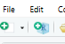
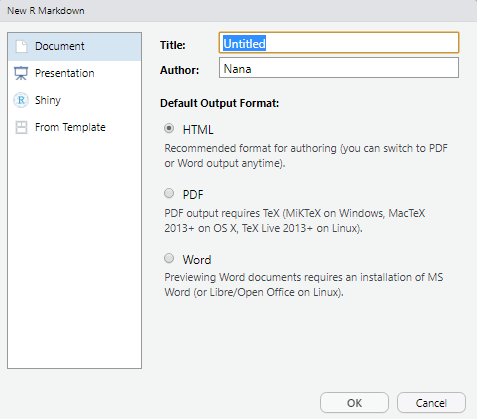

# Informes autoreproducibles con R Markdown

Cuando estamos trabajando en análisis de datos, generalmente buscamos incluir estos resultados en informes para compartir con el resto del equipo o para el futuro.

Hasta ahora, hemos trabajado escribiendo únicamente en Scripts de R, esto es útil, sin embargo a la hora de tomar notas no es la manera más amigable. Además si tuviésemos que escribir un informe con todo lo aprendido en este taller incluyendo ejemplos prácticos y análisis tomaría mucho trabajo ordenar todo el material y acomodarlo en un informe.

Con RStudio podemos escribir informes formales que incorporen el análisis y los resultados en un documento único. A pesar de que podemos lograr esto mismo en Word o con LAtex puede ser un proceso más tedioso y llevar mucho tiempo.

Crear una página web (como un archivo html) usando R markdown hace que el todo sea mas sencillo. El reporte puede ser muy largo, así que figuras altas que no cabrían normalmente en una página, pueden incluirse en tamaño original, ya que el lector las puede ver simplemente desplazando la página (con el scroll). Dar formato es simple y fácil de modificar, por lo que podemos dedicar más tiempo a nuestros análisis y no a la redacción de informes.

Lo ideal es que estos informes de análisis sean reproducibles. Es decir, si se encuentra un error o se mejora el análsis en algún aspecto, se puede volver a compilar el informes sin necesidad de reconstruir todo el informe. Para hacer estos informes se usa la herramienta **knitr** que permite mezclar texto y código en el mismo documento. Knitr permite combinar cualquier texto con cualquier código, pero lo recomendable es usar R Markdonw, que fue creado para crear páginas web y otros formatos.

## Crear un archivo R Markdown

Para esta sección vamos a seguir la clase paso a paso en un documento nuevo.

En RStudio:

1.  Nuevo archivo 

2.  Seleccione R Markdown y va a tener un cuadro de diálogo similar a este 

### Componentes básicos de R Markdown

El componente de texto inicial tiene las intrucciones básicas para R: título, autor, fecha y el tipo de output. (html es para páginas web)

```         
---
title: "prueba"
author: "Jorge"
date: "4/28/2021"
output: html_document
---
```

Los cambios de estética y formato se hacen en esta sección de código.

-   Para hacer **negrita** se usan dos asteriscos antes y después de lo que vayamos a resaltar.
-   Para *itálicas* se usa guión bajo antes y después.

También se puede hacer listas con puntos usando un asterisco o un guíon antes de cada punto así:

```         
* Punto 1 
* Punto 2

- Punto 1
- Punto 2
```

también se pueden hacer listas numeradas así:

```         
1. A
1. B
1. C
```

Automáticamente entiende que es una lista numerada y asigna los números.

Una parte muy importante de los informes es poder separarlo por secciones y subsecciones así:

```         
# Título
## Sección principal
### Subsección
#### Sub-subsección
```

se verá así:

\- \### Título

-## Sección principal

-## Subsección

-## Sub-subsección

### Otros elementos

-   Añadir un hipervínculo: `[text to show](http://the-web-page.com)`
-   Añadir una imagen: ``
-   Hacer subíndices (F~2~) usando el símbolo \~ (alt 126) y superíndices (F^2^) usando el símbolo \^ (alt 94) de la siguiente forma:

```         
F~2~
F^2^
```

-   Ecuaciones con [LaTeX] (<http://www.latex-project.org/>): \$ \$ para insertar ecuaciones matemáticas, como $E = mc^2$

### Insertar cógido R

Puede insertar una sección de código R en el documento haciendo uso de la siguiente notación:

\`\`\`{r}

lineas_de_código

\`\`\`

Esa sección de código en particular se puede ejecutar posando el cursor sobre la línea de interés y presionando ctrl+enter.

Cuando se ejecuta el documento (usando el botón "knit" o presionando Ctrl+shift+k), todo el código R se ejecutará, si se producen figuras o salidas se insertarán en el documento final.

```{r}
var1 = 1+1
```

Este fragmento de código tiene una variedad de parámetros para cambiar la forma en la que se ejecuta

-   Usar echo=FALSE para evitar que se muestre el código en sí ({r, echo=FALSE}).

-   Usar results="hide" para evitar que se impriman los resultados.

-   Usar eval=FALSE para únicamente mostrar el código mostrado pero no ejecutarlo.

-   Usar warning=FALSE y message=FALSE para ocultar cualquier advertencia o mensajes producidos

-   Usar fig.height y fig.width para controlar el tamaño de las figuras producidas (en pulgadas).

```{r}
plot(cars)
```

Para opciones que se quieran usar repetidamente se puede aplicar de manera global así:

\`\`\`{r global_options, echo=FALSE}

knitr::opts_chunk\$set(message=FALSE, warning=FALSE, echo=FALSE, results="hide", fig.width=11)

\`\`\`

Puede usar el formato \` r instruccionEnR \` para definir un fragmento de código en línea, por ejemplo: \` r sqrt(var1) \`. El código será ejecutado y reemplazado con el valor del resultado. (**Aquí es importante eliminar el primer espacio antes del caracter "r" sino les producirá un error al compilar**)

Otros recursos:

-   <https://rmarkdown.rstudio.com/>

-   <http://kbroman.org/knitr_knutshell/>

-   <https://rstudio.com/resources/webinars/getting-started-with-r-markdown/>

# **Gráfico de dispersión en R**

**Los diagramas o gráficos de dispersión**, también conocidos como nubes de puntos, scatter plots o scatter chart por su nombre en inglés, **representan las observaciones de las variables** (generalmente dos, pero también pueden ser tres).

## **¿Cómo hacer un gráfico de dispersión en R?**

Puedes crear un diagrama de dispersión en R con la función `plot`, especificando los valores de x en el primer argumento y los valores de y en el segundo, siendo x e y vectores numéricos de la misma longitud.

Al pasar estos parámetros, la función `plot` creará un gráfico de dispersión de forma predeterminada. También puedes **especificar el símbolo de las observaciones** de datos o incluso **el color**, entre otros parámetros gráficos.

Considera el modelo \$Y = 2 + 3X\^2+ ε\$, siendo Y la variable dependiente, X la variable independiente y ε un término de error, tal que $X ∼ U (0,1)$ y $ε ∼ N(0,0.25_).$

```{r}
set.seed(12)

n <- 100
x <- runif(n)
eps <- rnorm(n, 0, 0.25)

y <- 2 + 3 * x^2 + eps
```

Para dibujar las observaciones generadas podemos escribir:

```{r}
plot(x, y, pch = 19, col = "black")
plot(y ~ x, pch = 19, col = "black") # Equivalente
```


### **Nube de puntos en R con colores por grupo**

Si tienes una variable que clasifica las observaciones en grupos, puedes establecerla como parámetro del argumento `col` para dibujar los **puntos con diferentes colores** dependiendo de su grupo, o incluso establecer diferentes símbolos según el grupo.

```{r}
grupo <- as.factor(ifelse(x < 0.5, "Grupo 1", "Grupo 2"))
```

```{r}
plot(x, y, pch = as.numeric(grupo), col = grupo)
```

### **Gráfico de dispersión con curva de regresión**

Como dijimos en la introducción, el uso principal de los diagramas de dispersión en R es **verificar la relación entre variables**. Para ese propósito, **puedes añadir líneas de regresión** (o agregar curvas en caso de estimaciones no lineales) con la función `lines`, que permite personalizar el ancho de línea con el argumento `lwd` o el tipo de línea con el argumento `lty`, entre otros argumentos.

En este ejemplo, vamos a ajustar un modelo lineal y otro no paramétrico con las funciones `lm` y `lowess` respectivamente, con los argumentos predeterminados.

```{r}
plot(x, y, pch = 19, col = "gray52")

# Modelo subyacente
lines(seq(0, 1, 0.05), 2 + 3 * seq(0, 1, 0.05)^2, col = "2", lwd = 3, lty = 2)

# Ajsute lineal
abline(lm(y ~ x), col = "orange", lwd = 3)

# Ajuste suavizado
lines(lowess(x, y), col = "blue", lwd = 3)

# Leyenda
legend("topleft", legend = c("Teórico", "Lineal", "Suavizado"),
       lwd = 3, lty = c(2, 1, 1), col = c("red", "orange", "blue"))
```

Además, puedes agregar la correlación de Pearson que existe entre las variables, calculándola con la función `cor`. Luego puedes colocar la salida en algunas coordenadas del gráfico con la función `text`.

```{r}
# Calculamos la correlación entre las variables
Corr <- cor(x, y)

# Creamos el gráfico y añadimos el valor calculado
plot(x, y, pch = 19)
text(paste("Correlación:", round(Corr, 2)), x = 0.2, y = 4.5)
```

### **Añadir múltiples series al gráfico de dispersión**

También se pueden agregar más datos al gráfico original con la función `points`, que añadirá los nuevos puntos sobre el gráfico anterior, respetando la escala original.

```{r}
set.seed(1)

plot(x, y, pch = 19)

n <- 200

x2 <- runif(n)
y2 <- 2.5 + x2 + rnorm(n, 0, 0.1)

points(x2, y2, col = "green", pch = 19)
```

También podrías agregar los datos al conjunto de datos original y clasificar las observaciones para dibujar todas al mismo tiempo y con colores diferentes para cada serie.

### **Diagrama de dispersión en R con barras de error**

**Agregar barras de error a un gráfico de dispersión en R** es bastante sencillo. Considera que tienes 10 grupos con media gaussiana y desviación típica también gaussiana, como en el siguiente ejemplo. Puedes graficar los datos y especificar el límite del eje Y como el rango de la barra inferior y superior. Luego, deberás usar la función `arrows` de la siguiente manera para crear las barras de error.

```{r}
mis_datos <- 1:10
media <- rnorm(10)
desv <- rnorm(10, 1, 0.1)

plot(mis_datos, media,
     ylim = range(c(media - desv, media + desv)),
     pch = 16)

# Barras de error
arrows(x0 = mis_datos, y0 = media - desv, x1 = mis_datos, y1 = media + desv,
       length = 0.15, code = 3, angle = 90)
```

### **Diagrama de dispersión conectado en R**

Un gráfico de dispersión conectado es similar a un gráfico de líneas, pero **los puntos de corte están marcados con puntos u otro símbolo**. Para ese propósito, puedes establecer el argumento `type` como `"b"` y especificar el símbolo que prefieras con el argumento `pch`.

Recuerda usar este tipo de gráfico cuando tenga sentido (cuando las variables que quieras dibujar estén ordenadas correctamente), o los resultados no serán los esperados.

```{r}
set.seed(1)

x3 <- 0:10
y3 <- (0:10) ^ 1.45 + rnorm(11)
y4 <- (0:10) ^ 1.15 + rnorm(11)
y5 <- (0:10) ^ 1.05 + rnorm(11)

plot(x3, y3,  type = "b", col = 2 , lwd = 3, pch = 1)
lines(x3, y4, type = "b", col = 3 , lwd = 3, pch = 1)
lines(x3, y5, type = "b", col = 4 , lwd = 3, pch = 1)
```

Si prefieres unir los puntos con flechas puedes usar la siguiente función:

```{r}
# Función para conectar lo puntos con flechas
arrowsPlot <- function(x, y, lwd = 1, col = 1, angle = 20, length = 0.2) {
  invisible(sapply(1:length(x),
    function(i) arrows(x[i], y[i], x[i + 1], y[i + 1], lwd = lwd,
                       col = col, angle = angle, length = length)))
}

plot(x3, y3, col = 2, lwd = 3, pch = "")
arrowsPlot(x3, y3, col = 2, lwd = 3)

lines(x3, y4, col = 3, lwd = 3)
arrowsPlot(x3, y4, col = 3, lwd = 3)

lines(x3, y5, col = 4 , lwd = 3)
arrowsPlot(x3, y5, col = 4 , lwd = 3)
```

Este tipo de gráficos también son interesantes cuando quieres **mostrar la trayectoria que dibujan dos variables a lo largo del tiempo**.

Considera, como ilustración, que deseas mostrar la popularidad de un artista frente a los álbumes vendidos a lo largo del tiempo. Podrías dubujar algo como lo siguiente:

```{r}
# Datos de ejemplo
x4 <- ifelse(x3 < 5, x3, rev(x3 / 3))
y5 <- ifelse(y3 < 5, y3 ^ 3, rev(y3 + 5))

# Creando el gráfico de puntos conectados
plot(x4, y5, yaxt = "n", xaxt = "n", pch = "",
     xlab = "Popularidad", ylab = "Ventas", xlim = c(-1, 5.5))
arrowsPlot(x4, y5, col = 3, lwd = 3)

# Añadiendo los años a cada punto
text(x4 + 0.3, y5, 1970:1980)
```

## **Diagrama de dispersión suavizado**

La función `smoothScatter` es una función de R base que colorea el diagrama de dispersión según una estimación tipo núcleo de la densidad.

Los siguientes ejemplos muestran cómo usar los argumentos más básicos de la función. Ten en cuenta que, como otros métodos no paramétricos, deberás seleccionar una ventana. Aunque la función proporciona un ventana predeterminada, puedes personalizarla con el argumento de `bandwidth`.

```{r}
smoothScatter(x, y)
```

```{r}
smoothScatter(x, y, pch = 19,
              transformation = function(x) x ^ 0.5, # Escala
              colramp = colorRampPalette(c("#f7f7f7", "aquamarine"))) # Colores
```

### **Mapa de calor con un scatterplot**

Con la función `smoothScatter` también puedes crear un mapa de calor. Para ello, deberás especificar una paleta de colores de la siguiente manera:

```{r}
smoothScatter(x, y, transformation = function(x) x ^ 0.4,
              colramp = colorRampPalette(c("#000099", "#00FEFF", "#45FE4F",
                                           "#FCFF00", "#FF9400", "#FF3100")))
```

## **La funcion scatterplot**

Una alternativa para crear gráficos de dispersión en R es usar la función `scatterplot` del paquete `car`, que muestra automáticamente las curvas de regresión y permite **agregar boxplots marginales** al diagrama de dispersión.

```{r}
# install.packages("car")
library(car)

scatterplot(y ~ x)
scatterplot(x, y) # Equivalente
```

Por defecto, la función dibuja tres estimaciones (estimación de la media lineal y no paramétrica y la varianza condicional) con gráficos de de caja marginales, todo con el mismo color.

Para **personalizar el diagrama de dispersión**, utiliza los argumentos `col` y `pch` para cambiar el color y el símbolo de los puntos, respectivamente. Además, puedes pasar los argumentos como lista a los argumentos `regLine` y `smooth` para personalizar los parámetros gráficos de las estimaciones correspondientes.

```{r}
scatterplot(x, y,
           col = 1,   # Color de los puntos
           pch = 15,  # Símbolo
           regLine = list(col = "green", # Color de la regresión lineal
                          lwd = 3),      # Ancho de la línea
           smooth = list(col.smooth = "red",   # Color de la estimación no paramétrica de la media
                         col.spread = "blue")) # Color de la estimación no paramétrica de la varianza
```

Asimismo, en caso de que quieras eliminar alguna de las estimaciones, establece el argumento correspondiente como `FALSE`.

```{r}
scatterplot(x, y,
            smooth = FALSE,  # Borra la estimación suavizada
            regLine = FALSE) # Borra la estimación lineal
```

También puedes poner un solo boxplot marginal con el argumento `boxplots`, que por defecto es `"xy"`. Si lo configuras como `"x"`, solo se mostrará el diagrama de caja del eje X. Lo mismo para el eje Y, si establece el argumento en `"y"`. Si no quieres ningún diagrama de caja, pasa `""` al argumento.

```{r}
scatterplot(x, y,
            boxplots = "x") # Boxplot marginal del eje X
```

En caso de que tengas grupos que categoricen los datos, puedes crear estimaciones de regresión para cada grupo:

```{r}
scatterplot(y ~ x | grupo)
```

Ten en cuenta que puedes deshabilitar la leyenda estableciendo `legend = FALSE`.

Además, puedes deshabilitar el grid o agregar una elipse con los argumentos `grid` y `ellipse`, respectivamente.

```{r}
scatterplot(x, y,
            grid = FALSE,   # Eliminar el grid
            ellipse = TRUE) # Dibujar elipses
```

## **Matriz de dispersión en R**

Cuando se trabaja con múltiples variables, es común dibujar múltiples diagramas de dispersión dentro de una matriz de dispersión, que mostrarán cada variable frente a otra para [visualizar la correlación entre las variables](https://r-coder.com/grafico-correlacion-r/).

En R se puede crear un diagrama de dispersión con múltiples variables con la función `pairs`. El nombre de la función viene del inglés (pares), ya que estos gráficos también se conocen como "diagramas de dispersión por pares".

```{r}
pairs(~disp + wt + mpg + hp, data = mtcars)
```

Además, en caso de que tu conjunto de datos contenga una variable de tipo factor, puedes especificar la variable en el argumento `col` de la siguiente manera para dibujar los grupos con un color diferente.

```{r}
 pairs(~disp + wt + mpg + hp, col = factor(mtcars$am), pch = 19, data = mtcars)
```

Una alternativa es utilizar la función `scatterplotMatrix` del paquete `car`, que añade estimaciones de densidad tipo kernel en la diagonal.

```{r}
install.packages("car")
library(car)

scatterplotMatrix(~ disp + wt + mpg + hp, data = mtcars)
```

Para personalizarlo podemos usar los argumentos correspondientes:

```{r}
scatterplotMatrix(~ disp + wt + mpg + hp, data = mtcars,
                  diagonal = FALSE,             # Eliminar las estimaciones tipo núcleo
                  regLine = list(col = "green", # Color de la línea de regresión
                                 lwd = 3),      # Ancho de la línea de regresión
                  smooth = list(col.smooth = "red",   # Color de la media no paramétrica
                                col.spread = "blue")) # Color de la varianza no paramétrica
```

Otra alternativa es utilizar la función `cpairs` del paquete `gclus`.

```{r}
# install.packages("gclus")
library(gclus)
data <- mtcars[c(1, 3, 5, 6)] # Variables numéricas
# cpairs(data) # Alternativa a pairs()

corr <- abs(cor(data)) # Correlación en valor absoluto
corr
colors <- dmat.color(corr)
order <- order.single(corr)

cpairs(data, order, panel.colors = colors, gap = 0.5,
       main = "Variables ordenadas y coloreadas por correlación") 
```

## **Scatter plot en ggplot2**

La creación de un gráfico de dispersión con la librería `ggplot2` se puede lograr con la función `geom_point`. Además, puedes dividir los grupos por color pasando la función `aes` con el grupo como parámetro del argumento `colour`.

```{r}
# install.packages("ggplot2")
library(ggplot2)

mi_df <- data.frame(x = x, y = y, grupo = grupo)

ggplot(mi_df, aes(x = x, y = y)) +
  geom_point(aes(colour = grupo)) + # Puntos y colores por grupo
  scale_color_discrete("Grupos") +  # Cambiar el título de la leyena
  xlab("Variable X") +              # Etiqueta del eje X
  ylab("Variable Y")  +             # Etiqueta del eje Y
  theme(axis.line = element_line(colour = "black", # Cambia el tema por defecto
                                 size = 0.24))
```

## **Gráfico de dispersión 3D**

Con las librerías `scatterplot3d` y `rgl` se pueden crear **gráficos de dispersión 3D en R**. La función scatterplot3d permite crear un gráfico 3D estático de tres variables. Puedes ver la lista completa de argumentos de la función ejecutando `?scatterplot3d`.

```{r}
# install.packages("scatterplot3d")
library(scatterplot3d)

set.seed(2)
x <- rnorm(1000)
y <- rnorm(1000, mean = 100)
z <- rnorm(1000)

scatterplot3d(x, y, z, pch = 19, color = "blue")
```

Una alternativa es utilizar la función `plot3d` del paquete `rgl` que permite una visualización interactiva. Puedes rotar, acercar y alejar el diagrama de dispersión. Esto es muy útil para buscar patrones en datos tridimensionales.

```{r}
# install.packages("rgl")
library(rgl)

plot3d(x, y, z,      # Datos
       type = "s",   # Tipo de gráfico
       radius = 0.1, # Radio de las observaciones
       col = "lightblue",   # Color de las observaciones
       xlab ="X axis lab",  # Etiqueta del eje X
       ylab = "Y axis lab", # Etiqueta del eje Y
       zlab = "Z axis lab") # Etiqueta del eje Z
```

# **Gráfico de barras en R**

Cuando una variable toma pocos valores, es común resumir la información con una tabla de frecuencias que se puede representar con un gráfico de barras en R. Este tipo de gráficos se suelen utilizar, por ejemplo, para representar precipitaciones y temperaturas (si añadimos una curva por encima), en lo que se conoce como climogramas.

## **La función barplot en R**

Para crear un gráfico de barras en R, puedes usar la función de R base `barplot`. En este ejemplo, vamos a **crear un diagrama de barras a partir de un data frame**. Concretamente vamos a usar el conocido conjunto de datos `mtcars`.

En primer lugar, carga los datos y crea una tabla para la columna `cyl` con la función de `table`.

```{r}
# Cargamos los datos
data(mtcars)
attach(mtcars)

# Tabla de frecuencias
mi_tabla <- table(cyl)
mi_tabla
```

Recuerda que para crear un diagrama de barras en R puedes usar la función `barplot` y establecer como parámetro la tabla creada anteriormente para **mostrar la frecuencia absoluta** de los datos.

Sin embargo, si prefieres un **gráfico de barras con porcentajes** en el eje vertical (la frecuencia relativa), puedes usar la función `prop.table` y multiplicar el resultado por 100 de la siguiente manera.

```{r}
# Una fila, dos columnas
par(mfrow = c(1, 2))

# Gráfico de barras de frecuencia absoluta
barplot(mi_tabla, main = "Frequencia absoluta",
        col = rainbow(3))

# Gráfico de barras de frecuencia relativa
barplot(prop.table(mi_tabla) * 100, main = "Frequencia relativa (%)",
        col = rainbow(3))

par(mfrow = c(1, 1))
```

Ten en cuenta que también puedes crear un **diagrama de barras a partir de un factor** con la función `plot`.

```{r}
plot(factor(mtcars$cyl), col = rainbow(3))
```

Además, por una parte, podríamos agregar curvas sobre el gráfico de barras para representar otra variable, como sucede con la temperatura en el caso de los climogramas.

En este caso vamos a dibujar una línea sobre el gráfico que hemos hecho con nuestra tabla.

```{r}
barp <- barplot(mi_tabla,                     # Guarda los valores de X que
                main = "Frequencia absoluta", # representan el centro de 
                col = rainbow(3))             # cada barra           
                                                         
lines(barp, c(5, 4, 12), type = "o", lwd = 3)
```

Por otra parte, también podríamos mostrar los números correspondientes a la altura de las barras con la función `text` de la siguiente manera:

```{r}
barp <- barplot(mi_tabla, col = rainbow(3), ylim = c(0, 15))
text(barp, mi_tabla + 0.5, labels = mi_tabla)
```

Por último, podría resultar interesante añadir un grid debajo de las barras del gráfico con la función `grid`.

```{r}
barp <- barplot(mi_tabla, col = rainbow(3), ylim = c(0, 15))
grid(nx = NA, ny = NULL, lwd = 1, lty = 1, col = "gray")
barplot(mi_tabla, col = rainbow(3), ylim = c(0, 15), add = TRUE)
```

### **Título, etiquetas y colores del gráfico de barras**

Al igual que otros gráficos, puedes especificar una amplia variedad de **parámetros gráficos**, como etiquetas de eje, un título o personalizar los ejes. En el bloque de código anterior personalizamos los colores del diagrama de barras con el parámetro `col`. Puedes establecer los colores que prefieras con un vector o usar la función `rainbow` con el número de barras como parámetro como lo hicimos nosotros o usar otras paletas de colores. También puedes cambiar el color del borde de las barras con el argumento `border`.

```{r}
barplot(mi_tabla,                               # Datos
        main = "Gráfico de barras",             # Título
        xlab = "Número de cilindros",           # Etiqueta del eje X
        ylab = "Frecuencia",                    # Etiqueta del eje Y
        border = "black",                       # Color del borde de las barras
        col = c("darkgrey", "darkblue", "red")) # Color para cada barra
```

### **Cambiar las etiquetas de cada grupo**

La etiqueta de cada grupo se puede cambiar con el argumento `names.arg`. En nuestro ejemplo, los grupos están etiquetados con números, pero podemos cambiarlos escribiendo algo como lo siguiente:

```{r}
barplot(mi_tabla, names.arg = c("cuatro", "seis", "ocho")) 
```

### **Espacio y ancho de las barras**

También se puede **modificar el espacio entre barras o el ancho de las barras** con los argumentos `width` y `space`.

```{r}
par(mfrow = c(1, 2))  # Ancho de las barras (por defecto: width = 1) barplot(mi_tabla, main = "Cambiar el ancho de las barras",         col = rainbow(3), width = c(0.4, 0.2, 1))  # Espacio entre las barras barplot(mi_tabla, main = "Cambiar el espacio entre barras",         col = rainbow(3), space = c(1, 1.1, 0.1))  par(mfrow = c(1, 1))
```

El vector **`space`** **representa el espacio de la barra respecto a la anterior**, por lo que el primer elemento no se trendrá en cuenta.

### **Gráfico de barras a partir de una lista o un data frame**

Además, puedes **crear un diagrama de barras directamente con las variables de un data frame o incluso una matriz**, pero ten en cuenta que **la variable debe ser el recuento de algún evento o característica**.

En el siguiente ejemplo, contamos el número de vehículos por color y los dibujamos con un gráfico de barras. Usaremos cada color de los coches para colorear las barras correspondientes.

```{r}
df <- data.frame(ColorCoche = c("rojo", "verde", "blanco", "azul"),
                 num = c(3, 5, 9, 1))
# df <- as.list(df) # Equivalente

barplot(height = df$num, names = df$ColorCoche,
        col = c("red", "green", "white", "blue"))
```

### **Gráfico de barras horizontal en R**

Por defecto, los gráficos de barras en R se dibujan verticalmente. Sin embargo, es común representar gráficos de barras horizontales. Puedes rotar 90º el gráfico y crear un gráfico de barras horizontales estableciendo el argumento `horiz` como `TRUE`.

```{r}
barplot(mi_tabla, main = "Gráfico de barras horizontal",
        ylab = "Número de cilindros", xlab = "Frecuencia",
        horiz = TRUE) # Gráfico de barras horizontal
```

### **Leyenda del gráfico de barras**

Se puede agregar una leyenda a un diagrama de barras en R con el argumento `legend.text`, donde puedes especificar los nombres que quieres agregar a la leyenda. Ten en cuenta que **en RStudio la gráfica resultante puede ser ligeramente diferente**, ya que por ejemplo el fondo de la leyenda será blanco en lugar de transparente.

```{r}
barplot(mi_tabla, xlab = "Número de cilindros",
        col = rainbow(3),
        legend.text = rownames(mi_tabla)) # Leyenda
```

Nótese que, al usar el argumento **`legend.text`**, **la leyenda puede superponerse al diagrama de barras** .

El método más fácil para resolver este problema en este ejemplo es mover la leyenda a la izquierda. Esto se puede lograr con el argumento `args.legend`, donde puedes establecer parámetros gráficos dentro de una lista. Puedes establecer la posición en `top`, `bottom`, `topleft`, `topright`, `bottomleft` y `bottomright`.

```{r}
barplot(mi_tabla, xlab = "Número de cilindros",
        col = rainbow(3),
        legend.text = rownames(mi_tabla),
        args.legend = list(x = "top"))
```

De manera equivalente, se puede lograr el diagrama anterior con la función `legend` de la siguiente manera, con los argumentos `legend` y `fill`.

```{r}
barplot(mi_tabla, xlab = "Número de cilindros",
        col = rainbow(3))
legend("top", legend = rownames(mi_tabla), fill = rainbow(3))
```

Sin embargo, este enfoque **solo funciona bien si la leyenda no se superpone a las barras en esas posiciones**. Un mejor enfoque es **mover la leyenda a la derecha, fuera del gráfico de barras**. Puedes hacer esto configurando el argumento `inset` dentro de una lista pasada como parámetro al argumento `args.legend` de la siguiente manera.

```{r}
par(mar = c(5, 5, 4, 10))
barplot(mi_tabla, xlab = "Número de cilindros",
        col = rainbow(3),
        legend.text = rownames(mi_tabla), # Valores de la leyenda
        args.legend = list(x = "topright", inset = c(-0.20, 0))) # Argumentos de la leyenda
```

También podrías **cambiar los límites de los ejes** con los argumentos `xlim` e `ylim` para gráficos horizontales y verticales, respectivamente, pero ten en cuenta que en este caso el valor que pases dependerá del número y del ancho de las barras. Recuerda que si asignas un `barplot` a una variable puedes conocer los puntos del eje X que representan el centro de cada barra.

```{r}
barplot(mi_tabla, xlab = "Número de cilindos",
        col = rainbow(3),
        legend.text = rownames(mi_tabla), xlim = c(0, 4.25))
```

Otra alternativa para mover la leyenda es ponerla debajo del gráfico de barras con las funciones layout, par y plot.new. Este enfoque es más avanzado que los otros y es posible que debas borrar los parámetros gráficos antes de la ejecución del código para obtener la gráfica correcta, ya que éstos se cambiarán.

```{r}
# dev.off()
# opar <- par(no.readonly = TRUE)
plot.new()
layout(rbind(1, 2), heights = c(10, 3))
barplot(mi_tabla, xlab = "Número de cilindros",
        col = rainbow(3))

par(mar = c(0, 0, 0, 0))
plot.new()
legend("top", rownames(mi_tabla), lty = 1,
       col = c("red", "green", "blue"), lwd = c(1, 2))
# dev.off()
# on.exit(par(opar))
```

**Histograma en R**

Un histograma en R es el gráfico más habitual para representar datos continuos. Este tipo de gráfico es similar a un diagrama de barras, pero que representa las frecuencias en las que aparecen las mediciones agrupadas en ciertos intervalos y cuenta cuántas observaciones caen en cada intervalo. Además, la altura está determinada por el ratio entre la frecuencia y el ancho del intervalo.

## **¿Cómo hacer un histograma en R? La función hist**

Para explicar los pasos para **crear un histograma en R**, vamos a utilizar los siguientes datos, que representan las distancia (en yardas) que recorre una pelota de golf después de ser golpeada.

```{r}
distancia <- c(241.1, 284.4, 220.2, 272.4, 271.1, 268.3,
               291.6, 241.6, 286.1, 285.9, 259.6, 299.6,
               253.1, 239.6, 277.8, 263.8, 267.2, 272.6,
               283.4, 234.5, 260.4, 264.2, 295.1, 276.4,
               263.1, 251.4, 264.0, 269.2, 281.0, 283.2)
```

Puedes dibujar un histograma en R con la función `hist`. Por defecto, la función creará un **histograma de frecuencias**.

```{r}
hist(distancia, main = "Histograma de frecuencias", # Frecuencia
     ylab = "Frecuencia")
```

Sin embargo, si estableces el argumento `prob` como `TRUE`, obtendrás un **histograma de densidad**.

```{r}
hist(distancia, prob = TRUE, main = "Histograma de densidad", # Densidad
     ylab = "Densidad")
```

Además, puedes añadir un grid al histograma con la función `grid` de la siguiente manera.

``` r
hist(distancia, prob = TRUE, ylab = "Densidad", main = "Grid")
grid(nx = NA, ny = NULL, lty = 2, col = "gray", lwd = 1)
hist(distancia, prob = TRUE, add = TRUE, col = "white")
```

Ten en cuenta que hay que dibujar dos veces el histograma para que el grid salga por debajo de las barras en lugar de por encima.

## **Cambiar el color del histograma**

Ahora que ya sabes crear un histograma en R, también puedes personalizarlo. Si quieres cambiar el color de las barras puede establecer el parámetro `col` al color que prefieras. Al igual que sucede con cualquier otro gráfico en R, puedes personalizar muchas características del gráfico, como el título, los ejes, el tamaño de fuente, la escala de los ejes, ...

``` r
hist(distancia, main = "Cambiar color", ylab = "Frecuencia", col = "lightblue")
```

## **El argumento breaks**

Los histogramas son muy útiles para **representar la distribución subyacente de los datos** si el número de barras o clases se selecciona correctamente. Sin embargo, la selección del número de barras (o el ancho de las barras) puede ser complicada:

1.  Pocas clases agruparán demasiado las observaciones.

2.  Con demasiadas clases habrá pocas observaciones en cada una de ellas aumentando la variabilidad del gráfico obtenido.

Hay **varias reglas para determinar el número de barras**. En R, **el método de Sturges se usa por defecto**. Si quieres cambiar el número de barras, pasa al argumento `breaks` el número de clases que quieras.

``` r
par(mfrow = c(1, 3))

hist(distancia, breaks = 2, main = "Pocas clases", ylab = "Frecuencia")
hist(distancia, breaks = 50, main = "Demasiadas clases", ylab = "Frecuencia")
hist(distancia, main = "Método de Sturges", ylab = "Frecuencia")

par(mfrow = c(1, 1))
```

También puedes usar el método plug-in (Wand, 1995) implementando en la librería `KernSmooth` para seleccionar el ancho de las barras del histograma:

```{r}
# Método plug-in
# install.packages("KernSmooth")
library(KernSmooth)

ancho_barras <- dpih(distancia)

nbarras <- seq(min(distancia) - ancho_barras,
               max(distancia) + ancho_barras, by = ancho_barras)

hist(distancia, breaks = nbarras, main = "Plug-in", ylab = "Frecuencia")
```

## **Histograma en R con dos variables**

Establecer el argumento `add` como `TRUE` permite añadir un histograma sobre otro gráfico. Como ejemplo, puedes crear un **histograma en R por grupo** con el código del siguiente bloque:

```{r}
set.seed(1)

x <- rnorm(1000)    # Primer grupo
y <- rnorm(1000, 1) # Segundo grupo

hist(x, main = "Dos variables", ylab = "Frecuencia")
hist(y, add = TRUE, col = rgb(1, 0, 0, alpha = 0.5))
```

La función `rgb` permite establecer colores en canal RGB. El argumento `alpha` determina la transparencia. De hecho, cuando se combinan gráficos es una buena idea añadir colores con transparencia para no ocultar las representaciones entre si.

## **Histograma con curva normal**

Para dibujar una curva normal sobre un histograma, puede usar las funciones `dnorm` y `lines` de la siguiente manera:

```{r}
hist(distancia, prob = TRUE,
     main = "Histograma con curva normal", ylab = "Densidad")
x <- seq(min(distancia), max(distancia), length = 40)
f <- dnorm(x, mean = mean(distancia), sd = sd(distancia))
lines(x, f, col = "red", lwd = 2)
```

## **Añadir curva de densidad a un histograma en R**

Para agregar una curva de densidad sobre un histograma, puedes usar la función `lines` para trazar la curva y la función `density` para calcular una estimación no paramétrica (tipo núcleo) de la distribución.

```{r}
hist(distancia, freq = FALSE, main = "Curva densidad", ylab = "Densidad")
lines(density(distancia), lwd = 2, col = 'red')
```

La selección de ventana para ajustar las densidades no paramétricas es un área de intensa investigación. **Además, ten en cuenta que por defecto, la función `density` usa un núcleo gaussiano**. Para obtener más información, ejecuta **`?density`**.

Vamos a unir los códigos anteriores dentro de una función para **crear automáticamente un histograma con curvas normales y de densidad**.

```{r}
histDenNorm <- function (x, ...) {
   hist(x, ...) # Histograma
   lines(density(x), col = "blue", lwd = 2) # Densidad
   x2 <- seq(min(x), max(x), length = 40)
   f <- dnorm(x2, mean(x), sd(x))
   lines(x2, f, col = "red", lwd = 2) # Normal
   legend("topright", c("Histograma", "Densidad", "Normal"), box.lty = 0,
          lty = 1, col = c("black", "blue", "red"), lwd = c(1, 2, 2))
}
```

Ahora puedes verificar el comportamiento de la función anterior con datos de muestra.

```{r}
set.seed(1)

# Datos normales
x <- rnorm(n = 5000, mean = 110, sd = 5)

# Datos exponenciales
y <- rexp(n = 3000, rate = 1)
  
par(mfcol = c(1, 2))

histDenNorm(x, prob = TRUE, main = "Histograma de X")
histDenNorm(y, prob = TRUE, main = "Histograma de Y")

par(mfcol = c(1, 1))
```

## **Histograma y boxplot en R**

Se puede agregar un diagrama de caja sobre un histograma escribiendo `par(new = TRUE)` entre los códigos de los dos gráficos.

```{r}
hist(distancia, probability = TRUE, ylab = "", main = "",
     col = rgb(1, 0, 0, alpha = 0.5), axes = FALSE)
axis(1) # Añade el eje horizontal
par(new = TRUE)
boxplot(distancia, horizontal = TRUE, axes = FALSE,
        lwd = 2, col = rgb(0, 0, 0, alpha = 0.2))
```

## **Histograma en R con ggplot2**

Para crear un histograma con el paquete `ggplot2`, debes usar las funciones `ggplot` + `geom_histogram` y pasar los datos como data frame. En el argumento `aes` debes especificar el nombre de la variable del data frame.

```{r}
# install.packages("ggplot2")
library(ggplot2)

ggplot(data.frame(distancia), aes(x = distancia)) + 
       geom_histogram(color = "gray", fill = "white")
```

Este gráfico devolverá un mensaje advirtiéndote de que el histograma se calculó utilizando 30 clases. Esto se debe a que, de manera predeterminada, **`ggplot`** **no utiliza el método de Sturges**.

Ahora vamos a **calcular el número de barras con el método Sturges** como lo hace la función `hist` y establecerlo con el argumento `breaks`. Ten en cuenta que también puedes establecer el argumento `binwidth` si lo prefieres.

```{r}
# Calculando el número de barras como la función hist()
nbreaks <- pretty(range(distancia), n = nclass.Sturges(distancia),
                  min.n = 1)

ggplot(data.frame(distancia), aes(x = distancia)) + 
      geom_histogram(breaks = nbreaks, color = "gray", fill = "white")
```

Como puedes ver, el siguiente gráfico es igual al primer histograma.

En `ggplot2` también puedes agregar la curva de densidad con la función `geom_density`. Además, si quieres rellenar el área debajo de la curva, puedes indicar en el argumento `fill` el color que prefieras y en el argumento `alpha` el grado de transparencia del color. Ten en cuenta que necesitas establecer un nuevo `aes` dentro del `geom_histogram` de la siguiente manera:

```{r}
ggplot(data.frame(distancia), aes(x = distancia)) +
       geom_histogram(aes(y = ..density..), breaks = nbreaks,
                      color = "gray", fill = "white") +
       geom_density(fill = "black", alpha = 0.2)
```

## **Histograma en Plotly**

Una alternativa para crear histogramas es usar el paquete `plotly` (una adaptación de la librería de JavaScript para R), que crea gráficos en formato interactivo. Para nuestro ejemplo prodríamos ejecutar lo siguiente:

```{r}
distancia <- c(241.1, 284.4, 220.2, 272.4, 271.1, 268.3,
               291.6, 241.6, 286.1, 285.9, 259.6, 299.6,
               253.1, 239.6, 277.8, 263.8, 267.2, 272.6,
               283.4, 234.5, 260.4, 264.2, 295.1, 276.4,
               263.1, 251.4, 264.0, 269.2, 281.0, 283.2)

#install.packages("plotly")
library(plotly)

# Histograma de frecuencias
fig <- plot_ly(x = distancia, type = "histogram")
fig

# Histograma de densidad
fig <- plot_ly(x = distancia, type = "histogram", histnorm = "probability")
fig
```

# **Gráfico de densidad en R**

La función de densidad de probabilidad de un vector $x$, que se suele denotar como $f(x)$ **describe la probabilidad de que la variable tome un determinado valor**. La función de densidad de probabilidad empírica es una versión suavizada del histograma. Esta suavización también se conoce como estimador de Parzen-Rosenblatt o estimador kernel.

## **Función de densidad empírica en R**

Para **crear un gráfico de densidad en R**, puedes pasar a la función `plot` un objeto creado con la función `density` de R, que dibujará una curva de densidad en una nueva ventana. Si lo prefieres, también puedes superponer la línea de densidad sobre un histograma con la función `lines`.

``` {r}
set.seed(1234)

# Generamos datos
x <- rnorm(500)
```

``` {r}
par(mfrow = c(1, 2))

# Creamos un histograma
hist(x, freq = FALSE, main = "Histograma y densidad",
     ylab = "Densidad")

# Calculamos la densidad
dx <- density(x)

# Añadimos la línea de densidad
lines(dx, lwd = 2, col = "red")

# Curva de densidad sin histograma
plot(dx, lwd = 2, col = "red",
     main = "Densidad")

# Añadimos los datos con riudo en el eje X
rug(jitter(x))
```

El resultado es la **densidad de probabilidad empírica suavizada**. Una alternativa para crear una función de densidad en R es la función `epdfPlot` del paquete `EnvStats`. Con esta función puedes pasar el vector númerico directamente como parámetro.

``` {r}
# Alternativa equivalente con el paquete EnvStats
# install.packages("EnvStats")

library(EnvStats)

epdfPlot(x, epdf.col = "red")
```

## **Selección de ventana para densidades tipo núcleo**

Cuando dibujas una función de densidad de probabilidad en R, dibujas una estimación de **densidad tipo núcleo**. El gráfico de densidad tipo núcleo es un enfoque no paramétrico que **necesita seleccionar una ventana** (bandwidth). Puedes establecer la ventana con el argumento `bw` de la función `density`.

En general, **una ventana grande suavizará la curva** de densidad, y **una pequeña provocará un sobreajuste de la estimación** de densidad tipo núcleo En el siguiente bloque de código encontrarás un ejemplo que describe este problema.

``` {r}
par(mfrow = c(1, 2))

# Ventana grande
plot(density(x, bw = 20), lwd = 2,
     col = "red", main = "Ventana demasiado grande")

# Ventana pequeña
plot(density(x, bw = 0.05), lwd = 2,
     col = "red", main = "Ventana demasiado pequeña")
```

## **Gráfico de densidad con ggplot2**

Puedes crear una gráficas de densidad con el paquete de R `ggplot2` con las funciones `ggplot` y `geom_density` de la siguiente manera:

``` {r}
library(ggplot2)

df <- data.frame(x = x)

ggplot(df, aes(x = x)) + 
       geom_density(color = "red", # Color de la curva
                    fill = "red",  # Color del área sombreada
                    alpha = 0.5)   # Transparencia del color
```

Si quieres agregar más curvas, puedes establecer los límites del eje X con la función `xlim` y agregar una leyenda con `scale_fill_discrete` de la siguiente manera:

``` {r}
df <- data.frame(x = x, y = y)
df <- stack(df)

dx <- density(x)
dy <- density(y)

ggplot(df, aes(x = values, fill = ind)) + 
       geom_density(alpha = 0.5) + # Densidades con transparencia
       xlim(c(min(dx$x, dy$x), # Límites del eje X
            c(max(dx$x, dy$x)))) +
       scale_fill_discrete(name = "Título de la leyenda", # Cambiar el título de la leyenda
                           labels = c("A", "B")) # + # Cambiar las etiquetas de la leyenda
     # theme(legend.position = "none") # Eliminar leyenda


# Equivalente
ggplot(df, aes(x = values)) +
       geom_density(aes(group = ind, fill = ind), alpha = 0.5) + 
       xlim(c(min(dx$x, dy$x), c(max(dx$x, dy$x)))) +
       scale_fill_discrete(name = "Título de la leyenda", 
                           labels = c("A", "B"))
```
